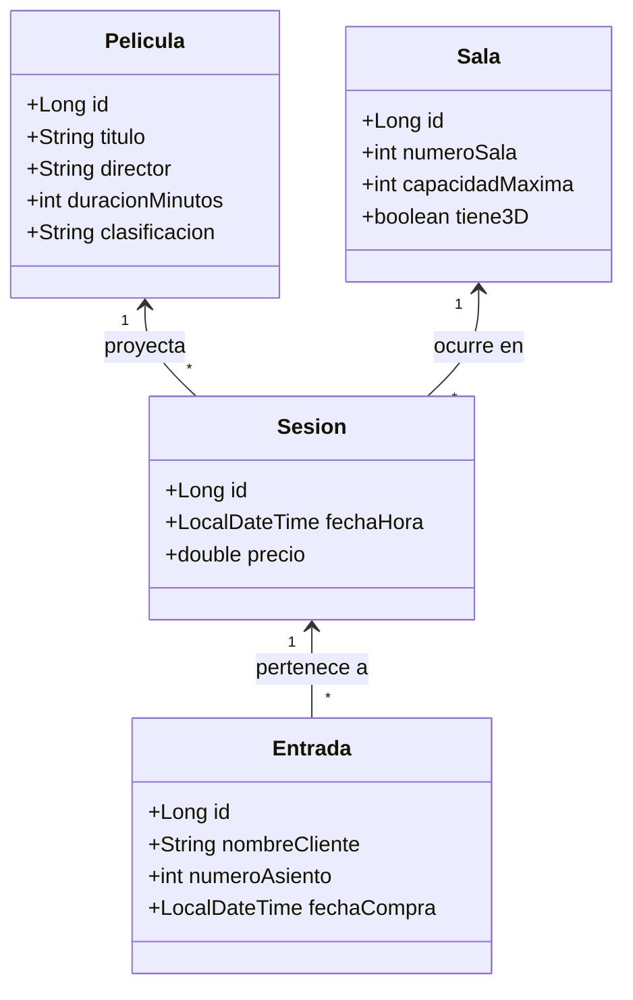

# 🎬 Blueprint: Sistema de Gestión "Cine Estrella"‌‌‌​‌​‌‌​‍‍‌‍​‌‍​​​‍​‌‌​‌​‌‍‌​​‌‌‌‍​​‌‍​‍‌‌‍‌‍​‌‌‌‍‌‍‌‍​‍‌‍​‌​‌​

## 📝 1. Enunciado y Contexto
El **Cine Estrella** necesita modernizar su antiguo sistema de taquilla y cartelería, el cual actualmente funciona mediante archivos de texto (o en memoria). El objetivo de este proyecto es construir la capa de acceso a datos de un nuevo sistema usando persistencia real sobre una base de datos relacional. 

El sistema debe permitir registrar las películas que están en cartelera, las salas del cine, las sesiones (horarios de proyección) y finalmente vender entradas a los clientes, asegurando que se descuentan los asientos disponibles.

## 🎯 2. Objetivos de Aprendizaje
* Configurar un proyecto desde cero usando **Maven**.
* Implementar el mapeo Objeto-Relacional (ORM) usando **Hibernate/JPA**.
* Diseñar e implementar relaciones reales en base de datos (`@OneToMany`, `@ManyToOne`).
* Entender el ciclo de vida de las entidades (Transient, Persistent, Detached).
* Control de versiones y despliegue del proyecto con **Git** y **GitHub CLI (`gh`)**.

## 🛠️ 3. Stack Tecnológico
* **Lenguaje:** Java 21+
* **Gestor de Dependencias:** Maven
* **Framework ORM:** Hibernate Core 6.x / JPA
* **Base de Datos:** PostgreSQL 16+
* **Control de Versiones:** Git + GitHub CLI (`gh`)
* **IDE Recomendado:** IntelliJ IDEA

## 🏗️ 4. UML y Arquitectura de Datos (Mermaid)
A continuación se presenta el Modelo de Clases / Modelo Entidad-Relación a implementar con anotaciones JPA:

## 🚀 5. Blueprint: Guía de Implementación Paso a Paso

**Fase 1: Setup y Configuración (Git & Maven)**
1. Inicializar repositorio local: `git init`
2. Crear estructura Maven (`pom.xml`) añadiendo las dependencias de **Hibernate Core** y **PostgreSQL Driver**.
3. Añadir el archivo de configuración `.gitignore` (ignorar `.idea/`, `target/`).
4. Crear repositorio en remoto usando GitHub CLI: `gh repo create cine-estrella --public --source=. --remote=origin --push`

**Fase 2: Entity Mapping (Hibernate)**
1. Crear el archivo `hibernate.cfg.xml` en `src/main/resources`. Configurar credenciales de PostgreSQL y dialecto.
2. Crear las clases `Pelicula`, `Sala`, `Sesion` y `Entrada` en el paquete `com.cineestrella.models`.
3. Anotar las clases con `@Entity`, `@Id`, `@GeneratedValue(strategy = GenerationType.IDENTITY)`.
4. Mapear las relaciones:
   - En `Sesion`: `@ManyToOne` hacia `Pelicula` y `Sala`.
   - En `Entrada`: `@ManyToOne` hacia `Sesion`.
   - En `Pelicula/Sala/Sesion`: Configurar el `@OneToMany(mappedBy = "...")` y opcionalmente `CascadeType.ALL`.

**Fase 3: Código Cliente y CRUD (Data Access Object / Main)**
1. Crear una clase `HibernateUtil` (o similar) que levante el `SessionFactory`.
2. Escribir el método `main` para probar:
   * Guardar 2 Películas y 2 Salas nuevas (Operación persist / save).
   * Crear 1 Sesión asociando una Película y una Sala.
   * Vender 2 Entradas para esa Sesión recién creada.
3. Hacer *Commit* y *Push* usando la línea de comandos de Git.
