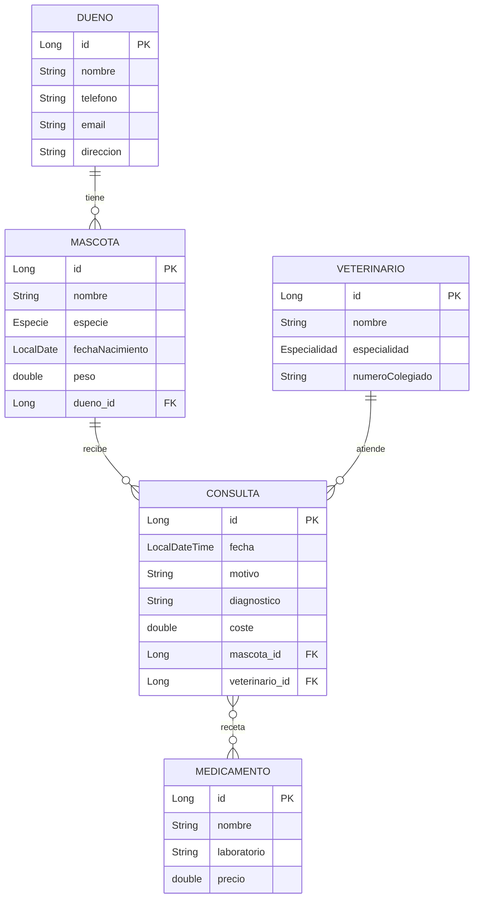
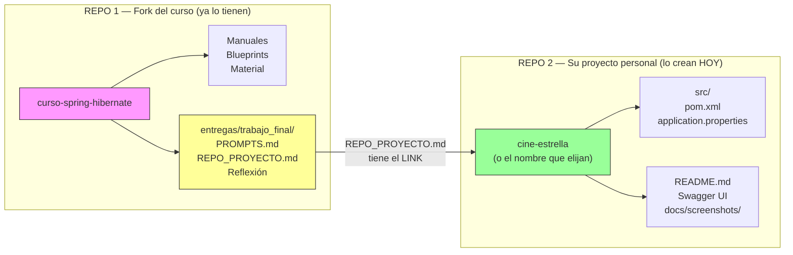
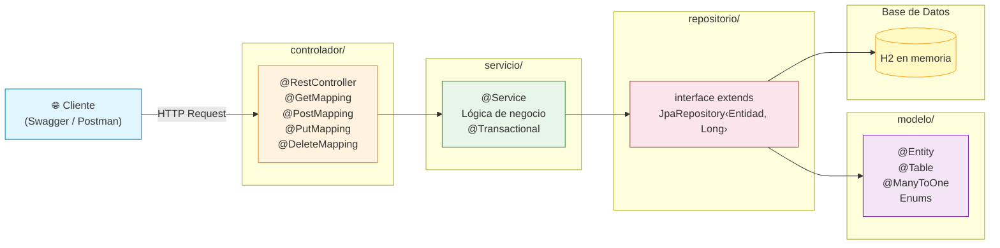
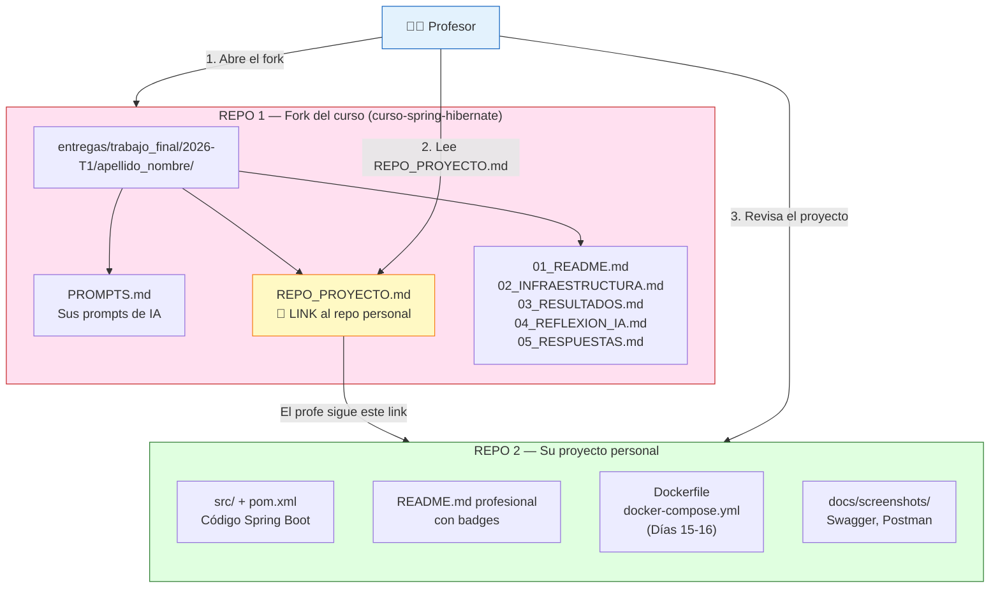

# Día 13: Proyecto Personal — Diseñen su Propia Aplicación

Llevan 12 días construyendo la Pizzería juntos. Hoy es SU turno. Van a crear una aplicación Spring Boot completa desde cero, con su propio dominio, sus propias entidades y sus propios endpoints REST.

Prof. Juan Marcelo Gutierrez Miranda

**Curso IFCD0014 — Semana 3, Día 13**
**Objetivo:** Elegir un blueprint, diseñar las entidades en papel, crear el proyecto Spring Boot dentro de un repositorio GitHub, y tener al menos un CRUD completo funcionando con Swagger/Postman.

> Este proyecto es su pieza de portafolio profesional. Va a estar en GitHub público y lo pueden mostrar en entrevistas. No es un ejercicio de clase — es su carta de presentación como backend developer.
>
> **Guía de referencia completa:** [Crear Repo de Portfolio](https://todoeconometria.github.io/curso-spring-hibernate/git-github/crear-repo-portfolio/) — consulten esta guía para los detalles de GitHub, README, capturas y más.

---

# PASO 0 — Recapitulación: todo lo que ya saben

En los últimos 5 días construyeron una aplicación completa. Miren todo lo que recorrieron:

| Día | Qué hicieron | Tecnología clave |
|-----|-------------|-----------------|
| 9 | Hibernate desde cero: ORM, EntityManager, CRUD | `persistence.xml`, `EntityManager`, `@Entity` |
| 10 | Pizzería con relaciones: @ManyToOne, @ManyToMany | `@JoinColumn`, `@JoinTable`, JPQL, DBeaver |
| 11 | Spring Boot intro: IoC, Lombok, REST, capas | `@SpringBootApplication`, `@RestController`, Postman |
| 12 | Pizzería completa en Spring Boot | Repository → Service → Controller, `data.sql` |

**Hoy aplican todo eso a un dominio que ustedes eligen.** El patrón es siempre el mismo:

```
Entidad (@Entity) → Repositorio (JpaRepository) → Servicio (@Service) → Controlador (@RestController)
```

Ya conocen cada pieza. Hoy toman decisiones: qué entidades crear, cómo relacionarlas, qué endpoints exponer. Eso es exactamente lo que hace un desarrollador en su primer día de trabajo.

---

# ═══════════════════════════════════════
# PARTE I — ELEGIR SU BLUEPRINT
# ═══════════════════════════════════════

# 1. Los 16 Blueprints disponibles

Cada blueprint describe un dominio con su contexto, sus entidades y sus relaciones. Los blueprints fueron diseñados para Hibernate puro, pero ustedes lo van a adaptar a Spring Boot (que es más sencillo).

| # | Blueprint | Dominio | Entidades principales |
|---|-----------|---------|----------------------|
| 01 | CineEstrella | Taquilla y cartelera de cine | Pelicula, Sala, Sesion, Entrada |
| 02 | VacunasSalud | Clínica de vacunación | Paciente, Vacuna, LoteVacuna, CitaVacunacion |
| 03 | AgenciaViajes | Reservas de paquetes turísticos | Destino, PaqueteTuristico, Cliente, Reserva |
| 04 | Mensajeria | Empresa de paquetería | Remitente, Paquete, Ruta, Envio |
| 05 | CarniceriaManolo | Ventas de carnicería | Cliente, ProductoCarne, Venta, DetalleVenta |
| 06 | Ferreteria | Inventario de ferretería | Producto, Proveedor, EntradaStock, Venta |
| 07 | Impresora3D | Taller de impresión 3D | Impresora, Filamento, PedidoImpresion, Diseño |
| 08 | BarReservas | Reservas de bar/restaurante | Mesa, Salon, Cliente, Reserva |
| 09 | Peluqueria | Agenda de peluquería | Estilista, ServicioPeluqueria, Cita, Cliente |
| 10 | FutbolPrimera | Liga de fútbol | Equipo, Jugador, Estadio, Partido |
| 11 | EscapeRoom | Escape room virtual | SalaEscape, Equipo, Jugador, SesionJuego |
| 12 | Zoo | Gestión de zoológico | Instalacion, Animal, Cuidador, Alimentacion |
| 13 | SalaConciertos | Sala de conciertos | Banda, Concierto, Entrada, Recinto |
| 14 | BibliotecaMariano | Biblioteca municipal | Libro, Autor, Socio, Prestamo |
| 15 | Restauracion | Restaurante de alta cocina | Plato, Camarero, Comanda, Cliente |
| 16 | BarajaEspanola | Juego de cartas españolas | Carta, Jugador, Partida, Mano |

> Lean el archivo del blueprint completo en `Blueprints_Proyectos_Hibernate/`. Ahí encontrarán el diagrama UML, la descripción detallada y las relaciones.

```
╔══════════════════════════════════════════════════════════════════╗
║                    REGLA DE SELECCIÓN                           ║
╠══════════════════════════════════════════════════════════════════╣
║                                                                 ║
║  → Cada alumno elige un blueprint DIFERENTE (no hay repetidos)  ║
║  → Levanten la mano y digan cuál quieren — primero en pedir,   ║
║    primero en llevárselo                                        ║
║  → Si nadie quiere uno, el profe lo asigna                     ║
║                                                                 ║
╚══════════════════════════════════════════════════════════════════╝
```

## 1.1 Requisitos mínimos del proyecto

Sin importar qué blueprint elijan, su proyecto debe cumplir estos mínimos:

```
╔══════════════════════════════════════════════════════════════════╗
║                    REQUISITOS MÍNIMOS                           ║
╠══════════════════════════════════════════════════════════════════╣
║                                                                 ║
║  → Mínimo 3 entidades (mejor 4-5)                              ║
║  → Al menos 1 relación @ManyToOne                               ║
║  → Al menos 1 relación @ManyToMany                              ║
║  → Al menos 1 enum con @Enumerated(EnumType.STRING)             ║
║  → Cada entidad con mínimo 3 atributos (además del id)          ║
║  → Al menos 1 Controller completo con CRUD                     ║
║  → data.sql con datos iniciales                                 ║
║  → La aplicación arranca sin errores                            ║
║                                                                 ║
╚══════════════════════════════════════════════════════════════════╝
```

## 1.2 Adaptar el blueprint de Hibernate a Spring Boot

Los blueprints originales usan Hibernate puro (EntityManager, persistence.xml, DAO). Ustedes lo hacen en Spring Boot, que es más simple:

| Blueprint dice | Ustedes usan |
|---------------|-------------|
| `persistence.xml` | `application.properties` |
| `EntityManager` | `JpaRepository` |
| Clase DAO con métodos manuales | Interface Repository con métodos automáticos |
| `main()` con `EntityManagerFactory` | `@SpringBootApplication` + `@RestController` |
| PostgreSQL | H2 en memoria (más adelante migraremos a PostgreSQL) |

Lo importante del blueprint son las **entidades y relaciones**. La forma de acceder a los datos la cambian a Spring Boot.

---

# ═══════════════════════════════════════
# PARTE II — DISEÑAR ANTES DE CODIFICAR
# ═══════════════════════════════════════

# 2. Diseño de entidades en papel

### ¿Por qué diseñar antes de abrir IntelliJ?

En el mundo laboral, ningún equipo empieza a codificar sin un diseño previo. Y hay una razón muy concreta: **el costo de un error de diseño crece con el tiempo**.

| Momento | Costo de corregir |
|---------|-------------------|
| En papel (antes de codificar) | 2 minutos: tachar y reescribir |
| Con 1 entidad creada | 10 minutos: renombrar clase, tabla, atributos |
| Con 3 entidades + relaciones + data.sql | 1-2 horas: rehacer joins, foreign keys, datos |
| Con el proyecto terminado | Posiblemente empezar de cero |

El diseño en papel les ahorra horas de frustración. Tómense 20-30 minutos para pensar antes de teclear.

## 2.1 Plantilla por entidad

Para cada entidad de su proyecto, llenen esta plantilla (en papel o en un archivo de texto):

```
┌──────────────────────────────────────────────────────────┐
│  Entidad: ___________________    Tabla: ________________ │
│                                                          │
│  Atributos:                                              │
│    - id (Long, @Id @GeneratedValue)                      │
│    - _____________ (tipo: _______)                       │
│    - _____________ (tipo: _______)                       │
│    - _____________ (tipo: _______)                       │
│    - _____________ (tipo: _______)                       │
│                                                          │
│  Relaciones:                                             │
│    - _____________ → _____________ (@ManyToOne)          │
│    - _____________ ↔ _____________ (@ManyToMany)         │
│                                                          │
│  Enum (si tiene):                                        │
│    - _____________ con valores: _____, _____, _____      │
└──────────────────────────────────────────────────────────┘
```

## 2.2 Ejemplo completo: Veterinaria

Para que vean cómo queda la plantilla completa, aquí tienen un proyecto de ejemplo con 5 entidades, 2 enums y todas las relaciones necesarias:

```
Entidad: Mascota              Tabla: mascotas
  - id (Long)
  - nombre (String, not null)
  - especie (Especie, enum: PERRO, GATO, AVE, REPTIL, OTRO)
  - fechaNacimiento (LocalDate)
  - peso (double)
  - dueno → Dueno (@ManyToOne)

Entidad: Dueno                Tabla: duenos
  - id (Long)
  - nombre (String, not null)
  - telefono (String)
  - email (String)
  - direccion (String)

Entidad: Veterinario          Tabla: veterinarios
  - id (Long)
  - nombre (String, not null)
  - especialidad (Especialidad, enum: GENERAL, CIRUGIA, DERMATOLOGIA, CARDIOLOGIA)
  - numeroColegiado (String, not null)

Entidad: Consulta             Tabla: consultas
  - id (Long)
  - fecha (LocalDateTime)
  - motivo (String, not null)
  - diagnostico (String)
  - coste (double)
  - mascota → Mascota (@ManyToOne)
  - veterinario → Veterinario (@ManyToOne)
  - medicamentos ↔ List<Medicamento> (@ManyToMany)

Entidad: Medicamento          Tabla: medicamentos
  - id (Long)
  - nombre (String, not null)
  - laboratorio (String)
  - precio (double)
```

**Relaciones del ejemplo:**
- Mascota → Dueno: muchas mascotas pertenecen a un dueño (`@ManyToOne`)
- Consulta → Mascota: muchas consultas son de una mascota (`@ManyToOne`)
- Consulta → Veterinario: muchas consultas las atiende un veterinario (`@ManyToOne`)
- Consulta ↔ Medicamento: una consulta puede recetar varios medicamentos, y un medicamento se usa en varias consultas (`@ManyToMany`)



> Este tipo de diagrama ER es exactamente lo que deberían dibujar en papel antes de empezar a codificar. Fíjense cómo las flechas indican las relaciones y las FK aparecen en la entidad "hija".

## 2.3 Patrones de relación comunes

| Relación | Significa | Ejemplo | Anotación |
|----------|-----------|---------|-----------|
| Muchos-a-Uno | Muchos X pertenecen a un Y | Mascota → Dueno | `@ManyToOne` + `@JoinColumn` |
| Muchos-a-Muchos | Muchos X se relacionan con muchos Y | Consulta ↔ Medicamento | `@ManyToMany` + `@JoinTable` |
| Uno-a-Muchos | Lado inverso de @ManyToOne (opcional) | Dueno → List&lt;Mascota&gt; | `@OneToMany(mappedBy = "dueno")` |

> **Consejo:** Empiecen solo con `@ManyToOne` y `@ManyToMany`. El `@OneToMany` es opcional y pueden agregarlo después si lo necesitan.

## 2.4 Guía para elegir tipos de datos

| Tipo Java | Cuándo usarlo | Ejemplo |
|-----------|--------------|---------|
| `String` | Texto libre: nombres, descripciones, emails | `nombre`, `email`, `direccion` |
| `int` | Números enteros pequeños: cantidades, edades | `cantidad`, `capacidad`, `dificultad` |
| `Long` | IDs y referencias | `id` (siempre Long para el ID) |
| `double` | Precios, pesos, medidas | `precio`, `peso`, `coste` |
| `boolean` | Verdadero/falso: estados binarios | `activo`, `esVip`, `disponible` |
| `LocalDate` | Fechas sin hora | `fechaNacimiento`, `fechaAlta` |
| `LocalDateTime` | Fechas con hora y minuto | `fechaConsulta`, `fechaReserva` |
| Enum | Categorías fijas y conocidas | `Especie`, `Estado`, `Categoria` |

> **Regla:** Si un campo tiene valores fijos y conocidos (PERRO/GATO/AVE), usen un enum. Si los valores pueden cambiar o son muchos, usen String o una entidad separada.

---

# ═══════════════════════════════════════
# PARTE III — CREAR EL REPO EN GITHUB Y EL PROYECTO SPRING BOOT
# ═══════════════════════════════════════

# 3. De cero a proyecto funcional (con GitHub desde el primer minuto)

La diferencia entre un ejercicio de clase y un proyecto de portfolio es que el portfolio vive en GitHub desde el principio. No van a crear el proyecto y "luego subirlo". Van a crear el repo primero y trabajar dentro de él.

## 3.1 Entender los dos repos (IMPORTANTE — leer antes de seguir)

Ya tienen un fork del repo del curso (`curso-spring-hibernate`) clonado en IntelliJ. Ahí están los manuales, los blueprints, todo el material. **Ese fork NO es su proyecto.** Ese fork es para seguir el curso y para la entrega formal (las plantillas de reflexión, prompts, etc.).

Su proyecto personal va en un **repo nuevo y separado**. Uno limpio, profesional, que un recruiter pueda abrir y entender en 2 minutos.



| | Fork del curso | Repo personal |
|---|---|---|
| **URL** | `github.com/SU_USUARIO/curso-spring-hibernate` | `github.com/SU_USUARIO/cine-estrella` |
| **Qué tiene** | Manuales, blueprints, material del curso | SOLO el código de su proyecto Spring Boot |
| **Para qué** | Seguir las clases + entrega formal | Portfolio profesional, entrevistas, CV |
| **En IntelliJ** | Ya lo tienen abierto | Lo abren como proyecto separado |
| **Cómo se conectan** | `REPO_PROYECTO.md` tiene el link al repo personal | El profe sigue el link y revisa |

> **En resumen:** hoy crean un repo nuevo en GitHub para su proyecto. El fork del curso lo dejan como está — lo usarán al final para la entrega formal.

## 3.2 Crear el repositorio personal en GitHub

1. Ir a [https://github.com/new](https://github.com/new)
2. Configurar:

| Campo | Valor | Ejemplo |
|---|---|---|
| **Repository name** | Nombre descriptivo, minúsculas, con guiones | `cine-estrella`, `zoo-park`, `bar-reservas` |
| **Description** | Una línea de qué hace | `API REST para gestión de un cine — Spring Boot 4 + H2` |
| **Visibility** | **Public** | (marcado) |
| **Add a README file** | **Marcado** | (GitHub crea uno inicial) |
| **Add .gitignore** | Seleccionar **Maven** | (ignora target/, .idea/, etc.) |

3. Click **Create repository**

```
╔══════════════════════════════════════════════════════════════════╗
║                 NOMBRES QUE FUNCIONAN vs QUE NO                  ║
╠══════════════════════════════════════════════════════════════════╣
║                                                                  ║
║  ✅ cine-estrella           ← descriptivo, profesional           ║
║  ✅ veterinaria-api         ← dice qué es                        ║
║  ✅ zoo-management          ← claro                              ║
║                                                                  ║
║  ❌ trabajo-final           ← no dice nada, grita "soy alumno"   ║
║  ❌ proyecto-spring         ← genérico, olvidable                 ║
║  ❌ mi-proyecto             ← lo peor que pueden poner            ║
║  ❌ asdfgh                  ← sin comentarios                     ║
║                                                                  ║
║  Un recruiter ve el nombre del repo antes de abrirlo.            ║
║  Si el nombre no dice nada, no lo abre.                          ║
║                                                                  ║
╚══════════════════════════════════════════════════════════════════╝
```

## 3.3 Clonar el repo en su máquina

Abran una terminal (Git Bash, PowerShell o la terminal de IntelliJ) y clonen:

```bash
cd DONDE_TENGAN_SUS_PROYECTOS
git clone https://github.com/SU_USUARIO/nombre-del-repo.git
```

> Sustituyan `SU_USUARIO` y `nombre-del-repo` por los suyos. La URL la copian del botón verde **Code** en GitHub.

Ahora abran esa carpeta en IntelliJ: **File → Open** → seleccionar la carpeta clonada.

Ya tienen un proyecto Git con `.gitignore` y `README.md`. Ahora falta el código Spring Boot.

## 3.4 Spring Initializr (dentro del repo clonado)

Vayan a [https://start.spring.io](https://start.spring.io) y configuren:

```
Project:    Maven
Language:   Java
Spring Boot: 4.0.x (la última disponible)

Group:      com.tudominio     (ej: com.veterinaria, com.cine, com.zoo)
Artifact:   nombre-proyecto   (ej: veterinaria, cine-estrella, zoo-park)
Name:       nombre-proyecto
Package:    com.tudominio
Packaging:  Jar
Java:       21
```

**Dependencias** (las mismas que la Pizzería + Swagger):

```
✓ Spring Web
✓ Spring Data JPA
✓ H2 Database
✓ Lombok
✓ Spring Boot DevTools
```

Generen, descarguen y **descompriman el contenido DENTRO de la carpeta del repo clonado**.

> **Importante:** Descompriman el CONTENIDO del zip, no la carpeta. El `pom.xml` debe quedar directamente en la raíz del repo, al lado del `README.md`. No debe quedar una carpeta dentro de otra.

Estructura correcta:
```
cine-estrella/              ← la carpeta del repo
├── .git/                   ← ya existía (del clone)
├── .gitignore              ← ya existía (del clone)
├── README.md               ← ya existía (del clone)
├── pom.xml                 ← del Initializr
├── src/                    ← del Initializr
│   ├── main/
│   └── test/
└── mvnw / mvnw.cmd         ← del Initializr
```

Abran el proyecto en IntelliJ (**File → Open** → seleccionar la carpeta). IntelliJ detectará el `pom.xml` y preguntará si quieren importar como Maven — digan que sí.

## 3.5 Agregar Swagger (springdoc-openapi)

Antes de empezar a codificar, añadan Swagger al `pom.xml`. Así desde el primer endpoint que creen, ya van a poder verlo en el navegador.

Abran `pom.xml` y dentro de `<dependencies>` añadan:

```xml
<dependency>
    <groupId>org.springdoc</groupId>
    <artifactId>springdoc-openapi-starter-webmvc-ui</artifactId>
    <version>2.8.6</version>
</dependency>
```

Refresquen Maven en IntelliJ (icono de recarga en la barra de Maven a la derecha, o `Ctrl + Shift + O`).

> Con esto, cuando arranquen la app podrán abrir `http://localhost:8080/swagger-ui.html` y ver todos sus endpoints en una interfaz gráfica. Es el "dashboard" de su API — lo que un recruiter abre primero cuando ve su repo.

## 3.6 Estructura de paquetes

Creen estos 4 paquetes dentro de su paquete raíz. Esta es la arquitectura de capas de Spring Boot:

```
src/main/java/com/tudominio/
├── modelo/           ← Entidades (@Entity) y enums
├── repositorio/      ← Interfaces JpaRepository
├── servicio/         ← Lógica de negocio (@Service)
└── controlador/      ← Endpoints REST (@RestController)
```



> **Flujo:** El cliente hace una petición HTTP → el Controller la recibe → delega al Service → que usa el Repository → que habla con la base de datos a través del modelo (@Entity).

> Pueden usar nombres en español (como la Pizzería) o en inglés (model, repository, service, controller). Lo importante es ser **consistente**: o todo en español o todo en inglés. No mezclen.

## 3.7 application.properties

Copien esta configuración y adapten el nombre de la base de datos a su proyecto.

*📁 Archivo a modificar: `src/main/resources/application.properties`*

```properties
# ===== BASE DE DATOS H2 =====
spring.datasource.url=jdbc:h2:mem:miproyectodb
spring.datasource.driverClassName=org.h2.Driver
spring.datasource.username=sa
spring.datasource.password=

# ===== JPA / HIBERNATE =====
spring.jpa.database-platform=org.hibernate.dialect.H2Dialect
spring.jpa.hibernate.ddl-auto=create-drop
spring.jpa.show-sql=true

# ===== CONSOLA H2 (para ver tablas en el navegador) =====
spring.h2-console.enabled=true
spring.h2-console.path=/h2-console

# ===== FORMATO JSON =====
spring.jackson.serialization.indent_output=true

# ===== DATOS INICIALES =====
spring.jpa.defer-datasource-initialization=true
```

> Cambien `miproyectodb` por un nombre que identifique su proyecto: `veterinariadb`, `cinedb`, `zoodb`, etc.

## 3.8 Bean para DBeaver (servidor TCP de H2)

Si quieren conectar DBeaver (herramienta de base de datos externa) a su H2 en memoria, necesitan agregar un bean en la clase principal de la aplicación. Esto ya lo hicieron en los días 11-12.

*📁 Archivo a modificar: `src/main/java/com/tudominio/NombreProyectoApplication.java`*

```java
package com.tudominio;

import org.h2.tools.Server;
import org.springframework.boot.SpringApplication;
import org.springframework.boot.autoconfigure.SpringBootApplication;
import org.springframework.context.annotation.Bean;

import java.sql.SQLException;

@SpringBootApplication
public class NombreProyectoApplication {

    public static void main(String[] args) {
        SpringApplication.run(NombreProyectoApplication.class, args);
    }

    @Bean(initMethod = "start", destroyMethod = "stop")
    public Server h2Server() throws SQLException {
        return Server.createTcpServer("-tcp", "-tcpAllowOthers", "-tcpPort", "9092");
    }
}
```

**En DBeaver:**
1. Nueva conexión → buscar **"H2 Server"** (NO "H2 Embedded")
2. JDBC URL: `jdbc:h2:tcp://localhost:9092/mem:miproyectodb`
3. User: `sa`, Password: vacío
4. Test Connection → debe dar OK

> **⚠️ Importante:** Usar "H2 Server", NO "H2 Embedded". H2 en memoria solo es visible dentro de la JVM. El servidor TCP abre un puerto para que DBeaver se conecte desde fuera.

---

# ═══════════════════════════════════════
# PARTE IV — IMPLEMENTAR ENTIDADES
# ═══════════════════════════════════════

# 4. Convertir el diseño en código

Ahora tomen la plantilla que llenaron en papel y conviértanla en clases Java. El patrón es siempre el mismo que usaron en la Pizzería.

Pero antes de empezar a copiar código, hay algo importante: Spring Boot usa muchas **anotaciones** (`@Entity`, `@Table`, `@Data`...). Si vienen de Java básico, es normal pensar "¿qué hacen todos esos @?". Aquí va la explicación corta:

### Las anotaciones: qué son y por qué están en todos lados

En Java básico, ustedes escriben TODO el código: la clase, los getters, los setters, el constructor, los métodos. En Spring Boot, muchas de esas cosas se generan automáticamente usando **anotaciones** — son instrucciones que le dan al framework para que haga trabajo por ustedes.

Piénsenlo así: una anotación es como una etiqueta en una caja de mudanza. Si ponen "FRÁGIL" en la caja, el transportista la trata diferente. No cambia lo que hay dentro, pero cambia cómo se maneja. Las anotaciones son lo mismo: no cambian su clase Java, pero le dicen a Spring/Hibernate/Lombok **cómo tratarla**.

| Anotación | Quién la lee | Qué hace por ustedes |
|-----------|-------------|---------------------|
| `@Entity` | Hibernate | "Esta clase es una tabla en la BD" → Hibernate crea la tabla automáticamente |
| `@Table(name = "mascotas")` | Hibernate | "La tabla se llama mascotas" → sin esto, usa el nombre de la clase |
| `@Id` | Hibernate | "Este campo es la clave primaria" |
| `@GeneratedValue` | Hibernate | "El ID se auto-incrementa solo, no lo pongo yo" |
| `@Column(nullable = false)` | Hibernate | "Este campo es NOT NULL en la BD" |
| `@ManyToOne` | Hibernate | "Esta relación es muchos-a-uno" → crea la FK automáticamente |
| `@Data` | Lombok | "Genera getters, setters, toString, equals y hashCode" |
| `@NoArgsConstructor` | Lombok | "Genera un constructor vacío `Mascota()`" |
| `@AllArgsConstructor` | Lombok | "Genera un constructor con TODOS los campos" |
| `@Service` | Spring | "Esta clase es un servicio, Spring la crea y la gestiona" |
| `@RestController` | Spring | "Esta clase recibe peticiones HTTP y devuelve JSON" |

> **La regla:** si algo les parece que "falta" en el código (¿dónde están los getters? ¿dónde está el constructor?), miren las anotaciones. Probablemente una anotación lo está generando por ustedes.

### Lombok: el robot que escribe código aburrido

En Java básico, para una clase `Mascota` con 5 campos, escribirían unos 80 líneas de getters, setters, constructor, toString... Con Lombok, escriben esto:

```java
// SIN Lombok — Java básico (unas 80 líneas)
public class Mascota {
    private Long id;
    private String nombre;
    private double peso;

    public Mascota() {}
    public Mascota(Long id, String nombre, double peso) {
        this.id = id;
        this.nombre = nombre;
        this.peso = peso;
    }
    public Long getId() { return id; }
    public void setId(Long id) { this.id = id; }
    public String getNombre() { return nombre; }
    public void setNombre(String nombre) { this.nombre = nombre; }
    public double getPeso() { return peso; }
    public void setPeso(double peso) { this.peso = peso; }
    @Override public String toString() { return "Mascota{id=" + id + ", nombre=" + nombre + "}"; }
    @Override public boolean equals(Object o) { /* ... */ }
    @Override public int hashCode() { /* ... */ }
}

// CON Lombok — exactamente lo mismo, pero en 8 líneas
@Data
@NoArgsConstructor
@AllArgsConstructor
public class Mascota {
    private Long id;
    private String nombre;
    private double peso;
}
```

Las dos versiones son **idénticas** en funcionalidad. Lombok genera todo ese código aburrido en tiempo de compilación. IntelliJ lo sabe y les deja usar `mascota.getNombre()` aunque no lo vean escrito.

> **Si Lombok les da problemas:** en IntelliJ, vayan a File → Settings → Plugins → buscar "Lombok" → instalar. Y en Settings → Build → Compiler → Annotation Processors → marcar "Enable annotation processing".

## 4.1 Checklist por entidad

Para **cada** entidad que diseñaron, verifiquen que tiene todo esto:

```
[ ] @Entity en la clase
[ ] @Table(name = "nombre_tabla") — plural, snake_case
[ ] @Data @NoArgsConstructor @AllArgsConstructor (Lombok)
[ ] @Id @GeneratedValue(strategy = GenerationType.IDENTITY)
[ ] Atributos con @Column(nullable = false) donde corresponda
[ ] @Enumerated(EnumType.STRING) para enums
[ ] @ManyToOne + @JoinColumn(name = "xxx_id") para relaciones muchos-a-uno
[ ] @ManyToMany + @JoinTable para relaciones muchos-a-muchos
[ ] Todos los imports de jakarta.persistence.* (NO javax.persistence)
```

## 4.2 Ejemplo completo: Mascota.java

*📁 Archivo de referencia: `src/main/java/com/veterinaria/modelo/Mascota.java`*

```java
package com.veterinaria.modelo;

import jakarta.persistence.*;
import lombok.*;
import java.time.LocalDate;

@Entity
@Table(name = "mascotas")
@Data
@NoArgsConstructor
@AllArgsConstructor
public class Mascota {

    @Id
    @GeneratedValue(strategy = GenerationType.IDENTITY)
    private Long id;

    @Column(nullable = false)
    private String nombre;

    @Enumerated(EnumType.STRING)
    @Column(nullable = false)
    private Especie especie;

    private LocalDate fechaNacimiento;

    private double peso;

    @ManyToOne
    @JoinColumn(name = "dueno_id")
    private Dueno dueno;
}
```

## 4.3 Ejemplo con relaciones: Consulta.java

Este ejemplo muestra dos `@ManyToOne` y un `@ManyToMany` en la misma entidad:

*📁 Archivo de referencia: `src/main/java/com/veterinaria/modelo/Consulta.java`*

```java
package com.veterinaria.modelo;

import jakarta.persistence.*;
import lombok.*;
import java.time.LocalDateTime;
import java.util.ArrayList;
import java.util.List;

@Entity
@Table(name = "consultas")
@Data
@NoArgsConstructor
@AllArgsConstructor
public class Consulta {

    @Id
    @GeneratedValue(strategy = GenerationType.IDENTITY)
    private Long id;

    private LocalDateTime fecha;

    @Column(nullable = false)
    private String motivo;

    private String diagnostico;

    private double coste;

    @ManyToOne
    @JoinColumn(name = "mascota_id")
    private Mascota mascota;

    @ManyToOne
    @JoinColumn(name = "veterinario_id")
    private Veterinario veterinario;

    @ManyToMany
    @JoinTable(
        name = "consulta_medicamentos",
        joinColumns = @JoinColumn(name = "consulta_id"),
        inverseJoinColumns = @JoinColumn(name = "medicamento_id")
    )
    private List<Medicamento> medicamentos = new ArrayList<>();
}
```

## 4.4 Enums: archivos separados

Los enums NO llevan `@Entity`. Son archivos Java normales dentro del paquete `modelo/`:

*📁 Archivo de referencia: `src/main/java/com/veterinaria/modelo/Especie.java`*

```java
package com.veterinaria.modelo;

public enum Especie {
    PERRO, GATO, AVE, REPTIL, OTRO
}
```

> Un archivo `.java` por cada enum. No los pongan dentro de la clase de la entidad.

## 4.5 Errores frecuentes al crear entidades

| Error | Causa | Solución |
|-------|-------|----------|
| `Cannot resolve symbol Entity` | Import incorrecto | Usar `jakarta.persistence.*` (NO `javax.persistence`) |
| `No default constructor` | Falta constructor vacío | Agregar `@NoArgsConstructor` (Lombok) |
| `Table not found` en data.sql | Nombre de tabla no coincide | Verificar `@Table(name = "xxx")` y que `data.sql` use el mismo nombre |
| `Column "XXX_ID" not found` | Nombre de join column no coincide | Verificar `@JoinColumn(name = "xxx_id")` vs el INSERT en `data.sql` |
| Error de serialización JSON circular | `@ManyToMany` bidireccional sin control | Agregar `@JsonIgnore` en un lado de la relación |

---

# ═══════════════════════════════════════
# PARTE V — REPOSITORIOS, SERVICIO Y CONTROLADOR
# ═══════════════════════════════════════

# 5. La cadena completa: Repository → Service → Controller

### Antes de empezar: ¿por qué 3 capas y no todo junto?

En Java básico, probablemente ponían todo en una clase con un `main()`. Aquí hay 3 capas separadas (Repository, Service, Controller) y es normal preguntarse "¿para qué tanto lío?". La respuesta corta: **separación de responsabilidades**.

Imaginen un restaurante:
- El **camarero** (Controller) recibe el pedido del cliente y trae la comida → no cocina
- El **cocinero** (Service) prepara el plato, decide los ingredientes → no atiende mesas ni va al almacén
- El **almacenero** (Repository) saca los ingredientes del almacén → no cocina ni atiende

¿Podrían hacer que una sola persona haga todo? Sí, en un bar de barrio funciona. Pero en un restaurante real, si el camarero también cocina, cuando hay 20 mesas el sistema colapsa. En software es igual: separar capas permite que cada pieza se pueda cambiar, testear y entender por separado.

| Capa | Archivo | Qué hace | En Java básico sería... |
|------|---------|----------|------------------------|
| **Repository** | `MascotaRepository.java` | Habla con la BD (SELECT, INSERT, DELETE) | Los métodos que hacían con `EntityManager` o JDBC |
| **Service** | `MascotaService.java` | Lógica de negocio, reglas, validaciones | La lógica que ponían en el `main()` o en métodos de la clase |
| **Controller** | `MascotaController.java` | Recibe peticiones HTTP, devuelve JSON | No existía en Java básico (no tenían servidor web) |

> **Regla práctica:** el Controller NO toca la BD. El Repository NO sabe de HTTP. El Service conecta los dos mundos.

## 5.1 Un repositorio por entidad — La interface "mágica"

Cada entidad necesita su propia interfaz que extienda `JpaRepository`. Esto les da gratis: `findAll()`, `findById()`, `save()`, `deleteById()` y más.

### Si vienen de Java básico, esto les va a chocar

En Java básico, una **interface** es un contrato: declaras métodos y LUEGO creas una clase que los implementa. Si escriben `interface Calculadora { double sumar(double a, double b); }`, necesitan una clase `class MiCalculadora implements Calculadora { ... }` con el código real.

Con `JpaRepository` NO. Escriben solo la interface y **Spring genera la implementación automáticamente** al arrancar la aplicación. No hay ningún archivo con `implements MascotaRepository`. Spring lo crea en memoria, invisible.

```java
// En Java básico: interface + implementación manual
interface MascotaDao {
    List<Mascota> findAll();
    Mascota save(Mascota m);
    void deleteById(Long id);
}

class MascotaDaoImpl implements MascotaDao {
    // 50+ líneas de código JDBC: Connection, PreparedStatement, ResultSet...
    @Override
    public List<Mascota> findAll() {
        String sql = "SELECT * FROM mascotas";
        // ... abrir conexión, ejecutar, mapear filas, cerrar conexión
    }
}

// En Spring Boot: SOLO la interface. Spring hace el resto.
@Repository
public interface MascotaRepository extends JpaRepository<Mascota, Long> {
    // YA TIENE findAll(), findById(), save(), deleteById()... ¡sin escribir nada!

    // Y si necesitan queries personalizadas, solo declaran el método:
    List<Mascota> findByEspecie(Especie especie);
    // Spring lee el nombre "findByEspecie" y genera:
    // SELECT * FROM mascotas WHERE especie = ?
}
```

> **¿Cómo sabe Spring qué SQL generar?** Lee el nombre del método. `findByEspecie` → busca por el campo `especie`. `findByNombreContaining` → busca donde el nombre contenga el texto. Es como hablarle en inglés y él traduce a SQL.

*📁 Archivo de referencia: `src/main/java/com/veterinaria/repositorio/MascotaRepository.java`*

```java
package com.veterinaria.repositorio;

import com.veterinaria.modelo.Especie;
import com.veterinaria.modelo.Mascota;
import org.springframework.data.jpa.repository.JpaRepository;
import org.springframework.stereotype.Repository;

import java.util.List;

@Repository
public interface MascotaRepository extends JpaRepository<Mascota, Long> {

    List<Mascota> findByEspecie(Especie especie);

    List<Mascota> findByDuenoId(Long duenoId);

    List<Mascota> findByNombreContainingIgnoreCase(String nombre);
}
```

> Agreguen 2-3 métodos `findBy...` que tengan sentido para su dominio. Spring genera la query SQL automáticamente a partir del nombre del método.

## 5.2 Derived queries: recordatorio rápido

| Nombre del método | SQL que genera Spring |
|-------------------|---------------------|
| `findByNombre(String n)` | `WHERE nombre = ?` |
| `findByPrecioGreaterThan(double p)` | `WHERE precio > ?` |
| `findByPrecioLessThan(double p)` | `WHERE precio < ?` |
| `findByNombreContainingIgnoreCase(String n)` | `WHERE LOWER(nombre) LIKE LOWER('%?%')` |
| `findByFechaAfter(LocalDate f)` | `WHERE fecha > ?` |
| `findByActivoTrue()` | `WHERE activo = true` |
| `findByTipoAndCategoria(Tipo t, Cat c)` | `WHERE tipo = ? AND categoria = ?` |
| `findByDuenoId(Long id)` | `WHERE dueno_id = ?` |

## 5.3 Primer servicio

El servicio contiene la lógica de negocio. Empiecen por la entidad principal de su dominio. Copien el patrón de `PizzaService` del día 12 y adapten.

### La inyección de dependencias: ¿quién crea el Repository?

En Java básico, cuando una clase necesita otra, ustedes la crean con `new`:

```java
// Java básico: ustedes crean TODO manualmente
public class MascotaService {
    private MascotaRepository repo = new MascotaRepository();  // ustedes lo crean
}
```

En Spring Boot, **ustedes NUNCA escriben `new`** para clases del framework. En vez de eso, piden lo que necesitan en el constructor y **Spring se lo pasa automáticamente**:

```java
// Spring Boot: Spring crea el Repository y se lo pasa al Service
@Service
public class MascotaService {
    private final MascotaRepository mascotaRepository;

    // Spring ve este constructor, ve que necesita un MascotaRepository,
    // y como ya creó uno (porque tiene @Repository), se lo inyecta aquí
    public MascotaService(MascotaRepository mascotaRepository) {
        this.mascotaRepository = mascotaRepository;
    }
}
```

Imaginen que Spring es un camarero: cuando crean una clase con `@Service`, Spring dice "necesita un MascotaRepository, ya tengo uno preparado, se lo paso". Ustedes solo dicen qué necesitan y Spring se encarga de conectar las piezas.

> **¿Cuándo usa Spring esta "magia"?** Solo con clases marcadas con `@Repository`, `@Service`, `@RestController` o `@Component`. Si crean una clase normal sin anotación, Spring no la conoce y no puede inyectarla.

### ¿Qué es "lógica de negocio"?

Suena muy abstracto, pero es simple: son **las reglas de su dominio** que NO son ni "guardar en BD" ni "recibir HTTP". Por ahora, el Service parece que solo llama al Repository (y es verdad). Pero conforme el proyecto crece, aquí irían cosas como:

- "No se puede crear una consulta si la mascota no tiene dueño"
- "El precio de una entrada no puede ser negativo"
- "Solo se pueden reservar mesas para máximo 10 personas"
- "Un veterinario no puede atender más de 8 consultas al día"

Hoy su Service será simple (llama al Repository y ya), y eso está bien. La estructura existe para cuando necesiten añadir esas reglas.

*📁 Archivo de referencia: `src/main/java/com/veterinaria/servicio/MascotaService.java`*

```java
package com.veterinaria.servicio;

import com.veterinaria.modelo.Especie;
import com.veterinaria.modelo.Mascota;
import com.veterinaria.repositorio.MascotaRepository;
import org.springframework.stereotype.Service;

import java.util.List;
import java.util.Optional;

@Service  // Le dice a Spring: "esta clase es un servicio, créala y gestiónala tú"
public class MascotaService {

    private final MascotaRepository mascotaRepository;

    // Spring ve que necesita un MascotaRepository y se lo pasa aquí
    public MascotaService(MascotaRepository mascotaRepository) {
        this.mascotaRepository = mascotaRepository;
    }

    // Cada método del Service llama al método correspondiente del Repository
    public List<Mascota> listarTodas() {
        return mascotaRepository.findAll();     // findAll() viene gratis de JpaRepository
    }

    public Optional<Mascota> buscarPorId(Long id) {
        return mascotaRepository.findById(id);  // devuelve Optional (puede no existir)
    }

    public Mascota crear(Mascota mascota) {
        return mascotaRepository.save(mascota);  // save() viene gratis de JpaRepository
    }

    public void eliminar(Long id) {
        mascotaRepository.deleteById(id);        // deleteById() viene gratis
    }

    public List<Mascota> buscarPorEspecie(Especie especie) {
        return mascotaRepository.findByEspecie(especie);  // este lo declararon ustedes
    }
}
```

> **Patrón:** el servicio recibe el repositorio por constructor (inyección de dependencias), y sus métodos llaman a los métodos del repositorio. Hoy es simple — más adelante aquí irán las reglas de negocio.

## 5.4 Primer controlador

El controlador expone los endpoints HTTP. Cada método del servicio se mapea a un verbo HTTP.

### Optional y `.map().orElse()` — Traducción a Java básico

En el Controller van a ver código como este:

```java
return mascotaService.buscarPorId(id)
        .map(ResponseEntity::ok)
        .orElse(ResponseEntity.notFound().build());
```

Si vienen de Java básico, esto parece código encriptado. Vamos a descifrarlo:

```java
// VERSIÓN LARGA (Java básico, con if-else) — HACE LO MISMO
Optional<Mascota> resultado = mascotaService.buscarPorId(id);

if (resultado.isPresent()) {
    // Sí existe → devolver 200 OK con la mascota
    Mascota mascota = resultado.get();
    return ResponseEntity.ok(mascota);
} else {
    // No existe → devolver 404 Not Found
    return ResponseEntity.notFound().build();
}

// VERSIÓN CORTA (con Optional) — HACE EXACTAMENTE LO MISMO
return mascotaService.buscarPorId(id)          // busca en BD → puede existir o no
        .map(ResponseEntity::ok)                // si existe → envolver en 200 OK
        .orElse(ResponseEntity.notFound().build()); // si no → 404
```

**¿Qué es `Optional`?** Es una "caja" que puede tener algo dentro o estar vacía. `findById()` devuelve un Optional porque el ID puede no existir en la BD. En vez de devolver `null` (que causa `NullPointerException`), devuelve un Optional vacío.

**¿Qué es `ResponseEntity::ok`?** Es un **method reference** (referencia a método). Es la versión corta de `mascota -> ResponseEntity.ok(mascota)`. Dice "toma lo que haya dentro del Optional y pásalo como argumento a `ResponseEntity.ok()`".

> **Si no entienden la versión corta, usen la versión larga con if-else.** Las dos compilan, las dos funcionan, las dos están bien. La corta es más elegante, la larga es más clara. Elijan la que les deje dormir tranquilos.

*📁 Archivo de referencia: `src/main/java/com/veterinaria/controlador/MascotaController.java`*

```java
package com.veterinaria.controlador;

import com.veterinaria.modelo.Especie;
import com.veterinaria.modelo.Mascota;
import com.veterinaria.servicio.MascotaService;
import org.springframework.http.ResponseEntity;
import org.springframework.web.bind.annotation.*;

import java.util.List;

@RestController                      // "Esta clase recibe HTTP y devuelve JSON"
@RequestMapping("/api/mascotas")     // Todos los endpoints empiezan con /api/mascotas
public class MascotaController {

    private final MascotaService mascotaService;

    // Misma inyección que en el Service: Spring pasa el MascotaService automáticamente
    public MascotaController(MascotaService mascotaService) {
        this.mascotaService = mascotaService;
    }

    // GET /api/mascotas → devuelve TODAS las mascotas como JSON (siempre 200)
    @GetMapping
    public List<Mascota> listarTodas() {
        return mascotaService.listarTodas();
    }

    // GET /api/mascotas/3 → devuelve UNA mascota por ID (200 si existe, 404 si no)
    @GetMapping("/{id}")    // {id} captura el número de la URL
    public ResponseEntity<Mascota> buscarPorId(@PathVariable Long id) {
        // Versión corta (equivale al if-else explicado arriba)
        return mascotaService.buscarPorId(id)
            .map(ResponseEntity::ok)                     // existe → 200
            .orElse(ResponseEntity.notFound().build());   // no existe → 404
    }

    // POST /api/mascotas + JSON en el body → crea una nueva mascota
    @PostMapping
    public Mascota crear(@RequestBody Mascota mascota) {
        // @RequestBody: Spring convierte el JSON del body en un objeto Mascota automáticamente
        return mascotaService.crear(mascota);
    }

    // DELETE /api/mascotas/3 → elimina la mascota con ID 3
    @DeleteMapping("/{id}")
    public ResponseEntity<Void> eliminar(@PathVariable Long id) {
        mascotaService.eliminar(id);
        return ResponseEntity.noContent().build();  // 204: "borrado, no hay nada que devolver"
    }

    // GET /api/mascotas/especie/PERRO → busca mascotas filtradas por especie
    @GetMapping("/especie/{especie}")
    public List<Mascota> buscarPorEspecie(@PathVariable Especie especie) {
        // Spring convierte el texto "PERRO" de la URL al enum Especie.PERRO automáticamente
        return mascotaService.buscarPorEspecie(especie);
    }
}
```

### Resumen visual: cómo fluye una petición GET /api/mascotas/3

Para que quede claro cómo se conectan las 3 capas, esto es lo que pasa cuando alguien hace `GET /api/mascotas/3` en Swagger:

```
1. Swagger/Postman manda: GET http://localhost:8080/api/mascotas/3

2. Spring busca qué Controller tiene @RequestMapping("/api/mascotas")
   → encuentra MascotaController

3. Dentro del Controller, busca @GetMapping("/{id}") que coincida con /3
   → ejecuta buscarPorId(3)

4. El Controller llama al Service: mascotaService.buscarPorId(3)

5. El Service llama al Repository: mascotaRepository.findById(3)

6. El Repository hace: SELECT * FROM mascotas WHERE id = 3
   → La mascota existe → devuelve Optional con la mascota dentro

7. El Service devuelve ese Optional al Controller

8. El Controller hace .map(ResponseEntity::ok)
   → como el Optional tiene mascota → envuelve en ResponseEntity con código 200

9. Spring convierte la Mascota Java a JSON y la devuelve como respuesta HTTP

10. Swagger muestra: { "id": 3, "nombre": "Pico", "especie": "AVE", ... }
```

> **Si el ID no existe:** el paso 6 devuelve Optional vacío → el paso 8 cae en `.orElse(notFound())` → respuesta HTTP 404.

## 5.5 Probar con Postman

Una vez que tienen el controlador, prueben cada endpoint:

| Verbo | URL | Body | Qué hace |
|-------|-----|------|----------|
| GET | `http://localhost:8080/api/mascotas` | — | Lista todas |
| GET | `http://localhost:8080/api/mascotas/1` | — | Busca por ID |
| POST | `http://localhost:8080/api/mascotas` | JSON | Crea una nueva |
| DELETE | `http://localhost:8080/api/mascotas/1` | — | Elimina por ID |
| GET | `http://localhost:8080/api/mascotas/especie/PERRO` | — | Busca por especie |

**Ejemplo de body para POST** (Postman → Body → raw → JSON):

```json
{
    "nombre": "Luna",
    "especie": "GATO",
    "fechaNacimiento": "2022-03-15",
    "peso": 4.5,
    "dueno": { "id": 1 }
}
```

> Para enviar una relación `@ManyToOne` en el POST, basta con enviar el `id` del objeto relacionado dentro de un objeto anidado.

---

# ═══════════════════════════════════════
# PARTE VI — DATOS INICIALES Y VERIFICACIÓN
# ═══════════════════════════════════════

# 6. data.sql y verificación

## 6.1 Crear data.sql

El archivo `data.sql` contiene INSERTs que cargan datos al arrancar la aplicación. **El orden importa:** primero las tablas padre (las que no dependen de nadie), luego las que tienen foreign keys.

*📁 Archivo a crear: `src/main/resources/data.sql`*

```sql
-- ===== TABLAS PADRE (sin foreign keys) =====
INSERT INTO duenos (nombre, telefono, email, direccion) VALUES
('Ana Lopez', '612345678', 'ana@email.com', 'Calle Mayor 1'),
('Carlos Ruiz', '698765432', 'carlos@email.com', 'Av. Libertad 23');

INSERT INTO medicamentos (nombre, laboratorio, precio) VALUES
('Amoxicilina', 'Pfizer', 12.50),
('Ibuprofeno', 'Bayer', 8.00),
('Antiparasitario', 'Merial', 15.00);

INSERT INTO veterinarios (nombre, especialidad, numero_colegiado) VALUES
('Dr. Garcia', 'GENERAL', 'COL-001'),
('Dra. Martinez', 'CIRUGIA', 'COL-002');

-- ===== TABLAS CON @ManyToOne (dependen de las de arriba) =====
INSERT INTO mascotas (nombre, especie, fecha_nacimiento, peso, dueno_id) VALUES
('Luna', 'GATO', '2022-03-15', 4.5, 1),
('Rocky', 'PERRO', '2020-07-20', 25.0, 1),
('Pico', 'AVE', '2023-01-10', 0.3, 2);

INSERT INTO consultas (fecha, motivo, diagnostico, coste, mascota_id, veterinario_id) VALUES
('2024-01-15T10:30:00', 'Vacunación anual', 'Sano', 35.00, 1, 1),
('2024-02-20T16:00:00', 'Cojera', 'Esguince leve', 60.00, 2, 2);

-- ===== TABLAS @ManyToMany (tabla intermedia) =====
INSERT INTO consulta_medicamentos (consulta_id, medicamento_id) VALUES
(1, 1),
(2, 2),
(2, 3);
```

```
╔══════════════════════════════════════════════════════════════════╗
║              ORDEN DE INSERCIÓN EN data.sql                    ║
╠══════════════════════════════════════════════════════════════════╣
║                                                                 ║
║  1. Tablas sin foreign keys (entidades independientes)          ║
║  2. Tablas con @ManyToOne (necesitan que exista el padre)       ║
║  3. Tablas intermedias de @ManyToMany (necesitan ambos lados)   ║
║                                                                 ║
║  Si el orden está mal → error: "Referential integrity"          ║
║                                                                 ║
╚══════════════════════════════════════════════════════════════════╝
```

> **Nombres de columnas en data.sql:** Spring convierte `fechaNacimiento` (Java) a `fecha_nacimiento` (SQL) automáticamente. Usen snake_case en los INSERTs.

## 6.2 Verificar en DBeaver

Con la aplicación corriendo y DBeaver conectado:

1. Expandir las tablas en el panel izquierdo — deben aparecer todas sus entidades
2. `SELECT * FROM mascotas;` — deben ver los datos de `data.sql`
3. `SELECT m.nombre, d.nombre FROM mascotas m JOIN duenos d ON m.dueno_id = d.id;` — los JOINs deben funcionar

## 6.3 Verificar en Postman / navegador

1. `GET http://localhost:8080/api/mascotas` → debe devolver JSON con los datos de `data.sql`
2. `POST http://localhost:8080/api/mascotas` → debe crear una nueva mascota
3. `GET http://localhost:8080/api/mascotas` → debe incluir la mascota recién creada
4. Verificar en DBeaver que el POST también se refleja en la tabla

---

# REFERENCIAS RÁPIDAS

## Referencia rápida de anotaciones

| Anotación | Dónde va | Qué hace |
|-----------|----------|----------|
| `@Entity` | Clase | Marca la clase como entidad JPA |
| `@Table(name = "xxx")` | Clase | Define el nombre de la tabla |
| `@Id` | Campo | Marca la clave primaria |
| `@GeneratedValue(strategy = GenerationType.IDENTITY)` | Campo | Auto-incremento del ID |
| `@Column(nullable = false)` | Campo | NOT NULL en la columna |
| `@Enumerated(EnumType.STRING)` | Campo | Guarda el enum como texto (no como número) |
| `@ManyToOne` | Campo | Relación muchos-a-uno |
| `@JoinColumn(name = "xxx_id")` | Campo | Nombre de la columna FK |
| `@ManyToMany` | Campo | Relación muchos-a-muchos |
| `@JoinTable(...)` | Campo | Configura la tabla intermedia |
| `@Data` | Clase | Lombok: getters, setters, toString, equals, hashCode |
| `@NoArgsConstructor` | Clase | Lombok: constructor vacío |
| `@AllArgsConstructor` | Clase | Lombok: constructor con todos los campos |
| `@Repository` | Interface | Marca un repositorio Spring |
| `@Service` | Clase | Marca un servicio Spring |
| `@RestController` | Clase | Marca un controlador REST |
| `@RequestMapping("/api/xxx")` | Clase | URL base del controlador |
| `@GetMapping` | Método | Endpoint GET |
| `@PostMapping` | Método | Endpoint POST |
| `@PutMapping` | Método | Endpoint PUT |
| `@DeleteMapping` | Método | Endpoint DELETE |
| `@PathVariable` | Parámetro | Extrae valor de la URL |
| `@RequestBody` | Parámetro | Convierte JSON del body a objeto Java |

## Imports frecuentes

```
Entidades:      jakarta.persistence.*
                lombok.*
                java.time.LocalDate / java.time.LocalDateTime

Repositorios:   org.springframework.data.jpa.repository.JpaRepository
                org.springframework.stereotype.Repository

Servicios:      org.springframework.stereotype.Service

Controladores:  org.springframework.web.bind.annotation.*
                org.springframework.http.ResponseEntity
```

## Si algo no compila

| Error | Causa | Solución |
|-------|-------|----------|
| `Cannot resolve symbol Entity` | Import incorrecto o falta dependencia | Usar `import jakarta.persistence.*` y verificar Spring Data JPA en `pom.xml` |
| `Table "XXX" not found` | Nombre en `@Table` no coincide con `data.sql` | Revisar `@Table(name)` y que `ddl-auto=create-drop` |
| `No default constructor` | Falta constructor vacío | Agregar `@NoArgsConstructor` o verificar que Lombok esté habilitado |
| Endpoint devuelve 404 | Paquete del controlador mal ubicado | El controlador debe estar en un subpaquete del paquete de `@SpringBootApplication` |
| JSON devuelve `[]` vacío | No hay datos | Crear `data.sql` o hacer POST primero |
| `Referential integrity constraint violation` | Orden incorrecto en `data.sql` | Insertar tablas padre primero, luego las que tienen FK |
| `Could not determine recommended JdbcType for class` | Enum sin `@Enumerated` | Agregar `@Enumerated(EnumType.STRING)` al campo enum |
| Error de recursión infinita en JSON | Relación bidireccional | Agregar `@JsonIgnore` en un lado o usar `@JsonManagedReference`/`@JsonBackReference` |

## Para profundizar

- **Spring Data JPA** (documentación oficial): https://docs.spring.io/spring-data/jpa/reference/
- **Spring Boot Reference** (guía completa): https://docs.spring.io/spring-boot/reference/
- **Baeldung — Spring Data JPA**: https://www.baeldung.com/the-persistence-layer-with-spring-data-jpa
- **Baeldung — Relationships in Spring Data JPA**: https://www.baeldung.com/spring-data-rest-relationships

---

## Referencia HTTP — ResponseEntity y códigos de estado

Cuando escriben un Controller, usan `ResponseEntity` para devolver respuestas HTTP. El problema es que métodos como `ResponseEntity.notFound().build()` no dicen explícitamente "404" — hay que saberse las equivalencias. Esta tabla es su diccionario:

**Los que van a usar siempre:**

| Código HTTP | Significado | Cómo se escribe en Java | Cuándo usarlo |
|:-----------:|-------------|-------------------------|---------------|
| **200** | OK | `ResponseEntity.ok(objeto)` | GET exitoso, PUT exitoso |
| **201** | Created | `ResponseEntity.status(HttpStatus.CREATED).body(objeto)` | POST que crea algo nuevo |
| **204** | No Content | `ResponseEntity.noContent().build()` | DELETE exitoso (borré, no hay nada que devolver) |
| **400** | Bad Request | `ResponseEntity.badRequest().body("mensaje")` | El JSON que mandaron está mal (enum inválido, campo faltante) |
| **404** | Not Found | `ResponseEntity.notFound().build()` | No existe el recurso con ese ID |
| **409** | Conflict | `ResponseEntity.status(HttpStatus.CONFLICT).body("mensaje")` | No se puede hacer la operación (FK, duplicado, regla de negocio) |
| **500** | Internal Server Error | Spring lo devuelve automáticamente | Excepción no controlada (algo que no esperaban) |

**Los que ven en Swagger/Postman pero no escriben ustedes:**

| Código | Significado | Quién lo genera | Ejemplo |
|:------:|-------------|-----------------|---------|
| **405** | Method Not Allowed | Spring automáticamente | Hacer POST a una URL que solo acepta GET |
| **415** | Unsupported Media Type | Spring automáticamente | Mandar form-data en vez de JSON |
| **503** | Service Unavailable | El servidor / Docker | La app no ha arrancado todavía |

**Patrón típico de un Controller completo:**

```java
// GET /api/mascotas      → 200 con lista (aunque esté vacía)
// GET /api/mascotas/1    → 200 con objeto  ó  404 si no existe
// POST /api/mascotas     → 201 con el objeto creado
// PUT /api/mascotas/1    → 200 con el actualizado  ó  404 si no existe
// DELETE /api/mascotas/1 → 204 sin body  ó  404 si no existe  ó  409 si tiene FK
```

> En la Pizzería aprendimos por las malas que `ResponseEntity.notFound().build()` es un 404. Cuando el DELETE atrapaba la excepción de foreign key con un catch genérico de `RuntimeException`, devolvía 404 en vez de 409. El cliente veía "no encontrado" cuando la pizza SÍ existía — el problema era que tenía pedidos asociados. La lección: **elige el código HTTP que refleja la CAUSA real del error**, no el que sea más fácil de escribir.

---

## Excepciones y try-catch — La guía de supervivencia

En Spring Boot hay excepciones que van a aparecer sí o sí. No es cuestión de si pasan, sino de cuándo. Aquí están las que van a encontrar en sus proyectos y cómo manejarlas.

**Las excepciones más comunes en Spring Boot REST:**

| Excepción | Cuándo salta | Qué significa | HTTP sugerido |
|-----------|-------------|---------------|:-------------:|
| `DataIntegrityViolationException` | DELETE/UPDATE con FK, duplicados | Violación de integridad referencial | **409** |
| `EntityNotFoundException` | `getReferenceById()` cuando no existe | El ID no está en la BD | **404** |
| `MethodArgumentNotValidException` | `@Valid` con campos inválidos | El JSON no pasa validación | **400** |
| `HttpMessageNotReadableException` | Enum con valor inválido, JSON mal formado | El cliente mandó basura | **400** |
| `EmptyResultDataAccessException` | `deleteById()` con ID inexistente | Intentar borrar algo que no existe | **404** |
| `RuntimeException` | Catch genérico | Algo no previsto | **500** |

**Jerarquía de excepciones que importa entender:**

```
RuntimeException (la madre de todas las no-checked)
├── DataAccessException (Spring — todo lo de BD)
│   ├── DataIntegrityViolationException  ← FK, unique, not null
│   └── EmptyResultDataAccessException   ← deleteById sin resultado
├── EntityNotFoundException              ← JPA
└── IllegalArgumentException             ← validaciones manuales
```

**El patrón de try-catch en un Controller:**

```java
@DeleteMapping("/{id}")
public ResponseEntity<String> eliminar(@PathVariable Long id) {
    try {
        servicio.eliminar(id);
        return ResponseEntity.noContent().build();              // 204
    } catch (DataIntegrityViolationException e) {
        // PRIMERO: la excepción MÁS ESPECÍFICA
        return ResponseEntity.status(HttpStatus.CONFLICT)
                .body("No se puede eliminar: tiene registros asociados"); // 409
    } catch (RuntimeException e) {
        // DESPUÉS: la excepción MÁS GENÉRICA
        return ResponseEntity.notFound().build();               // 404
    }
}
```

**Las 3 reglas de oro del try-catch en Controllers:**

1. **Orden importa:** los catch van de MÁS ESPECÍFICO a MÁS GENÉRICO. `DataIntegrityViolationException` ANTES que `RuntimeException`. Si lo ponen al revés, el catch genérico atrapa todo y el específico nunca se ejecuta.

2. **Cada excepción → su código HTTP:** No todo es 404. Una FK rota es 409 (Conflict), un JSON mal formado es 400 (Bad Request), un ID que no existe es 404 (Not Found). Ya lo vieron en la Pizzería: el catch de `RuntimeException` devolvía 404 cuando el error REAL era una violación de foreign key (409).

3. **El mensaje importa:** `"No se puede eliminar: tiene pedidos asociados"` le dice al cliente QUÉ HACER. `"Error"` no le dice nada a nadie. En el mundo laboral, un mensaje claro ahorra horas de debugging al equipo de frontend.

> Esto lo vimos en vivo el Día 12 con el DELETE de la Pizzería. Si alguien intenta borrar una mascota que tiene consultas asociadas, o un veterinario con consultas, van a ver exactamente el mismo error. La solución es la misma: catch específico de `DataIntegrityViolationException` ANTES del catch genérico.

---

## Testing — Que su proyecto no solo funcione, sino que lo DEMUESTRE

Un proyecto sin tests es como un coche sin ITV: puede que funcione, pero nadie te lo garantiza. En el mundo laboral, un recruiter que ve tests en un proyecto de portfolio piensa "este sabe lo que hace". Sin tests, piensan "ejercicio de clase".

No van a montar una suite de testing completa hoy, pero sí pueden añadir tests básicos que demuestren que su API funciona. Spring Boot viene con todo lo necesario.

**Lo mínimo que deberían tener (y que pueden hacer en 30 minutos):**

### Test 1: Verificar que la aplicación arranca

*Archivo: `src/test/java/com/tudominio/NombreProyectoApplicationTests.java`*

Este ya existe — lo creó Spring Initializr. Solo verifican que pasa:

```java
@SpringBootTest
class NombreProyectoApplicationTests {
    @Test
    void contextLoads() {
        // Si este test pasa, Spring arrancó bien:
        // todas las entidades, repos, servicios y controllers se cargaron
    }
}
```

### Test 2: Probar el repositorio (que las queries funcionan)

*Archivo: `src/test/java/com/tudominio/repositorio/MascotaRepositoryTest.java`*

```java
package com.tudominio.repositorio;

import com.tudominio.modelo.Especie;
import com.tudominio.modelo.Mascota;
import org.junit.jupiter.api.Test;
import org.springframework.beans.factory.annotation.Autowired;
import org.springframework.boot.test.autoconfigure.orm.jpa.DataJpaTest;

import java.util.List;

import static org.junit.jupiter.api.Assertions.*;

@DataJpaTest  // Levanta solo JPA + H2, sin el servidor web completo
class MascotaRepositoryTest {

    @Autowired
    private MascotaRepository mascotaRepository;

    @Test
    void guardarYBuscarMascota() {
        // Arrange — preparar datos
        Mascota mascota = new Mascota();
        mascota.setNombre("Luna");
        mascota.setEspecie(Especie.GATO);
        mascota.setPeso(4.5);

        // Act — ejecutar la acción
        Mascota guardada = mascotaRepository.save(mascota);

        // Assert — verificar resultado
        assertNotNull(guardada.getId());  // H2 generó un ID
        assertEquals("Luna", guardada.getNombre());
    }

    @Test
    void buscarPorEspecieDevuelveSoloEsaEspecie() {
        // Arrange
        Mascota gato = new Mascota();
        gato.setNombre("Luna");
        gato.setEspecie(Especie.GATO);
        gato.setPeso(4.5);

        Mascota perro = new Mascota();
        perro.setNombre("Rocky");
        perro.setEspecie(Especie.PERRO);
        perro.setPeso(25.0);

        mascotaRepository.save(gato);
        mascotaRepository.save(perro);

        // Act
        List<Mascota> gatos = mascotaRepository.findByEspecie(Especie.GATO);

        // Assert
        assertEquals(1, gatos.size());
        assertEquals("Luna", gatos.get(0).getNombre());
    }
}
```

### Test 3: Probar el Controller (que los endpoints responden)

*Archivo: `src/test/java/com/tudominio/controlador/MascotaControllerTest.java`*

```java
package com.tudominio.controlador;

import org.junit.jupiter.api.Test;
import org.springframework.beans.factory.annotation.Autowired;
import org.springframework.boot.test.autoconfigure.web.servlet.AutoConfigureMockMvc;
import org.springframework.boot.test.context.SpringBootTest;
import org.springframework.test.web.servlet.MockMvc;

import static org.springframework.test.web.servlet.request.MockMvcRequestBuilders.get;
import static org.springframework.test.web.servlet.result.MockMvcResultMatchers.*;

@SpringBootTest
@AutoConfigureMockMvc
class MascotaControllerTest {

    @Autowired
    private MockMvc mockMvc;

    @Test
    void listarTodasDevuelve200() throws Exception {
        mockMvc.perform(get("/api/mascotas"))
                .andExpect(status().isOk())            // 200
                .andExpect(content().contentType("application/json"));
    }

    @Test
    void buscarPorIdInexistenteDevuelve404() throws Exception {
        mockMvc.perform(get("/api/mascotas/999"))
                .andExpect(status().isNotFound());      // 404
    }
}
```

**Cómo ejecutar los tests:**

```bash
# Desde la raíz del proyecto
./mvnw test

# O en IntelliJ: click derecho en src/test → Run All Tests
```

**El patrón AAA (Arrange-Act-Assert):**

Todos los tests siguen el mismo patrón. Es como una receta de cocina:

| Paso | Qué hace | Ejemplo |
|------|----------|---------|
| **Arrange** | Preparar los datos y el escenario | Crear objetos, guardar en BD |
| **Act** | Ejecutar la acción que quieren probar | Llamar al método / endpoint |
| **Assert** | Verificar que el resultado es correcto | `assertEquals`, `assertNotNull`, `status().isOk()` |

**Qué poner en el README cuando tengan tests:**

Añadan esta sección a su README.md:

```markdown
## Tests

```bash
./mvnw test
```

- Tests de repositorio: verifican queries JPA contra H2
- Tests de controller: verifican endpoints HTTP y códigos de respuesta
```

> **Para los ambiciosos:** en el repo del curso hay un plan de testing profesional completo (`qudo_testing_plan.md`) con estrategias de cobertura (JaCoCo), mutation testing (Pitest), CI con GitHub Actions y mucho más. Si quieren llevar sus tests al siguiente nivel, léanlo. Es exactamente lo que usan los equipos de backend en empresas reales.

---

# ═══════════════════════════════════════
# PARTE VII — SUBIR A GITHUB Y README PROFESIONAL
# ═══════════════════════════════════════

# 7. Primer push y README

## 7.1 Hacer commit y push

Como clonaron el repo de GitHub al principio, ya tienen Git configurado. Solo falta hacer commit y push con lo que llevan.

Abran una terminal en la raíz del proyecto:

```bash
# Ver qué archivos hay nuevos/modificados
git status

# Añadir todo
git add .

# Primer commit
git commit -m "Proyecto inicial: entidades, repositorios, servicio y controlador"

# Subir a GitHub
git push origin main
```

Vayan a GitHub y refresquen la página de su repo. Deben ver todos los archivos del proyecto.

> **Si git push da error de autenticación:** necesitan configurar un token personal o una SSH key. El profe les ayuda con esto. Es una sola vez.

> **Si git push dice "rejected" porque el README de GitHub tiene cambios que no tienen en local:** hagan `git pull origin main` primero, luego `git push origin main`.

## 7.2 README profesional — La primera impresión

El README es lo primero que ve cualquier persona que abra su repo en GitHub. Un README vacío o genérico dice "soy un ejercicio de clase". Un README bien hecho dice "sé trabajar como profesional".

Abran el `README.md` que ya existe (lo creó GitHub al crear el repo) y reemplacen TODO el contenido con esta plantilla. **Adapten cada línea a su proyecto:**

```markdown
# Nombre del Proyecto


> Descripción en 1-2 líneas: qué hace la app y con qué tecnologías.
> Ejemplo: "API REST para gestión de una veterinaria: mascotas, dueños,
> consultas y medicamentos. Construido con Spring Boot 4, Hibernate y H2."

---

## Tecnologías

- Java 21, Maven
- Spring Boot 4 + Spring Data JPA + Hibernate 7
- H2 (desarrollo) — migración a PostgreSQL pendiente
- Swagger UI (documentación interactiva)
- Lombok

---

## Cómo ejecutar

```bash
# Clonar el repo
git clone https://github.com/TU_USUARIO/tu-proyecto.git
cd tu-proyecto

# Ejecutar
./mvnw spring-boot:run
```

- **API:** http://localhost:8080
- **Swagger UI:** http://localhost:8080/swagger-ui.html
- **Consola H2:** http://localhost:8080/h2-console

---

## Endpoints principales

| Método | Endpoint | Descripción |
|--------|----------|-------------|
| GET | `/api/mascotas` | Listar todas |
| GET | `/api/mascotas/{id}` | Obtener por ID |
| POST | `/api/mascotas` | Crear nueva |
| PUT | `/api/mascotas/{id}` | Actualizar |
| DELETE | `/api/mascotas/{id}` | Eliminar |
| GET | `/api/mascotas/especie/PERRO` | Buscar por especie |

---

## Arquitectura

```
Cliente HTTP → Controller (@RestController)
                  → Service (@Service)
                      → Repository (JpaRepository)
                          → Base de datos (H2/PostgreSQL)
```

---

## Entidades

Describir brevemente las entidades y sus relaciones:

- **Mascota**: nombre, especie (enum), peso, fecha nacimiento → pertenece a un Dueño
- **Dueño**: nombre, teléfono, email → tiene muchas Mascotas
- **Consulta**: fecha, motivo, diagnóstico → de una Mascota, atendida por un Veterinario
- **Veterinario**: nombre, especialidad (enum), número colegiado
- **Medicamento**: nombre, laboratorio, precio → recetado en muchas Consultas

---

## Autor

**Tu Nombre** — [GitHub](https://github.com/TU_USUARIO)

Proyecto desarrollado como parte del curso IFCD0014 (Spring Boot + Hibernate).
```

> **Adapten TODO:** cambien mascotas por sus entidades, los endpoints por los suyos, la descripción por la de su dominio. No dejen nada genérico.

## 7.3 Commit del README y segundo push

```bash
git add README.md
git commit -m "README profesional con descripción, endpoints y arquitectura"
git push origin main
```

Vayan a GitHub, refresquen, y vean cómo queda el README renderizado. Los badges azules y verdes aparecen automáticamente.

## 7.4 Swagger UI — Verificar que funciona

Si añadieron la dependencia de springdoc-openapi en el paso 3.4, arranquen la app:

```bash
./mvnw spring-boot:run
```

Abran en el navegador: `http://localhost:8080/swagger-ui.html`

Deben ver todos sus endpoints listados con botones "Try it out" para probarlos. Esto es lo que un recruiter va a ver cuando abra su proyecto.

> **Hagan una captura de pantalla** de Swagger con sus endpoints y guárdenla en `docs/screenshots/swagger-ui.png`. Más adelante la incrustarán en el README.

Para crear la carpeta:
```bash
mkdir -p docs/screenshots
```

## 7.5 Qué ven los recruiters (y por qué importa el README)

En Big Data hacen dashboards en Tableau y un recruiter dice "wow, qué gráfico". En backend no hay gráficos. Pero un recruiter técnico de backend abre su GitHub y en 2 minutos decide:

```
╔══════════════════════════════════════════════════════════════════╗
║           LO QUE UN RECRUITER HACE CON SU REPO                  ║
╠══════════════════════════════════════════════════════════════════╣
║                                                                  ║
║  1. Abre el README                                               ║
║     → ¿Tiene descripción? ¿Tabla de endpoints? ¿Instrucciones?  ║
║     → Si dice "Spring Boot project generated by Initializr"     ║
║       → DESCARTADO                                               ║
║                                                                  ║
║  2. Mira el código 30 segundos                                   ║
║     → ¿Paquetes organizados? ¿Nombres coherentes?               ║
║                                                                  ║
║  3. Clona y ejecuta                                              ║
║     → ./mvnw spring-boot:run (o docker compose up)               ║
║     → Abre Swagger → prueba un GET, un POST                     ║
║     → Si funciona a la primera → BUENA IMPRESIÓN                ║
║                                                                  ║
║  4. Decisión en < 3 minutos                                      ║
║     → "Este candidato sabe montar un backend completo"           ║
║                                                                  ║
╚══════════════════════════════════════════════════════════════════╝
```

Su proyecto va a tener más piezas en los próximos días (Docker, CI/CD, tests), pero el README y Swagger son la base. Sin ellos, nadie mira el resto.

> **Referencia completa:** [Guía: Crear Repo de Portfolio](https://todoeconometria.github.io/curso-spring-hibernate/git-github/crear-repo-portfolio/) — ahí tienen todos los detalles de capturas, badges avanzados, diagramas Mermaid y más.

---

# ═══════════════════════════════════════
# PARTE VIII — CIERRE DEL DÍA
# ═══════════════════════════════════════

## Resumen: lo que lograron hoy

| Tarea | Estado |
|-------|--------|
| Eligieron un blueprint y leyeron su documentación | ✓ |
| Diseñaron las entidades en papel con relaciones | ✓ |
| Crearon el repo en GitHub (público, con .gitignore) | ✓ |
| Crearon el proyecto Spring Boot con Initializr | ✓ |
| Añadieron Swagger (springdoc-openapi) | ✓ |
| Implementaron las entidades con anotaciones JPA | ✓ |
| Crearon repositorios con métodos findBy | ✓ |
| Crearon al menos un servicio y un controlador | ✓ |
| Cargaron datos con data.sql | ✓ |
| Probaron con Swagger/Postman que el CRUD funciona | ✓ |
| Escribieron un README profesional | ✓ |
| Hicieron push a GitHub | ✓ |

> **Consejo final:** Mejor 3 entidades simples que FUNCIONAN que 6 entidades complejas que NO COMPILAN. Empiecen simple, prueben que arranca, luego agreguen. Así se trabaja en el mundo real: iterando.

## Checklist de fin de día

| # | Tarea | Prioridad |
|:-:|-------|:---------:|
| 1 | Repo público en GitHub con nombre descriptivo | Alta |
| 2 | 3+ entidades con anotaciones JPA correctas | Alta |
| 3 | Al menos 1 relación @ManyToOne funcionando | Alta |
| 4 | Al menos 1 relación @ManyToMany funcionando | Alta |
| 5 | Al menos 1 enum con @Enumerated(EnumType.STRING) | Alta |
| 6 | Al menos 1 Controller completo con CRUD (GET, POST, DELETE) | Alta |
| 7 | DELETE con try-catch específico (DataIntegrityViolationException) | Alta |
| 8 | Swagger UI funciona en /swagger-ui.html | Alta |
| 9 | La aplicación arranca sin errores | Alta |
| 10 | data.sql carga datos correctamente | Alta |
| 11 | GET en Swagger/Postman devuelve datos JSON | Alta |
| 12 | README con descripción, endpoints y cómo ejecutar | Media |
| 13 | Al menos 2 commits + push a GitHub | Alta |
| 14 | Test contextLoads() pasa (la app arranca en test) | Media |
| 15 | Al menos 1 test de repositorio o controller | Bonus |

## Lo que viene en los próximos días

```
╔══════════════════════════════════════════════════════════════════╗
║           ROADMAP DE SU PROYECTO-PORTFOLIO                       ║
╠══════════════════════════════════════════════════════════════════╣
║                                                                  ║
║  Hoy (Día 13)  → Repo + entidades + primer CRUD + Swagger       ║
║  Día 14        → Completar todos los controllers + servicios     ║
║  Día 15-16     → Docker + Docker Compose (app + BD)              ║
║  Día 17        → GitHub Actions (CI/CD) + badge verde            ║
║  Día 18        → Pulir Docker + pipeline                         ║
║  Día 19        → README final + capturas + preparar demo         ║
║  Día 20        → Demo Day: presentan su proyecto ante la clase   ║
║                                                                  ║
║  Cada día añaden una pieza. Al final tienen un proyecto          ║
║  completo, desplegable y documentado en su GitHub.               ║
║                                                                  ║
╚══════════════════════════════════════════════════════════════════╝
```

> Si les falta algo de hoy, mañana tienen tiempo para completar antes de avanzar con los controllers que falten.

---

# ═══════════════════════════════════════
# PARTE IX — CONECTAR CON LA ENTREGA DEL CURSO (para la calificación)
# ═══════════════════════════════════════

# 9. Cómo enlazar su proyecto personal con el fork del curso

Esto NO lo tienen que hacer hoy — lo harán cuando preparen la entrega final (Día 19). Pero lo pongo aquí para que sepan cómo funciona desde el principio y no se pierdan.

## 9.1 El concepto

El profesor les califica desde **su fork** del curso. Ahí van las plantillas de reflexión (PROMPTS.md, preguntas, etc.). Pero el código de su proyecto está en **su repo personal**. Para conectar los dos, existe un archivo llamado `REPO_PROYECTO.md` donde pegan el link.



> **Resumen:** el profe abre su fork, lee `REPO_PROYECTO.md`, sigue el link a su repo personal, y verifica que todo funciona. El código NUNCA va en el fork — solo los documentos de reflexión y el link.

## 9.2 Los pasos (cuando llegue el momento)

Cuando estén preparando la entrega (Día 19), harán esto en su fork:

**1. Copiar la plantilla a su carpeta de entrega:**

```bash
# Desde la raíz de su fork del curso
cp -r trabajo_final/plantilla/ entregas/trabajo_final/2026-T1/apellido_nombre/
```

> Sustituyan `apellido_nombre` por el suyo, ej: `garcia_carlos`, `lopez_ana`.

**2. Editar `REPO_PROYECTO.md` con el link a su proyecto:**

Abran `entregas/trabajo_final/2026-T1/apellido_nombre/REPO_PROYECTO.md` y rellenen:

```markdown
# Repo del Proyecto — Portfolio

**Alumno:** Carlos Garcia

**Nombre del proyecto:** Cine Estrella

**Repo:** https://github.com/carlosgarcia/cine-estrella
```

**3. Rellenar las demás plantillas** (PROMPTS.md, reflexión, respuestas — todo está explicado en cada archivo).

**4. Commit y push al fork:**

```bash
git add .
git commit -m "Entrega trabajo final - Carlos Garcia"
git push origin main
```

El profesor revisa su fork, abre `REPO_PROYECTO.md`, sigue el link a su repo personal, y verifica que todo funciona.

> **No necesitan crear Pull Request.** El profesor revisa directamente su fork.

## 9.3 Lo que NO va en el fork

El código de su proyecto (`src/`, `pom.xml`, `Dockerfile`) ya está en su repo personal. **No lo dupliquen en el fork.** En el fork solo van los documentos de reflexión + el link.

> **Más detalles:** [trabajo_final en el repo del curso](https://github.com/TodoEconometria/curso-spring-hibernate/tree/main/trabajo_final) — ahí está la rúbrica completa, los bloques de evaluación, y qué se califica.

---

## Créditos y referencias

Este proyecto ha sido desarrollado siguiendo la metodología y el código base de **Juan Marcelo Gutierrez Miranda** @TodoEconometria.

| | |
|---|---|
| **Autor original** | Prof. Juan Marcelo Gutierrez Miranda |
| **Institución** | @TodoEconometria |
| **Hash de Certificación** | `4e8d9b1a5f6e7c3d2b1a0f9e8d7c6b5a4f3e2d1c0b9a8f7e6d5c4b3a2f1e0d9c` |

*Todos los materiales didácticos, la metodología pedagógica, la estructura del curso, los ejemplos y el código base de este proyecto son producción intelectual de Juan Marcelo Gutierrez Miranda. Queda prohibida su reproducción total o parcial sin la autorización expresa del autor.*
