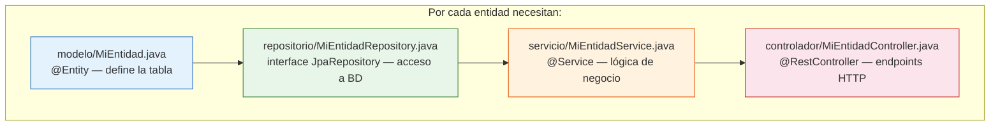
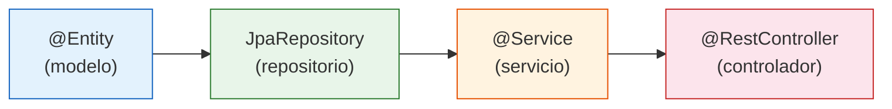
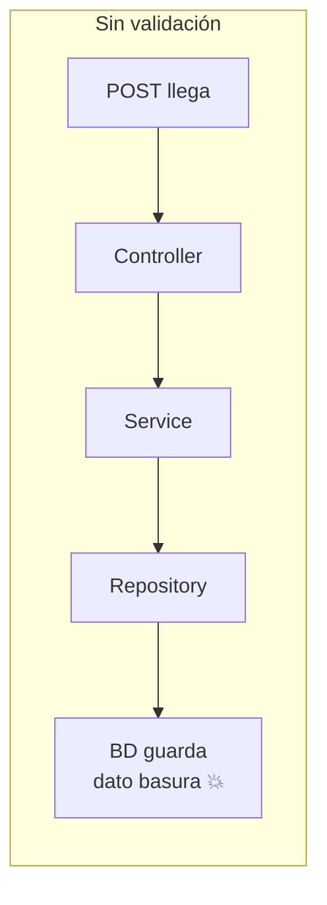
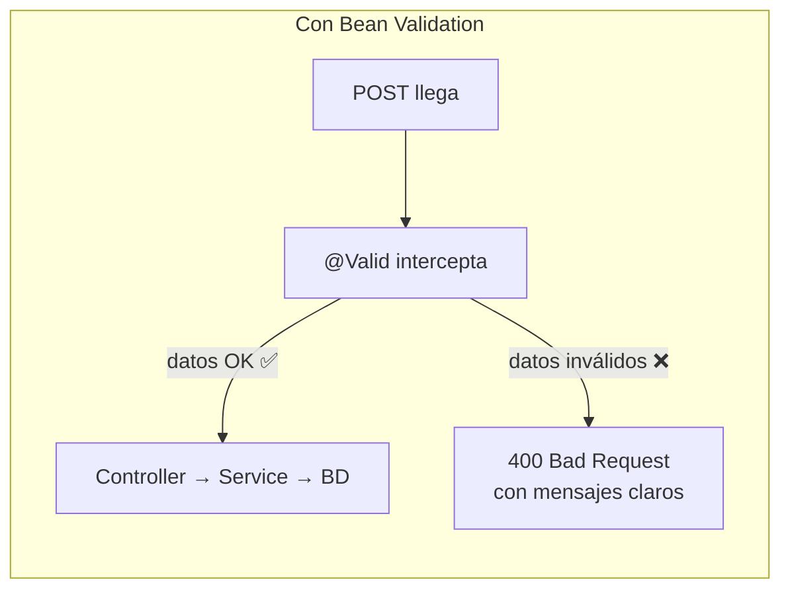
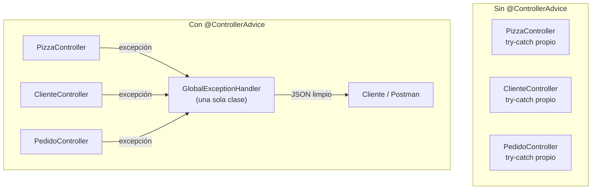
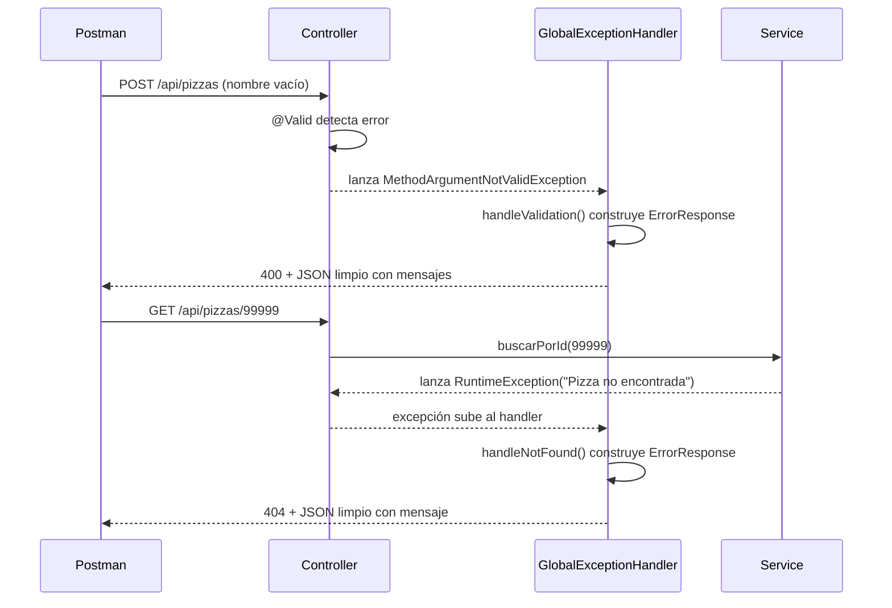
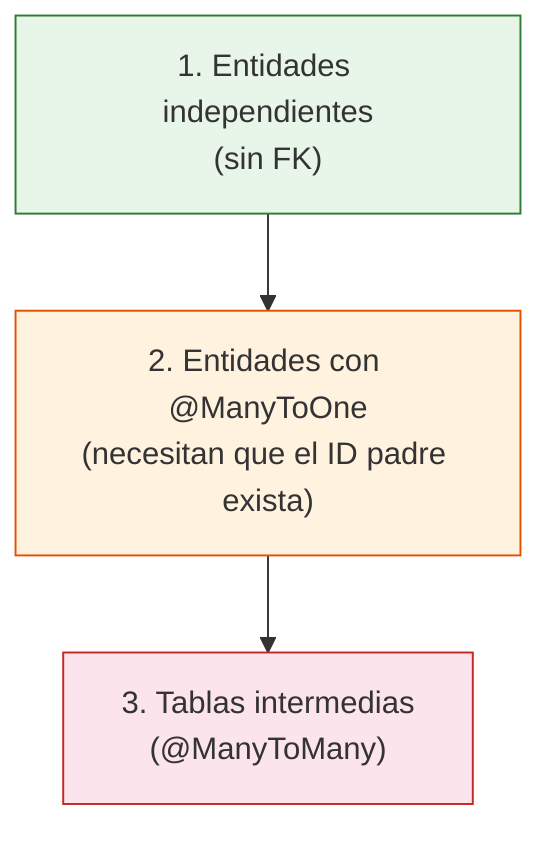
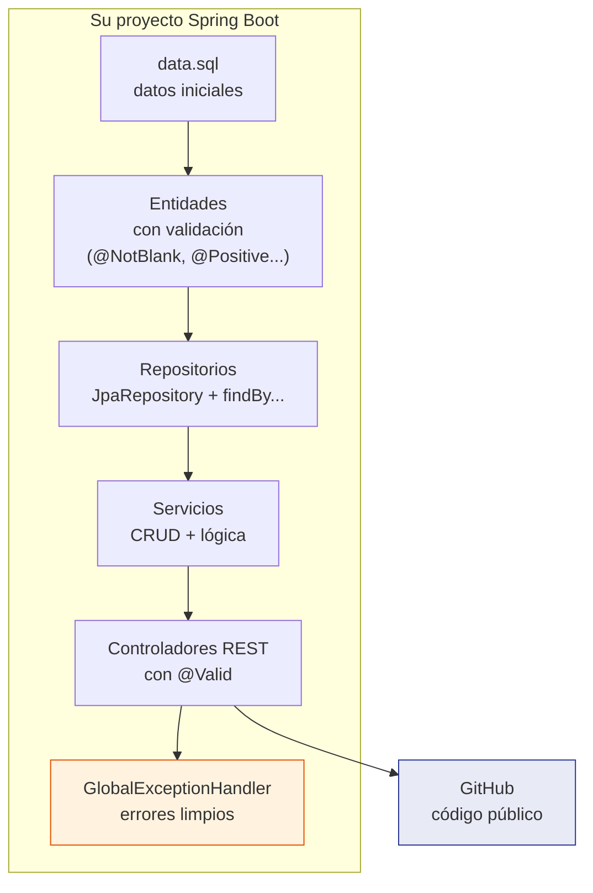
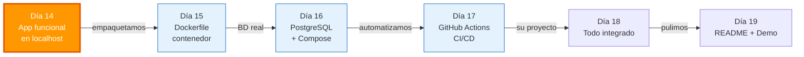

# Día 14: De "Funciona" a "Es Profesional" — Subiendo el Nivel de su Proyecto

Ayer eligieron un blueprint, diseñaron entidades en papel, crearon el proyecto Spring Boot y dejaron al menos un CRUD funcionando. Hoy no aprenden tecnología nueva — hoy aplican criterio profesional a lo que ya tienen.

Prof. Juan Marcelo Gutierrez Miranda

**Curso IFCD0014 — Semana 3, Día 14**
**Objetivo:** Completar todos los CRUDs de su proyecto, agregar validación de datos, manejo global de errores, datos iniciales y subir a GitHub.

> Que la aplicación "funcione" es el mínimo. Hoy la convierten en algo que no les daría vergüenza mostrar en una entrevista. Y esto no es el final del camino — miren dónde están:

---

## El mapa completo: están en la mitad

Hay una tentación natural cuando ya tienes endpoints funcionando y Postman devuelve JSON: pensar que terminaste. No terminaron. Miren el panorama completo:

```mermaid
graph LR
    subgraph "✅ Ya lo saben"
        D9["Día 9<br/>Hibernate puro"]
        D10["Día 10<br/>Relaciones JPA"]
        D11["Día 11<br/>Spring Boot intro"]
        D12["Día 12<br/>Pizzería REST"]
        D13["Día 13<br/>Proyecto propio"]
    end

    subgraph "📍 HOY"
        D14["<strong>Día 14</strong><br/>Validación + Errores<br/>+ GitHub"]
    end

    subgraph "🔜 Lo que falta"
        D15["Día 15<br/>Docker"]
        D16["Día 16<br/>PostgreSQL<br/>+ Compose"]
        D17["Día 17<br/>CI/CD<br/>GitHub Actions"]
        D18["Día 18<br/>Proyecto<br/>dockerizado"]
        D19["Día 19<br/>Pulir + README"]
        D20["Día 20<br/>🎤 Demo Day"]
    end

    D9 --> D10 --> D11 --> D12 --> D13 --> D14
    D14 --> D15 --> D16 --> D17 --> D18 --> D19 --> D20

    style D14 fill:#ff9800,stroke:#e65100,color:#fff,stroke-width:3px
    style D20 fill:#4caf50,stroke:#2e7d32,color:#fff,stroke-width:2px
```



Después de hoy les quedan **5 días completos** donde van a:

| Día | Qué van a aprender | Por qué importa |
|-----|-------------------|-----------------|
| 15 | **Docker** — meter su app en un contenedor | "Funciona en mi máquina" deja de ser excusa |
| 16 | **PostgreSQL + Docker Compose** — base de datos real | H2 es para desarrollo. En producción se usa PostgreSQL |
| 17 | **GitHub Actions** — CI/CD automático | Cada push compila, testea y empaqueta solo |
| 18 | **Integración completa** — su proyecto dockerizado | App + BD + pipeline, todo junto |
| 19 | **Pulir y preparar presentación** | README profesional, demo ensayada |
| 20 | **Demo Day** — presentan su proyecto en vivo | 5-7 minutos + preguntas, como en una entrevista real |

Así que no, hoy no terminamos el curso. Hoy terminan la **aplicación Java**. A partir del día 15, la empaquetan y la despliegan como se hace en el mundo real.

---

# Nivel 0 — Checkpoint: ¿dónde quedaron ayer?

Antes de seguir, necesitan saber exactamente en qué punto está su proyecto. Abran IntelliJ, arranquen la aplicación y respondan:

```
¿Arranca sin errores?                          → Si no arranca, esa es la prioridad
¿Tienen al menos 3 entidades con @Entity?       → Si no, completar entidades primero
¿Al menos 1 Controller con CRUD responde?       → Si no, terminar ese Controller
¿data.sql carga datos?                          → Si no, no pasa nada, lo hacemos hoy
```

Si la aplicación **no arranca**, levanten la mano. No avancen con validación sobre algo roto — primero que arranque, después se mejora. Los errores más comunes del día 13 fueron:

| Error | Causa probable | Solución |
|-------|---------------|----------|
| `Failed to configure DataSource` | Falta dependencia H2 en pom.xml | Agregar `spring-boot-starter-data-jpa` y `h2` |
| `Not a managed type` | La entidad no tiene `@Entity` o está en otro paquete | Verificar que esté en subpaquete del `@SpringBootApplication` |
| `Table not found` en data.sql | Nombre de tabla no coincide con `@Table` | Los nombres en data.sql van en snake_case y deben coincidir |
| Lombok no funciona | Annotation processing desactivado | Settings → Build → Compiler → Enable annotation processing |

Si todo arranca y responde en Postman — perfecto, están listos para subir de nivel.

---

# Guía de arquitectura: cuántos archivos, qué va en cada uno, cómo se nombran

Antes de crear nada, necesitan tener claro cómo se organiza un proyecto Spring Boot. Esto no es opinión — es el estándar que sigue el 90% de la industria.

## Archivos por entidad

Cada entidad de su dominio necesita exactamente **4 archivos** en 4 paquetes distintos:



Si su proyecto tiene 4 entidades, necesitan **16 archivos Java** (4 × 4) más los enums y las clases de soporte (ErrorResponse, GlobalExceptionHandler). Parece mucho, pero el 80% es copiar el patrón del primero y cambiar nombres.

## Convención de nombres

| Paquete | Clase | Ejemplo (entidad Mascota) |
|---------|-------|--------------------------|
| `modelo/` | Nombre de la entidad en singular | `Mascota.java` |
| `modelo/` | Enums aparte, en singular | `Especie.java`, `TipoCliente.java` |
| `repositorio/` | Entidad + `Repository` | `MascotaRepository.java` |
| `servicio/` | Entidad + `Service` | `MascotaService.java` |
| `controlador/` | Entidad + `Controller` | `MascotaController.java` |

Los nombres van en **singular** (`MascotaController`, no `MascotasController`). La tabla en la BD va en **plural** con `@Table(name = "mascotas")`. Los endpoints van en **plural** (`/api/mascotas`). Esta convención es la más extendida en Spring Boot.

## Qué va en cada capa y qué NO va

| Capa | Lo que SÍ va | Lo que NO va |
|------|-------------|-------------|
| **Entity** (modelo) | Campos, anotaciones JPA (`@Entity`, `@Column`, `@ManyToOne`), validación (`@NotBlank`, `@Positive`), Lombok (`@Data`) | Lógica de negocio, consultas a BD, nada de HTTP |
| **Repository** (repositorio) | Interfaz que extiende `JpaRepository`, métodos `findBy...` | Implementación (Spring la genera sola), lógica de negocio |
| **Service** (servicio) | Lógica de negocio, `@Transactional`, llamadas al Repository, cálculos, verificaciones | Anotaciones HTTP (`@GetMapping`), nada de `ResponseEntity` |
| **Controller** (controlador) | `@RestController`, `@GetMapping`/`@PostMapping`, `@Valid`, `ResponseEntity`, rutas HTTP | Lógica de negocio compleja, consultas directas a BD |

La regla es: **el Controller traduce HTTP a Java, el Service tiene la lógica, el Repository habla con la BD**. Si ponen lógica de negocio en el Controller o consultas SQL en el Service, están mezclando responsabilidades.

## Cuántos endpoints por controlador

Mínimo 6, siguiendo el patrón REST estándar:

| # | Método HTTP | Ruta | Qué hace | ¿Siempre? |
|---|-------------|------|----------|-----------|
| 1 | GET | `/api/entidad` | Listar todos | Siempre |
| 2 | GET | `/api/entidad/{id}` | Buscar por id | Siempre |
| 3 | POST | `/api/entidad` | Crear nuevo | Siempre |
| 4 | PUT | `/api/entidad/{id}` | Actualizar | Casi siempre (ver tabla de decisiones abajo) |
| 5 | DELETE | `/api/entidad/{id}` | Eliminar | Siempre |
| 6 | GET | `/api/entidad/filtro/...` | Búsqueda personalizada | Al menos 1 por entidad principal |

## ¿Qué entidades necesitan PUT (actualizar)?

No todas. La pregunta es: ¿tiene sentido de negocio editar este registro después de crearlo?

| Entidad típica | ¿PUT? | Por qué |
|---------------|-------|---------|
| Pizza, Producto, Plato, Libro | Sí | El precio cambia, el nombre se corrige, el stock se actualiza |
| Cliente, Paciente, Jugador, Socio | Sí | El teléfono cambia, la dirección se actualiza |
| Pedido, Entrada, Venta | No | Un pedido se crea o se cancela (DELETE), no se edita |
| Reserva, Cita | Sí | Se puede cambiar la fecha o la hora |
| Consulta, Sesión, Partido | Depende | Si es futuro sí (reprogramar), si ya pasó no |

## ¿Qué anotación de validación para cada tipo de campo?

| Tipo de campo | Ejemplo en sus blueprints | Anotación recomendada |
|--------------|--------------------------|----------------------|
| Nombre, título, motivo (String obligatorio) | `nombre`, `titulo`, `motivo` | `@NotBlank` + `@Size(min = 2, max = 100)` |
| String opcional | `telefono`, `observaciones` | Solo `@Size(max = 200)` si quieren limitar longitud |
| Email | `email` | `@Email` + `@NotBlank` si es obligatorio |
| Precio, coste, importe | `precio`, `total` | `@Positive` (mayor que 0) |
| Cantidad, stock, aforo | `cantidad`, `plazas` | `@Min(0)` o `@PositiveOrZero` |
| Enum obligatorio | `categoria`, `tipoCliente`, `estado` | `@NotNull` (los enums no son Strings → `@NotBlank` no funciona) |
| Fecha pasada | `fechaNacimiento`, `fechaIngreso` | `@PastOrPresent` + `@NotNull` |
| Fecha futura | `fechaReserva`, `fechaCita` | `@Future` + `@NotNull` |
| Relación @ManyToOne obligatoria | `cliente`, `sala`, `veterinario` | `@NotNull` |
| Relación @ManyToOne opcional | `supervisor`, `referido` | No poner nada |
| Relación @ManyToMany | `pizzas`, `medicamentos` | Casi nunca obligatoria al crear → no validar |

> **Regla general:** validar es pensar qué datos necesita el negocio para funcionar, no poner anotaciones en todos lados. Si un campo puede estar vacío sin que eso sea un error, no lo validen.

## ¿findBy... para qué filtros?

Piensen: "¿qué le preguntaría el dueño del negocio a la aplicación?" Eso es un endpoint personalizado.

| Pregunta de negocio | Endpoint REST | Método del Repository |
|---------------------|--------------|----------------------|
| "¿Qué películas hay de acción?" | `GET /api/peliculas/genero/ACCION` | `findByGenero(Genero)` |
| "¿Qué pedidos hizo este cliente?" | `GET /api/pedidos/cliente/3` | `findByClienteId(Long)` |
| "¿Qué reservas hay para mañana?" | `GET /api/reservas/fecha?fecha=2026-03-14` | `findByFecha(LocalDate)` |
| "¿Qué productos cuestan menos de 20€?" | `GET /api/productos/baratos?max=20` | `findByPrecioLessThan(double)` |
| "¿Quién se llama García?" | `GET /api/clientes/buscar?nombre=garcia` | `findByNombreContainingIgnoreCase(String)` |
| "¿Qué mesas están libres?" | `GET /api/mesas/estado/LIBRE` | `findByEstado(EstadoMesa)` |

## El ErrorResponse y GlobalExceptionHandler: una sola vez para todo el proyecto

Estos 2 archivos se crean en el paquete `controlador/` y **no se duplican por entidad**. Son globales — se escriben una vez y cubren todos los controladores automáticamente:

| Archivo | Cantidad | Dónde va |
|---------|----------|----------|
| Entity, Repository, Service, Controller | 1 por entidad | Cada uno en su paquete |
| Enums | 1 por enum | `modelo/` |
| `ErrorResponse.java` | **1 solo** para todo el proyecto | `controlador/` |
| `GlobalExceptionHandler.java` | **1 solo** para todo el proyecto | `controlador/` |

---

# Nivel 1 — Completar los CRUDs que faltan

Ayer implementaron el CRUD de su entidad principal. Hoy completan **todas** las entidades. El patrón es siempre el mismo que usaron en el día 12 con la Pizzería:



**Para cada entidad** de su proyecto, necesitan esos 4 archivos. Si tienen 4 entidades, son 16 archivos (4 x 4). Parece mucho, pero el 80% es copiar el patrón y cambiar nombres.

## Endpoints mínimos por controlador

Cada controlador debe exponer al menos estos endpoints — exactamente como hicimos con `PizzaController` en el día 12:

| Método | Ruta | Qué hace | Código HTTP |
|--------|------|----------|-------------|
| GET | `/api/entidad` | Listar todos | 200 OK |
| GET | `/api/entidad/{id}` | Buscar por id | 200 o 404 |
| POST | `/api/entidad` | Crear nuevo | 201 Created |
| PUT | `/api/entidad/{id}` | Actualizar | 200 o 404 |
| DELETE | `/api/entidad/{id}` | Eliminar | 204 o 404 |
| GET | `/api/entidad/filtro/...` | Búsqueda personalizada | 200 |

El último endpoint es el que usa los métodos `findBy...` del repositorio. Recuerden del día 12: en la Pizzería teníamos `findByCategoria` y `findByPrecioLessThan`. Ustedes necesitan al menos uno por entidad principal. Ejemplos según blueprints:

```
GET /api/peliculas/genero/ACCION           → findByGenero(Genero.ACCION)
GET /api/animales/instalacion/3            → findByInstalacionId(3L)
GET /api/productos/baratos?max=20          → findByPrecioLessThan(20.0)
GET /api/reservas/fecha?desde=2026-03-01   → findByFechaAfter(LocalDate.parse("2026-03-01"))
```

En la práctica, nadie escribe cada Controller desde cero. Se toma el primero que funciona, se duplica el archivo y se reemplazan nombres. Es literalmente copiar y pegar con criterio — y es así como se trabaja en equipos reales cuando hay que crear varios CRUDs con el mismo patrón.

---

# Nivel 2 — Validación: "Nunca confíes en lo que te manda el frontend"

## ¿Qué es Bean Validation y de dónde sale?

Bean Validation es una **especificación de Java** (JSR-380) que define un conjunto estándar de anotaciones para validar datos. No es exclusiva de Spring — existe desde Java EE y funciona en cualquier aplicación Java. Spring Boot simplemente la integra en su flujo de peticiones HTTP.

La idea es declarativa: en vez de escribir `if (nombre == null || nombre.isEmpty())` en cada método de cada servicio, se pone `@NotBlank` una vez en el atributo de la entidad y el framework se encarga del resto. Menos código repetido, menos errores, más consistencia.





La validación ocurre **antes** de que el código del Controller se ejecute. Si los datos no pasan, Spring ni siquiera llama al método — devuelve el error directamente. Esto es importante: la lógica de negocio del Service nunca trabaja con datos inválidos.

## ¿Cuándo se usa?

Siempre que una entidad recibe datos **desde fuera** de la aplicación: peticiones HTTP (POST, PUT), formularios web, mensajes de colas, archivos importados. Si el dato lo genera el propio sistema (un id autogenerado, un timestamp), no necesita validación de entrada.

En la práctica, todo proyecto Spring Boot profesional tiene validación. No es opcional — es una de las primeras cosas que se configura.

## ¿Por qué el frontend no es suficiente?

Ahora mismo, si alguien envía un POST con el nombre vacío o un precio negativo, la aplicación lo guarda sin pestañear. "Pero el formulario del frontend ya valida eso" — sí, y el usuario puede saltarse ese formulario usando Postman, curl, o cualquier cliente HTTP. El frontend valida para **mejorar la experiencia del usuario** (mostrar mensajes bonitos sin recargar la página). El backend valida para **proteger los datos**. Son dos cosas distintas y se necesitan las dos.

## Paso 1: Agregar la dependencia

En el `pom.xml`, dentro de `<dependencies>`:

```xml
<dependency>
    <groupId>org.springframework.boot</groupId>
    <artifactId>spring-boot-starter-validation</artifactId>
</dependency>
```

Recarguen Maven (`Ctrl + Shift + O` en IntelliJ o el icono del elefante).

## Paso 2: Anotar las entidades

Les muestro con la `Pizza` de la Pizzería que todos conocen. Así está ahora (día 12):

```java
@Entity
@Table(name = "pizzas")
@Data
@NoArgsConstructor
@AllArgsConstructor
public class Pizza {
    @Id
    @GeneratedValue(strategy = GenerationType.IDENTITY)
    private Long id;

    @Column(nullable = false)
    private String nombre;

    @Column(nullable = false)
    private double precio;

    @Enumerated(EnumType.STRING)
    @Column(nullable = false)
    private Categoria categoria;
}
```

Y así queda con validación:

```java
import jakarta.validation.constraints.*;

@Entity
@Table(name = "pizzas")
@Data
@NoArgsConstructor
@AllArgsConstructor
public class Pizza {
    @Id
    @GeneratedValue(strategy = GenerationType.IDENTITY)
    private Long id;

    @NotBlank(message = "El nombre de la pizza es obligatorio")
    @Size(min = 2, max = 100, message = "El nombre debe tener entre 2 y 100 caracteres")
    @Column(nullable = false)
    private String nombre;

    @Positive(message = "El precio debe ser mayor que 0")
    @Column(nullable = false)
    private double precio;

    @NotNull(message = "La categoria es obligatoria")
    @Enumerated(EnumType.STRING)
    @Column(nullable = false)
    private Categoria categoria;
}
```

¿Qué cambió? Tres anotaciones, tres mensajes claros. Eso es todo. La base de datos ya tenía `nullable = false`, pero eso lanza un error SQL feo. Con Bean Validation, el error se captura **antes** de llegar a la base de datos y el mensaje es legible para el usuario.

## Las anotaciones que van a usar

No necesitan memorizarlas — necesitan saber que existen y buscar la que les haga falta:

| Tipo de dato | Anotaciones útiles | Ejemplo |
|-------------|-------------------|---------|
| **String** | `@NotBlank`, `@Size(min, max)`, `@Email`, `@Pattern(regexp)` | `@NotBlank @Size(max = 100)` |
| **Números** | `@NotNull`, `@Min`, `@Max`, `@Positive`, `@PositiveOrZero` | `@Positive` para precios |
| **Fechas** | `@Past`, `@Future`, `@PastOrPresent` | `@PastOrPresent` para fecha de nacimiento |
| **Enums** | `@NotNull` | `@NotNull` para categorías obligatorias |
| **Relaciones** | `@NotNull` | `@NotNull` en el `@ManyToOne` si la FK es obligatoria |

Todas aceptan `message = "texto personalizado"`. **Siempre pongan mensaje** — el mensaje por defecto está en inglés y no le dice nada útil al cliente de su API.

> **Diferencia entre `@NotNull` y `@NotBlank`:** `@NotNull` solo comprueba que no sea null. `@NotBlank` comprueba que no sea null, no esté vacío y no sea solo espacios en blanco. Para Strings, usen `@NotBlank`. Para todo lo demás, `@NotNull`.

## Paso 3: Activar la validación en el controlador

Agregar las anotaciones en la entidad **no hace nada** si el controlador no las activa. Necesitan `@Valid` antes de `@RequestBody` en los métodos POST y PUT.

Así estaba el `crear` de `PizzaController` en el día 12:

```java
@PostMapping
public ResponseEntity<Pizza> crear(@RequestBody Pizza pizza) {
    Pizza nueva = pizzaService.crear(pizza);
    return ResponseEntity.status(HttpStatus.CREATED).body(nueva);
}
```

Y así queda con validación activada:

```java
import jakarta.validation.Valid;

@PostMapping
public ResponseEntity<Pizza> crear(@Valid @RequestBody Pizza pizza) {
    Pizza nueva = pizzaService.crear(pizza);
    return ResponseEntity.status(HttpStatus.CREATED).body(nueva);
}
```

Un `@Valid`. Eso es todo. Spring intercepta la petición, valida el objeto contra las anotaciones, y si algo falla devuelve automáticamente un `400 Bad Request` antes de que el código del Service se ejecute.

Hagan lo mismo en el `@PutMapping`:

```java
@PutMapping("/{id}")
public ResponseEntity<Pizza> actualizar(
        @PathVariable Long id, @Valid @RequestBody Pizza pizza) {
    try {
        Pizza actualizada = pizzaService.actualizar(id, pizza);
        return ResponseEntity.ok(actualizada);
    } catch (RuntimeException e) {
        return ResponseEntity.notFound().build();
    }
}
```

## Paso 4: Probarlo en Postman

Envíen este POST a su endpoint con datos inválidos:

```json
{
    "nombre": "",
    "precio": -5,
    "categoria": null
}
```

Deben recibir un `400 Bad Request`. El formato del error por defecto es un poco verboso pero funcional. En el siguiente nivel lo mejoramos.

**Apliquen esto a TODAS las entidades de su proyecto** antes de pasar al siguiente nivel. Cada entidad debe tener al menos 2-3 validaciones con mensajes en español.

---

# Nivel 3 — Manejo de errores: "No le muestres tus tripas al cliente"

## ¿Qué es @ControllerAdvice y por qué existe?

En cualquier aplicación, las cosas van a fallar: un id que no existe, un JSON mal formado, una base de datos que no responde. La pregunta no es si van a fallar, sino **cómo comunica la aplicación ese fallo al cliente**.

Sin un manejo centralizado, cada controlador necesita sus propios try-catch, cada método repite la misma lógica de construir respuestas de error, y si un día deciden cambiar el formato del error tienen que tocarlo en 20 sitios.

Spring resuelve esto con el patrón **AOP (Aspect-Oriented Programming)** aplicado a los controladores. `@RestControllerAdvice` es una clase que se sienta "por encima" de todos los controladores y **intercepta las excepciones** antes de que lleguen al cliente. Es un filtro global — se escribe una vez y aplica a toda la aplicación.



Esto es un patrón que van a ver en el 100% de las aplicaciones Spring Boot en producción. No es algo opcional ni avanzado — es infraestructura básica.

## ¿Cuándo se usa?

Siempre. Desde el momento en que una aplicación tiene más de un controlador, centralizar el manejo de errores ahorra código y garantiza que **todas** las respuestas de error tengan el mismo formato. Al cliente de la API (sea un frontend, una app móvil o otro servicio) le da igual si el error vino de PizzaController o de PedidoController — espera siempre la misma estructura JSON.

## El problema concreto

Prueben esto en Postman: hagan un GET a un id que no existe (`/api/pizzas/99999`). Reciben un `404` limpio. Bien. Ahora envíen un POST con un JSON mal formado (quiten una coma). Reciben... un volcado de 50 líneas con nombres de clases internas de Spring, rutas de archivos del servidor, y la versión de Java.

Eso en producción es un problema de seguridad. Le estás diciendo a cualquiera qué framework usas, qué versión, y la estructura interna de tus clases. Y al usuario legítimo le estás mostrando un mensaje incomprensible.

La solución es exactamente lo que acabamos de explicar: un **GlobalExceptionHandler** con `@RestControllerAdvice`.

## Paso 1: Clase para las respuestas de error

Creen esta clase en el paquete `controlador` de su proyecto:

```java
package com.miproyecto.controlador;

import lombok.AllArgsConstructor;
import lombok.Data;
import java.time.LocalDateTime;
import java.util.List;

@Data
@AllArgsConstructor
public class ErrorResponse {
    private LocalDateTime timestamp;
    private int status;
    private String error;
    private List<String> mensajes;
}
```

Es un POJO simple. Cuando Spring la convierta a JSON, el cliente recibirá algo así:

```json
{
    "timestamp": "2026-03-13T10:30:00",
    "status": 400,
    "error": "Error de validacion",
    "mensajes": [
        "nombre: El nombre de la pizza es obligatorio",
        "precio: El precio debe ser mayor que 0"
    ]
}
```

Limpio, legible, útil. Eso es lo que debe devolver una API profesional.

## Paso 2: El GlobalExceptionHandler

```java
package com.miproyecto.controlador;

import org.springframework.http.HttpStatus;
import org.springframework.http.ResponseEntity;
import org.springframework.web.bind.MethodArgumentNotValidException;
import org.springframework.web.bind.annotation.ExceptionHandler;
import org.springframework.web.bind.annotation.RestControllerAdvice;

import java.time.LocalDateTime;
import java.util.List;

@RestControllerAdvice
public class GlobalExceptionHandler {

    // Errores de validacion (@Valid falla)
    @ExceptionHandler(MethodArgumentNotValidException.class)
    public ResponseEntity<ErrorResponse> handleValidation(
            MethodArgumentNotValidException ex) {

        List<String> errores = ex.getBindingResult()
                .getFieldErrors()
                .stream()
                .map(error -> error.getField() + ": " + error.getDefaultMessage())
                .toList();

        ErrorResponse response = new ErrorResponse(
                LocalDateTime.now(),
                HttpStatus.BAD_REQUEST.value(),
                "Error de validacion",
                errores
        );

        return ResponseEntity.badRequest().body(response);
    }

    // Entidad no encontrada (las RuntimeException de los Service)
    @ExceptionHandler(RuntimeException.class)
    public ResponseEntity<ErrorResponse> handleNotFound(RuntimeException ex) {

        ErrorResponse response = new ErrorResponse(
                LocalDateTime.now(),
                HttpStatus.NOT_FOUND.value(),
                "No encontrado",
                List.of(ex.getMessage())
        );

        return ResponseEntity.status(HttpStatus.NOT_FOUND).body(response);
    }

    // Cualquier otro error inesperado
    @ExceptionHandler(Exception.class)
    public ResponseEntity<ErrorResponse> handleGeneral(Exception ex) {

        ErrorResponse response = new ErrorResponse(
                LocalDateTime.now(),
                HttpStatus.INTERNAL_SERVER_ERROR.value(),
                "Error interno del servidor",
                List.of("Ocurrio un error inesperado")
        );

        return ResponseEntity.status(HttpStatus.INTERNAL_SERVER_ERROR).body(response);
    }
}
```

### ¿Qué está pasando aquí?



Tres cosas importantes:

- **`@RestControllerAdvice`** intercepta excepciones de **todos** los controladores. No necesitan try-catch en cada método.
- **`@ExceptionHandler`** define qué tipo de excepción maneja cada método. Spring elige el más específico.
- **El método `handleGeneral`** es la red de seguridad: si algo inesperado explota, el cliente recibe un 500 genérico sin stack traces. Nunca revelen errores internos.

Creen estos dos archivos (`ErrorResponse.java` y `GlobalExceptionHandler.java`) en el paquete `controlador` de su proyecto. No necesitan tocar ningún otro archivo — Spring los detecta automáticamente.

## Paso 3: Verificar en Postman

Ahora repitan las pruebas:

| Prueba | Antes | Después |
|--------|-------|---------|
| POST con nombre vacío | 400 con stack trace | 400 con `"nombre: El nombre es obligatorio"` |
| GET con id inexistente | 404 o 500 con stack trace | 404 con `"Pizza no encontrada"` |
| POST con JSON roto | 500 con volcado de Spring | 500 con `"Error inesperado"` |

Si los tres casos devuelven JSON limpio, el handler funciona.

---

# Nivel 4 — Datos iniciales y testing manual

Una aplicación que arranca vacía es una aplicación difícil de probar y difícil de demostrar. Cuando el día 20 lleguen a presentar su proyecto y hagan un GET que devuelve `[]` vacío, van a tener que crear datos en vivo con POST delante de toda la clase. Eso es nervios innecesarios.

## data.sql: que la app arranque con datos

Creen (o completen) el archivo `src/main/resources/data.sql`. Las reglas son las mismas que vimos en el día 12 con la Pizzería:

**Orden de inserción:** primero las entidades que NO dependen de nadie, después las que tienen `@ManyToOne` (necesitan que el id de la otra ya exista), y al final las tablas intermedias de `@ManyToMany`.



Ejemplo con la estructura de la Pizzería para que lo vean concreto:

```sql
-- 1. Entidades independientes
INSERT INTO pizzas (nombre, precio, categoria) VALUES ('Margarita', 8.50, 'CLASICA');
INSERT INTO pizzas (nombre, precio, categoria) VALUES ('Pepperoni', 10.00, 'CLASICA');
INSERT INTO pizzas (nombre, precio, categoria) VALUES ('Trufa Negra', 18.50, 'PREMIUM');

INSERT INTO clientes (nombre, telefono, tipo_cliente) VALUES ('Maria Garcia', '612345678', 'VIP');
INSERT INTO clientes (nombre, telefono, tipo_cliente) VALUES ('Carlos Lopez', '698765432', 'NORMAL');

-- 2. Entidades con FK (pedidos necesitan que el cliente exista)
INSERT INTO pedidos (fecha, total, cliente_id) VALUES (CURRENT_TIMESTAMP, 27.00, 1);
INSERT INTO pedidos (fecha, total, cliente_id) VALUES (CURRENT_TIMESTAMP, 10.00, 2);

-- 3. Tablas intermedias ManyToMany (pedido_pizzas necesita que pedido y pizza existan)
INSERT INTO pedido_pizzas (pedido_id, pizza_id) VALUES (1, 1);
INSERT INTO pedido_pizzas (pedido_id, pizza_id) VALUES (1, 3);
INSERT INTO pedido_pizzas (pedido_id, pizza_id) VALUES (2, 2);
```

**Adapten esto a sus entidades.** Pongan al menos **5-10 registros** por entidad principal. Cuantos más datos tengan, más fácil es probar filtros y búsquedas, y más impresionante queda la demo.

### Recordatorio: la property que activa data.sql

En `application.properties` deben tener:

```properties
spring.jpa.defer-datasource-initialization=true
```

Sin esa línea, Spring intenta ejecutar `data.sql` antes de crear las tablas y falla. Lo vimos en el día 12.

### Columnas en snake_case

Los nombres de columna en `data.sql` van en **snake_case** (con guiones bajos), no en camelCase. Spring convierte automáticamente:

| En Java (camelCase) | En la tabla (snake_case) |
|--------------------|------------------------|
| `fechaNacimiento` | `fecha_nacimiento` |
| `tipoCliente` | `tipo_cliente` |
| `precioUnitario` | `precio_unitario` |

Si ponen `fechaNacimiento` en el INSERT, H2 no encuentra la columna. Usen `fecha_nacimiento`.

## Ronda de testing manual con Postman

Con los datos cargados, abran Postman y prueben **todos** los endpoints de **todas** las entidades:

```
Para cada entidad:
  ✓ GET /api/entidad              → devuelve la lista con datos del data.sql
  ✓ GET /api/entidad/1            → devuelve 1 registro
  ✓ GET /api/entidad/99999        → devuelve 404 con JSON limpio
  ✓ POST /api/entidad (válido)    → crea y devuelve 201
  ✓ POST /api/entidad (inválido)  → devuelve 400 con mensajes de validación
  ✓ PUT /api/entidad/1            → actualiza y devuelve 200
  ✓ DELETE /api/entidad/1         → devuelve 204
  ✓ GET /api/entidad/filtro/...   → devuelve resultados filtrados
```

Si algún endpoint falla, corríjanlo ahora. Es mucho más fácil arreglar un error hoy con la app fresca en la cabeza que la semana que viene cuando estén metidos en Docker.

---

# Nivel 5 — GitHub: su carta de presentación

Este proyecto va a estar en su perfil de GitHub público. Cuando en una entrevista les pregunten "¿tienes algo de código para enseñarme?", van a pasar este enlace. Así que importa cómo se ve.

## Paso 1: El .gitignore

Antes de hacer ningún commit, creen el `.gitignore` en la **raíz del proyecto** (al mismo nivel que el `pom.xml`):

```
# Compilación
target/
*.class

# IntelliJ IDEA
.idea/
*.iml
out/

# VS Code
.vscode/

# Sistema
.DS_Store
*.log
Thumbs.db

# Secretos (nunca subir)
.env
```

Este archivo evita que suban basura al repositorio: archivos compilados, configuración del IDE, logs. Si el entrevistador ve una carpeta `.idea/` en su repo, sabe que el candidato no entiende `.gitignore`. Es una señal pequeña pero importa.

## Paso 2: Inicializar y subir

Si ayer ya crearon el repo en GitHub siguiendo la [guía de portfolio](https://todoeconometria.github.io/curso-spring-hibernate/git-github/crear-repo-portfolio/), solo necesitan hacer commit y push de lo nuevo:

```bash
git add .
git commit -m "API REST completa: validacion, manejo de errores, datos iniciales"
git push
```

Si todavía **no tienen repo en GitHub**, sigan estos pasos:

```bash
cd mi-proyecto/
git init
git add .
git commit -m "Proyecto inicial: API REST con Spring Boot, JPA, validacion y error handling"
```

En GitHub: **New repository** → nombre del proyecto → **NO** marcar "Initialize with README" → Create. Luego copien las instrucciones que GitHub les da:

```bash
git remote add origin https://github.com/SU_USUARIO/SU_PROYECTO.git
git branch -M main
git push -u origin main
```

Verifiquen en GitHub que ven: archivos Java, `pom.xml`, `application.properties`, `data.sql`, y **no** ven: `target/`, `.idea/`, `.class`.

## ¿Y el README?

Por ahora no se preocupen por el README. El día 19 van a crear uno profesional con badges, descripción, capturas de Postman y todo. Hoy la prioridad es que el código esté subido y funcionando.

---

# Problemas comunes y soluciones

## "Infinite recursion" en el JSON

Esto pasa cuando tienen relaciones **bidireccionales** (`@OneToMany` + `@ManyToOne`). Jackson intenta serializar A → B → A → B → infinito.

**Solución:** `@JsonIgnore` en el lado `@OneToMany`:

```java
// En la entidad "padre" (ej: Dueno, Cliente, Sala...)
@OneToMany(mappedBy = "cliente")
@JsonIgnore
private List<Pedido> pedidos;
```

Si solo tienen `@ManyToOne` (sin el `@OneToMany` inverso), como en la Pizzería, no van a tener este problema.

## Otros errores frecuentes

| Error | Causa | Solución |
|-------|-------|----------|
| `H2 table not found` al arrancar | Nombres en `data.sql` no coinciden con `@Table` | Verificar snake_case y que coincidan exactamente |
| Validation no funciona | Falta dependencia o falta `@Valid` | Verificar `spring-boot-starter-validation` en pom.xml Y `@Valid` antes de `@RequestBody` |
| POST con `@ManyToOne` devuelve null en la relación | Están enviando el objeto completo en vez del id | Enviar solo: `"cliente": { "id": 1 }`, NO el objeto entero |
| `Column "FECHA_NACIMIENTO" not found` en data.sql | Usaron camelCase en el SQL | Usar `fecha_nacimiento` (snake_case) |
| DELETE da error 500 | La entidad tiene hijos con FK | Necesitan borrar los hijos primero, o configurar `cascade` — lo vimos en el día 12 con la Pizzería |

---

# Lo que tienen al final del día



Esto es una aplicación backend real. No es un ejercicio de clase — es un proyecto con validación, manejo de errores, datos de prueba, endpoints organizados y código público en GitHub.

**Pero no es una aplicación lista para producción.** Le faltan piezas que vamos a agregar la próxima semana:



La semana que viene, cuando metan esta aplicación en un contenedor Docker con PostgreSQL y un pipeline de CI/CD, van a entender por qué cada pieza que agregaron hoy importa. La validación evita que datos basura lleguen a PostgreSQL. El error handler evita que los logs de producción se llenen de stack traces. El `data.sql` se convierte en la base para los scripts de migración.

Todo lo que hicieron hoy tiene un "para qué" que van a ver la próxima semana.

---

## Créditos y referencias

Este proyecto ha sido desarrollado siguiendo la metodología y el código base de **Juan Marcelo Gutierrez Miranda** @TodoEconometria.

| | |
|---|---|
| **Autor original** | Prof. Juan Marcelo Gutierrez Miranda |
| **Institución** | @TodoEconometria |
| **Hash de Certificación** | `4e8d9b1a5f6e7c3d2b1a0f9e8d7c6b5a4f3e2d1c0b9a8f7e6d5c4b3a2f1e0d9c` |

*Todos los materiales didácticos, la metodología pedagógica, la estructura del curso, los ejemplos y el código base de este proyecto son producción intelectual de Juan Marcelo Gutierrez Miranda. Queda prohibida su reproducción total o parcial sin la autorización expresa del autor.*
