# Dia 15: Docker — La Pizzeria en un Contenedor

Hoy su pizzeria-spring deja de depender de "lo que hay instalado en mi maquina". Van a empaquetarla con todo lo que necesita para funcionar en cualquier lugar.

Prof. Juan Marcelo Gutierrez Miranda

**Curso IFCD0014 — Semana 4, Dia 15 (Lunes)**
**Objetivo:** Entender que es Docker, instalar Docker Desktop, aprender los comandos basicos, crear un Dockerfile para pizzeria-spring y ejecutarla en un contenedor.

> Este manual es de consulta. Sigan los pasos con Docker Desktop abierto y la terminal lista.
> Recuerden que su pizzeria-spring ya funciona en local (Dia 14) — hoy la vamos a empaquetar para que funcione en **cualquier maquina**.

---

# PARTE I — EL PROBLEMA Y LA SOLUCION

# 1. El Problema: "En mi maquina funciona"

Todos hemos escuchado (o dicho) esta frase. Un companero les pasa su proyecto y no compila. Esto pasa constantemente en el mundo real: alguien desarrolla en su portatil, todo funciona perfecto, y cuando lo pasa a otro equipo o a un servidor... se rompe. No es culpa del codigo, es culpa del **entorno**.

Veamos las causas mas comunes con ejemplos concretos de nuestra pizzeria:

| Situacion | Ejemplo con la Pizzeria |
|-----------|-------------------------|
| Versiones de Java diferentes | Ustedes tienen Java 17, el tiene Java 21 — algunas APIs cambiaron |
| Sistema operativo distinto | Ustedes estan en Windows, el servidor de produccion es Linux |
| Variables de entorno faltantes | Nadie documento que la app necesita `SPRING_PROFILES_ACTIVE=dev` |
| Base de datos distinta | En local usan H2 (en memoria), en produccion PostgreSQL |
| Librerias del SO faltantes | Una dependencia nativa que nadie recuerda haber instalado |

El resultado siempre es el mismo: **funciona en un lugar y no en otro.** Y lo peor es que el error puede ser muy dificil de diagnosticar — a veces la app arranca pero se comporta distinto, o falla en un caso concreto que no probaron en local.

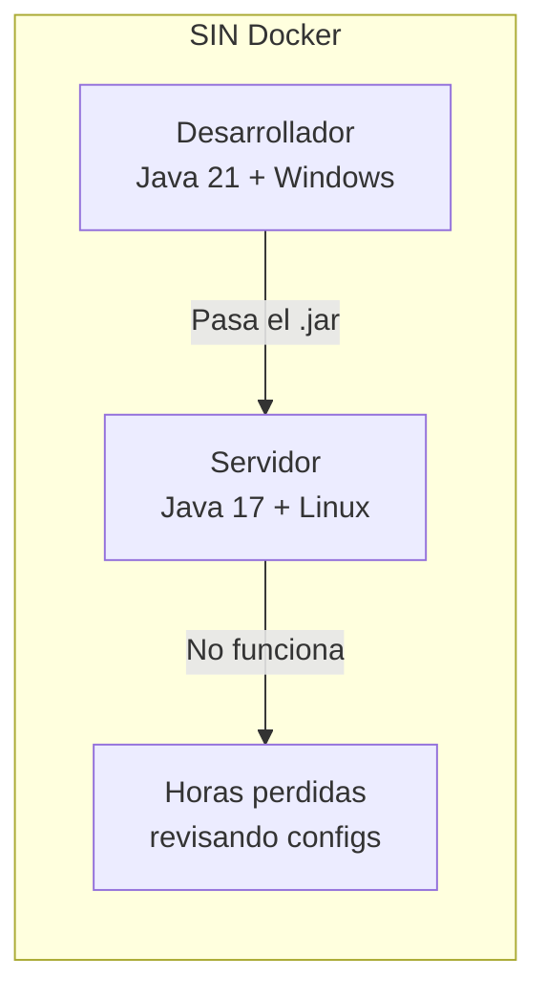

Lo que ven en el diagrama de arriba es el flujo clasico: el desarrollador genera su `.jar` con `mvn package` (como hicieron en el Dia 7), se lo pasa al equipo de operaciones, y alli no funciona porque el servidor tiene otra version de Java, otro sistema operativo, u otra configuracion. El resultado: horas perdidas buscando que es diferente entre las dos maquinas.

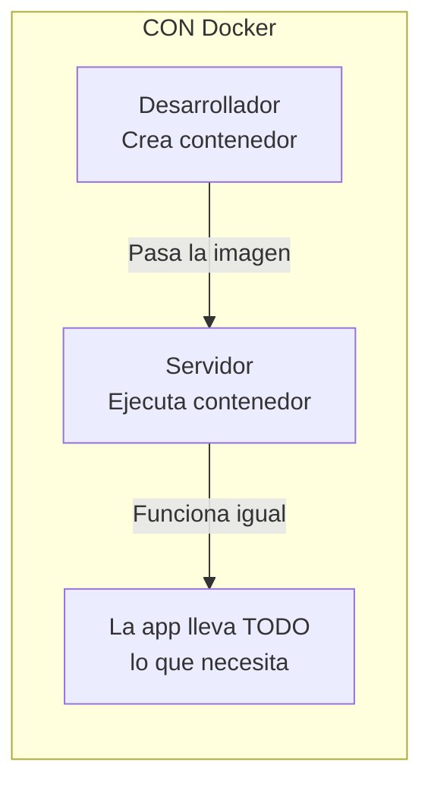

Con Docker el flujo cambia completamente: en vez de pasar un `.jar` suelto, el desarrollador empaqueta la aplicacion **junto con Java, las librerias, y toda la configuracion** en una imagen Docker. Cuando el servidor ejecuta esa imagen, obtiene exactamente el mismo entorno que tenia el desarrollador. No hay sorpresas.

**Docker resuelve esto:** empaqueta la aplicacion + Java + dependencias + configuracion en una "caja" (contenedor) que funciona igual en cualquier maquina. Es como enviar una pizza ya hecha en su caja, en vez de enviar los ingredientes y esperar que la otra persona tenga el mismo horno.

---

# 2. Que es Docker?

## Contenedor vs Maquina Virtual

Antes de Docker, la solucion para el problema de "en mi maquina funciona" era usar maquinas virtuales (VMs). La idea era: si el entorno es el problema, vamos a crear un entorno completo e identico para cada aplicacion. Una VM incluye un sistema operativo completo (Ubuntu, CentOS, etc.), lo cual garantiza que todo sea igual... pero es pesado y lento.

Docker propone otra solucion: en vez de virtualizar un sistema operativo entero, los contenedores **comparten el kernel del sistema operativo del host** (la maquina donde corren) y solo aislan lo que la aplicacion necesita. Es mucho mas ligero.

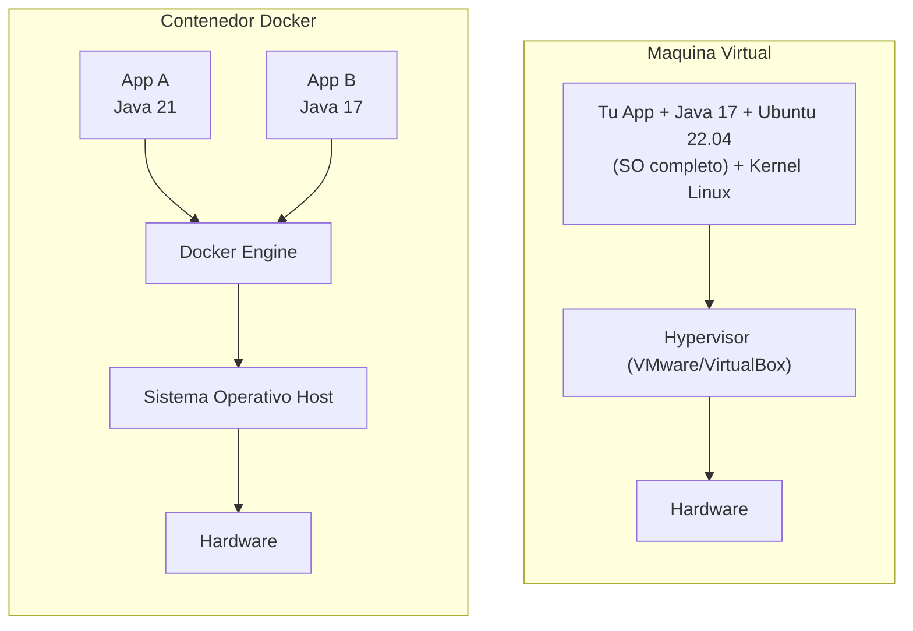

El diagrama de arriba muestra la diferencia clave. A la izquierda, la maquina virtual: cada app necesita su propio sistema operativo completo (Ubuntu, kernel, librerias del SO...), todo virtualizado encima de un hypervisor como VMware. A la derecha, Docker: las dos apps (una con Java 21, otra con Java 17) comparten el Docker Engine y el sistema operativo del host. Cada app solo lleva lo que ella necesita, no un SO entero.

| Caracteristica | Maquina Virtual | Contenedor Docker |
|----------------|:---------------:|:-----------------:|
| **Peso** | 2 – 10 GB | 50 – 400 MB |
| **Arranque** | 1 – 3 minutos | 1 – 3 segundos |
| **RAM** | Reserva fija | Solo lo que usa |
| **SO incluido** | Si (completo) | No (comparte el del host) |
| **Aislamiento** | Total | A nivel de proceso |

Vamos a explicar las dos ultimas filas porque son importantes:

**"SO incluido: Si / No"** — Una maquina virtual incluye un sistema operativo completo dentro de ella (por ejemplo, Ubuntu 22.04 con su kernel, sus librerias, sus servicios). Eso es lo que la hace tan pesada (varios GB). Un contenedor Docker, en cambio, **no lleva sistema operativo propio**. Comparte el kernel (el nucleo) del sistema operativo de la maquina donde esta corriendo (el "host"). Por eso es tan ligero: solo incluye las librerias minimas que la app necesita, no un SO entero.

**"Aislamiento: Total / A nivel de proceso"** — Una maquina virtual esta completamente aislada de las demas: tiene su propia CPU virtual, su propia memoria, su propio disco. Es como si fuera un ordenador independiente dentro de otro ordenador. Un contenedor Docker tiene un aislamiento mas ligero: comparte el kernel del host pero cada contenedor tiene su propio sistema de archivos, su propia red virtual, y sus propios procesos. Es como tener apartamentos en un edificio: cada uno tiene su propia puerta, su propia cocina, sus propias llaves... pero comparten la estructura del edificio (el kernel). Para el 99% de los casos, este nivel de aislamiento es mas que suficiente y la ganancia en rendimiento es enorme.

## Conceptos clave: Imagen y Contenedor

Estos son los dos conceptos fundamentales de Docker. Si entienden esto, entienden Docker. Y si vienen de Java (Dias 9-14), la analogia es directa:

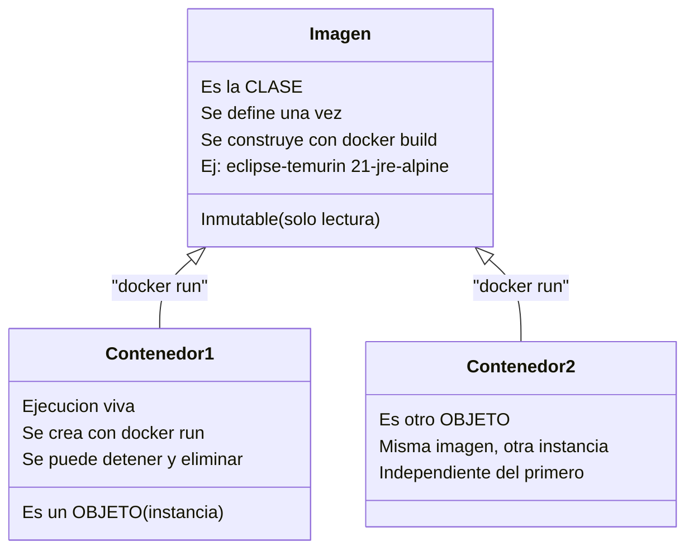

El diagrama muestra exactamente lo mismo que ya saben de Java: una **imagen** es como una clase — es una plantilla que define que contiene la aplicacion (Java, librerias, el `.jar`). Un **contenedor** es como un objeto — es una instancia viva de esa imagen que esta ejecutandose. Igual que pueden hacer `new Pizza()` varias veces para crear varios objetos de la misma clase, pueden hacer `docker run` varias veces para crear varios contenedores de la misma imagen.

| Concepto Java (Dias 9-12) | Concepto Docker | Ejemplo |
|----------------------------|-----------------|---------|
| `class Pizza { ... }` | **Imagen** (plantilla inmutable) | `eclipse-temurin:21-jre-alpine` |
| `Pizza p1 = new Pizza();` | **Contenedor** (instancia viva) | `docker run eclipse-temurin:21` |
| `Pizza p2 = new Pizza();` | **Otro contenedor** (misma imagen) | Otro `docker run` del mismo |
| Varios objetos de una clase | Varios contenedores de una imagen | Pueden correr 10 pizzerias en paralelo |

La diferencia clave con Java: cuando hacen `new Pizza()`, el objeto vive en la memoria de la JVM. Cuando hacen `docker run`, el contenedor es un proceso real del sistema operativo, con su propio sistema de archivos y su propia red. Pero la idea es la misma: plantilla (inmutable) vs instancia (viva y efimera).

## Docker Engine y Docker Hub

Para trabajar con Docker necesitan entender dos piezas mas. No son complicadas, pero es importante saber por que existen y que rol cumplen:

**Docker Engine** es el motor que hace todo el trabajo pesado. Es el programa que sabe como crear contenedores, ejecutarlos, detenerlos, y gestionar imagenes. Cuando escriben `docker run` en la terminal, es el Engine el que recibe ese comando y lo ejecuta. Piensen en el como la JVM: asi como la JVM sabe como interpretar y ejecutar sus archivos `.class`, el Docker Engine sabe como interpretar y ejecutar imagenes Docker. Sin el Engine, los comandos `docker` no hacen nada.

**Docker Desktop** es la aplicacion que van a instalar en Windows. Incluye el Docker Engine dentro, pero ademas les da una interfaz grafica donde pueden ver sus contenedores, imagenes, volumenes, etc. Es como IntelliJ: IntelliJ incluye el compilador de Java, pero ademas les da una interfaz para escribir codigo, depurar, etc. Podrian usar solo el Engine desde la terminal, pero Docker Desktop les facilita la vida, especialmente en Windows donde Docker necesita WSL 2 (un subsistema Linux) para funcionar.

**Docker Hub** es un repositorio publico en internet donde la comunidad y las empresas publican imagenes Docker listas para usar. Es exactamente el mismo concepto que Maven Central (Dia 7): asi como Maven Central tiene miles de librerias Java que pueden anadir a su `pom.xml`, Docker Hub tiene miles de imagenes que pueden descargar y usar directamente. Cuando escriben `docker pull postgres:16-alpine`, Docker va a Docker Hub, busca la imagen de PostgreSQL version 16 basada en Alpine Linux, y la descarga a su maquina. No necesitan instalar PostgreSQL manualmente — alguien ya preparo esa imagen con todo lo necesario.

Docker Hub esta en https://hub.docker.com — pueden buscar imagenes ahi. Algunas de las mas usadas: `postgres`, `mysql`, `nginx`, `redis`, `maven`, `eclipse-temurin`, `node`, `python`.

| Componente | Que es | Analogia del curso |
|------------|--------|---------------------|
| **Docker Engine** | El motor que ejecuta contenedores | Como la JVM que ejecuta sus `.jar` |
| **Docker Desktop** | App grafica que incluye Docker Engine + WSL 2 | Como IntelliJ que incluye el compilador |
| **Docker Hub** | Repositorio publico de imagenes en internet | Como Maven Central (Dia 7-8) pero para contenedores |

---

# PARTE II — INSTALACION Y PRIMEROS PASOS

# 3. Instalar Docker Desktop

## Paso 1: Descargar

Ir a https://www.docker.com/products/docker-desktop/ y descargar Docker Desktop para Windows.

## Paso 2: Instalar

Ejecutar el instalador. Aceptar los valores por defecto. Reiniciar Windows cuando lo pida.

> **Importante — WSL 2:** Docker Desktop en Windows necesita WSL 2 (Windows Subsystem for Linux) para funcionar. WSL 2 es una capa que permite ejecutar un kernel Linux real dentro de Windows — Docker lo necesita porque los contenedores son tecnologia Linux. Si no lo tienen instalado, Docker Desktop les mostrara un mensaje y les guiara. Basicamente abriran PowerShell **como administrador** y ejecutaran `wsl --install`, reiniciaran, y listo. Es un paso unico.

## Paso 3: Verificar la instalacion

Abran una terminal (Git Bash, PowerShell o CMD) y ejecuten estos tres comandos. Los tres deben funcionar para confirmar que Docker esta correctamente instalado:

```bash
# 1. Verificar que el comando docker existe y ver la version
docker --version
```

Deben ver algo como:

```
Docker version 27.x.x, build xxxxxxx
```

```bash
# 2. Verificar que Docker Engine esta corriendo y puede comunicarse
docker info
```

Este comando es mas completo que `docker --version`. No solo verifica que Docker esta instalado, sino que **el Engine esta activo y respondiendo**. Si ven un bloque de informacion con "Server Version", "Storage Driver", "Operating System", etc., significa que todo funciona. Si ven un error tipo "Cannot connect to the Docker daemon", significa que Docker Desktop no esta abierto — abranlo y esperen unos segundos.

```bash
# 3. Verificar que pueden descargar y ejecutar imagenes
docker run hello-world
```

Si ven el mensaje "Hello from Docker!" — Docker puede descargar imagenes de Docker Hub, crear contenedores, y ejecutarlos. Es la prueba completa de que todo el flujo funciona: internet + Docker Hub + Engine + contenedores.

### Que acaba de pasar con `docker run hello-world`?

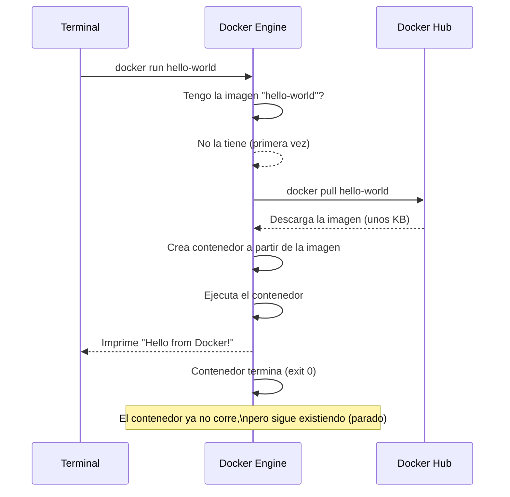

El diagrama muestra paso a paso lo que ocurre cuando ejecutan `docker run hello-world`. Primero Docker mira si ya tiene la imagen `hello-world` descargada en su maquina. Como es la primera vez, no la tiene, asi que la descarga de Docker Hub (como cuando Maven descarga una dependencia la primera vez). Luego crea un contenedor a partir de esa imagen (como hacer `new HelloWorld()`), lo ejecuta (imprime el mensaje), y el contenedor termina. El contenedor **sigue existiendo** en su maquina en estado "parado" — pueden verlo con `docker ps -a`. Esto es importante: detener un contenedor no lo elimina, igual que cerrar IntelliJ no borra sus proyectos.

> **Consejo profesional:** En el dia a dia, el comando que mas van a usar para verificar que Docker funciona no es `hello-world` sino `docker info` y `docker ps`. El `hello-world` es solo una prueba inicial de que el flujo completo funciona (descargar imagen, crear contenedor, ejecutar). Una vez que saben que funciona, no lo necesitan mas.

---

# 4. Comandos Basicos de Docker

## Los 8 comandos que van a usar siempre

Estos son los comandos que usaran el 90% del tiempo. No hay que memorizarlos — con la practica salen solos, igual que `git add`, `git commit`, `git push` ya les salen sin pensarlo.

| Comando | Que hace | Analogia Java/Maven |
|---------|----------|----------------------|
| `docker run` | Crea y ejecuta un contenedor | `new Pizza()` + ejecutar el main |
| `docker ps` | Lista contenedores en ejecucion | Ver que procesos Java estan activos |
| `docker ps -a` | Lista TODOS los contenedores | Incluye los detenidos (como ver procesos terminados) |
| `docker stop` | Detiene un contenedor | Parar el proceso (como Ctrl+C en la terminal) |
| `docker rm` | Elimina un contenedor | Borrar el objeto de memoria (liberar recursos) |
| `docker images` | Lista imagenes locales | Ver que `.jar` tienen compilados |
| `docker pull` | Descarga una imagen de Docker Hub | Como `mvn dependency:resolve` (Dia 7) |
| `docker build` | Construye una imagen desde Dockerfile | Como `mvn package` (Dia 7) |

La diferencia entre `docker stop` y `docker rm` es importante: `stop` es como pausar un video — el contenedor deja de correr pero sigue existiendo (pueden reiniciarlo con `docker start`). `rm` es como borrar el video — el contenedor desaparece completamente. Siempre hay que hacer `stop` antes de `rm` (no pueden borrar algo que esta corriendo).

## Practica 1: Un servidor web en 10 segundos

Vamos a ver lo poderoso que es Docker. Con un solo comando van a levantar un servidor web profesional:

```bash
docker run -d -p 80:80 nginx
```

Abran el navegador en http://localhost — tienen un servidor web Nginx funcionando. Sin instalar nada. Sin configurar nada. Un comando.

Ahora vamos a entender cada parte del comando:

| Opcion | Significado | Por que se usa |
|--------|-------------|----------------|
| `-d` | **D**etached (en segundo plano) | Sin `-d`, la terminal queda bloqueada mostrando los logs. Con `-d`, el contenedor corre en segundo plano y pueden seguir usando la terminal |
| `-p 80:80` | **P**uerto `host:contenedor` | El primer numero (80) es el puerto en SU maquina. El segundo (80) es el puerto dentro del contenedor. Cuando su navegador pide `localhost:80`, Docker redirige esa peticion al puerto 80 del contenedor |
| `nginx` | Nombre de la imagen | Docker la busca en local, si no la tiene la descarga de Docker Hub |

Ahora practiquen el ciclo de vida completo de un contenedor:

```bash
# Ver que el contenedor esta corriendo
docker ps

# Detener el contenedor (usen el CONTAINER ID que les dio docker ps)
docker stop <container_id>

# Verificar que ya no esta corriendo
docker ps

# Pero sigue existiendo (detenido) — como un proceso terminado
docker ps -a

# Eliminar el contenedor definitivamente
docker rm <container_id>
```

> **Consejo:** Pueden usar solo los primeros 3-4 caracteres del CONTAINER ID. No hace falta copiar los 12 caracteres completos. Si el ID es `a1b2c3d4e5f6`, basta con `docker stop a1b2`.

## Practica 2: Una base de datos PostgreSQL instantanea

Esta practica tiene un objetivo concreto: demostrarles por que Docker va a cambiar su forma de trabajar con bases de datos. Recuerden el Dia 10 cuando configuraron H2 en `application.properties` — H2 funciona bien para desarrollo porque es una base de datos embebida que no necesita instalacion. Pero en el mundo real, las aplicaciones en produccion usan bases de datos como PostgreSQL, MySQL o MariaDB. Instalar PostgreSQL en Windows es un proceso largo: descargar el instalador, elegir version, configurar usuario, contrasena, puerto, variables de entorno... Con Docker, todo eso se reduce a un comando:

```bash
docker run -d -p 5432:5432 -e POSTGRES_PASSWORD=secret postgres:16-alpine
```

Acaban de levantar un servidor PostgreSQL version 16, listo para recibir conexiones. Tardaron 3 segundos en vez de 15 minutos.

| Opcion | Significado | Detalle |
|--------|-------------|---------|
| `-d` | En segundo plano | Ya lo conocen de la practica anterior |
| `-p 5432:5432` | Puerto del host:puerto del contenedor | 5432 es el puerto estandar de PostgreSQL |
| `-e POSTGRES_PASSWORD=secret` | Variable de entorno | El `-e` define variables de entorno dentro del contenedor. PostgreSQL requiere que le definan una contrasena para el usuario admin. En produccion usarian una contrasena segura, pero para desarrollo `secret` esta bien |
| `postgres:16-alpine` | Imagen y tag | `postgres` es el nombre, `16` es la version, `alpine` significa que usa Alpine Linux (una distribucion de solo 5 MB, lo que hace la imagen mucho mas ligera) |

> **Consejo de desarrollo real:** Esto es exactamente lo que hacen los equipos profesionales. En vez de pedir a cada desarrollador que instale PostgreSQL en su maquina, ponen un `docker run` en el README del proyecto. Todos trabajan con la misma version, la misma configuracion. Y cuando terminan, hacen `docker stop` y `docker rm` — no queda nada instalado en su maquina. Limpio.

Si quieren conectarse a este PostgreSQL desde IntelliJ (Database tool) o desde DBeaver:
- **Host:** localhost
- **Puerto:** 5432
- **Usuario:** postgres
- **Contrasena:** secret
- **Base de datos:** postgres (viene por defecto)

Para detenerlo:

```bash
docker ps                    # ver el ID del contenedor
docker stop <container_id>   # detener
docker rm <container_id>     # eliminar
```

## Tabla de referencia rapida

Estos son todos los comandos que van a necesitar hoy. Pueden volver a esta tabla en cualquier momento.

### Comandos de Contenedores

| Comando | Descripcion | Ejemplo |
|---------|-------------|---------|
| `docker run -d -p 8081:8081 imagen` | Crear y ejecutar en segundo plano | `docker run -d -p 8081:8081 pizzeria:v1` |
| `docker ps` | Ver contenedores activos | Muestra ID, imagen, puertos, estado |
| `docker ps -a` | Ver todos (incluye parados) | Para ver contenedores que ya terminaron |
| `docker stop <id>` | Detener contenedor | `docker stop a1b2` (bastan 3-4 chars) |
| `docker rm <id>` | Eliminar contenedor | `docker rm a1b2` |
| `docker logs <id>` | Ver logs completos | `docker logs pizzeria` |
| `docker logs -f <id>` | Seguir logs en vivo (Ctrl+C para salir) | `docker logs -f pizzeria` |

### Comandos de Imagenes

| Comando | Descripcion | Ejemplo |
|---------|-------------|---------|
| `docker images` | Listar imagenes en su maquina | Muestra nombre, tag, tamano |
| `docker pull imagen:tag` | Descargar de Docker Hub | `docker pull postgres:16-alpine` |
| `docker build -t nombre:tag .` | Construir imagen desde Dockerfile | `docker build -t pizzeria:v1 .` |
| `docker rmi imagen` | Eliminar imagen local | `docker rmi pizzeria:v1` |

### Limpieza

| Comando | Descripcion |
|---------|-------------|
| `docker system prune` | Elimina contenedores parados, imagenes sin uso, redes huerfanas. Pregunta confirmacion |
| `docker system prune -a` | Lo mismo pero tambien elimina imagenes que no usa ningun contenedor. Mas agresivo |

---

# PARTE III — DOCKERIZAR LA PIZZERIA

# 5. El Dockerfile: Receta para Empaquetar pizzeria-spring

## Que es un Dockerfile?

Un Dockerfile es un archivo de texto plano con instrucciones para construir una imagen Docker. Es como una receta de cocina: paso a paso, sin ambiguedad, siempre produce el mismo resultado.

Recuerden el `pom.xml` del Dia 7: asi como el `pom.xml` le dice a Maven **que dependencias necesita y como compilar**, el `Dockerfile` le dice a Docker **que base usar, que copiar dentro, y como arrancar la aplicacion**. El `pom.xml` produce un `.jar`; el `Dockerfile` produce una **imagen Docker**.

Datos importantes sobre el archivo:
- Se llama exactamente **`Dockerfile`** — sin extension (no es `Dockerfile.txt`, no es `dockerfile.docker`, es solo `Dockerfile` con la D mayuscula)
- Se coloca en la **raiz del proyecto**, es decir, en la misma carpeta donde esta el `pom.xml`
- Para nuestra pizzeria, la ruta completa seria: `pizzeria-spring/Dockerfile`
- Pueden crearlo con cualquier editor de texto (IntelliJ, VS Code, Notepad++) — creen un archivo nuevo, llamenlo `Dockerfile` y asegurense de que el editor no le anade extension

## El Dockerfile para pizzeria-spring (multi-stage)

Abran IntelliJ (o su editor), vayan a la carpeta raiz de `pizzeria-spring/` (donde esta el `pom.xml`), creen un archivo nuevo llamado `Dockerfile` (sin extension) y escriban esto:

```dockerfile
# ============================================================
# Etapa 1: Compilar con Maven (como hacer mvn package)
# ============================================================
FROM maven:3.9-eclipse-temurin-21 AS builder
WORKDIR /app
COPY pom.xml .
COPY src ./src
RUN mvn clean package -DskipTests

# ============================================================
# Etapa 2: Ejecutar con JRE ligero (solo lo necesario)
# ============================================================
FROM eclipse-temurin:21-jre-alpine
WORKDIR /app
COPY --from=builder /app/target/*.jar app.jar
EXPOSE 8081
ENTRYPOINT ["java", "-jar", "app.jar"]
```

Antes de explicar cada linea, vamos a entender **por que hay dos secciones** (dos `FROM`). Esto se llama "multi-stage build" y es un patron que se usa en la industria. La idea es sencilla:

- **Etapa 1 (builder):** necesitan Maven + JDK para compilar el codigo. Esto ocupa mucho espacio (~800 MB). Pero una vez que tienen el `.jar` compilado, ya no necesitan ni Maven ni el codigo fuente.
- **Etapa 2 (final):** solo necesitan un JRE ligero + el `.jar`. Esto ocupa mucho menos (~200 MB).

Docker permite hacer esto: usar una imagen grande para compilar, extraer solo el resultado (el `.jar`), y meterlo en una imagen limpia y pequena. La etapa 1 se descarta. Solo queda la etapa 2.

> **Por que `EXPOSE 8081` y no `8080`?** Porque en el `application.properties` de pizzeria-spring configuramos `server.port=8081` (Dia 11). El `EXPOSE` no cambia el puerto — solo documenta cual usa la app. Es como un comentario para que quien lea el Dockerfile sepa en que puerto escucha.

## Explicacion linea por linea

### Etapa 1: Compilacion (esta etapa se descarta despues del build)

| Linea | Que hace | Por que |
|-------|----------|---------|
| `FROM maven:3.9-eclipse-temurin-21 AS builder` | Parte de una imagen que ya tiene Maven 3.9 y JDK 21 instalados. Le pone el nombre "builder" para poder referenciarla despues | No tienen que instalar Maven ni Java dentro del contenedor — ya vienen en la imagen base. El nombre "builder" es una etiqueta que usaran en la etapa 2 |
| `WORKDIR /app` | Crea la carpeta `/app` dentro del contenedor y se posiciona ahi | Todo lo que hagan despues (COPY, RUN) ocurre dentro de `/app`. Es como hacer `mkdir /app && cd /app` |
| `COPY pom.xml .` | Copia el `pom.xml` de su maquina al contenedor (a `/app/pom.xml`) | Docker necesita el pom para saber que dependencias descargar. Se copia **antes** que el codigo fuente por una razon de rendimiento que explicamos abajo |
| `COPY src ./src` | Copia la carpeta `src/` de su maquina al contenedor (a `/app/src/`) | Todo el codigo Java de la pizzeria: los modelos, controladores, servicios, repositorios, y el `application.properties` |
| `RUN mvn clean package -DskipTests` | Ejecuta Maven dentro del contenedor: compila, empaqueta, genera el `.jar` en `/app/target/` | Es exactamente lo mismo que hacen en la terminal o IntelliJ (Dia 7). El `-DskipTests` salta los tests para que el build sea mas rapido |

> **Por que se copia el `pom.xml` aparte del `src/`?** Por el cache de capas de Docker. Si copian todo junto y cambian una linea de codigo, Docker re-descarga TODAS las dependencias Maven. Si copian el `pom.xml` primero (que cambia poco), Docker cachea las dependencias y solo re-compila el codigo cuando cambia. Esto puede ahorrarles minutos en cada build.

### Etapa 2: Ejecucion (esta es la imagen final)

| Linea | Que hace | Por que |
|-------|----------|---------|
| `FROM eclipse-temurin:21-jre-alpine` | Comienza una imagen NUEVA basada en JRE 21 con Alpine Linux | **JRE** (Java Runtime Environment) es mas ligero que JDK: solo tiene lo necesario para ejecutar, no para compilar. **Alpine** es una distribucion Linux minimalista de solo 5 MB. La combinacion da una imagen final muy pequena |
| `WORKDIR /app` | Crea y entra a `/app` | Carpeta de trabajo en la imagen final |
| `COPY --from=builder /app/target/*.jar app.jar` | Copia el `.jar` compilado DESDE la etapa "builder" a la imagen final, renombrandolo como `app.jar` | Aqui esta la magia del multi-stage: toma SOLO el `.jar` de la etapa 1. Todo lo demas (Maven, JDK, codigo fuente, carpeta target) se descarta. La imagen final no sabe nada de Maven |
| `EXPOSE 8081` | Documenta que la app usa el puerto 8081 | Es informativo — le dice a quien use esta imagen que la app escucha en el 8081. No abre ni redirige ningun puerto por si solo |
| `ENTRYPOINT ["java", "-jar", "app.jar"]` | Define el comando que se ejecuta cuando arranca el contenedor | Cuando hagan `docker run`, Docker ejecutara `java -jar app.jar` automaticamente. Es como cuando en IntelliJ le dan al boton "Play" |

## Por que multi-stage?

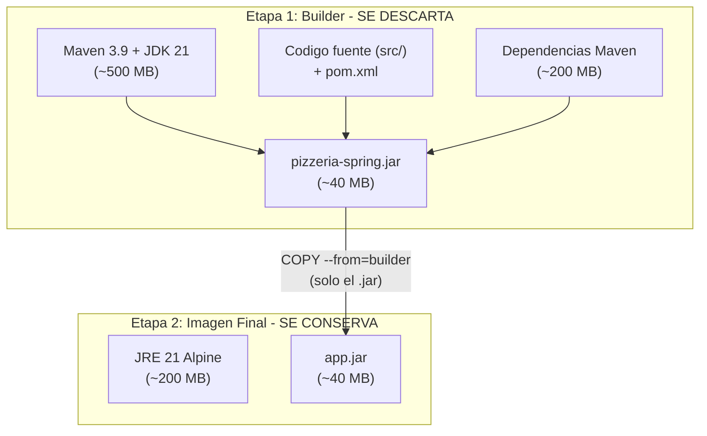

Este diagrama muestra lo que ocurre cuando Docker construye la imagen con el multi-stage build. En la Etapa 1 (rojo), Docker descarga Maven, el JDK 21, todas las dependencias del `pom.xml`, copia el codigo fuente, y ejecuta `mvn package` para generar el `.jar`. Todo eso pesa mas de 1 GB. Pero de todo eso, **lo unico que necesitan para ejecutar la app es el `.jar`** (unos 40 MB).

La flecha `COPY --from=builder` es la pieza clave: extrae unicamente el `.jar` de la Etapa 1 y lo coloca en la Etapa 2 (verde). La Etapa 2 solo tiene el JRE ligero (~200 MB) y el `.jar` (~40 MB). Todo lo de la Etapa 1 (Maven, JDK, codigo fuente, dependencias descargadas) se **descarta** — no forma parte de la imagen final.

| Aspecto | Sin multi-stage | Con multi-stage |
|---------|:---------------:|:---------------:|
| **Contenido de la imagen** | Maven + JDK + codigo fuente + `.jar` | Solo JRE + `.jar` |
| **Tamano** | ~1.2 GB | ~250 MB |
| **Seguridad** | Codigo fuente visible dentro de la imagen | Solo el binario compilado — nadie puede ver su codigo |
| **Velocidad de descarga** | Lenta (1.2 GB por cada despliegue) | Rapida (250 MB) |

**Analogia de cocina:** Para preparar una pizza necesitan harina, levadura, salsa, queso, horno, rodillo, tabla de amasar... pero al cliente le sirven solo la **pizza**, no la cocina entera. El multi-stage build es eso: compilan con todas las herramientas (Etapa 1) y entregan solo el producto final (Etapa 2).

---

# 6. Construir y Ejecutar la Imagen

## Paso 1: Construir la imagen

Abran una terminal y naveguen a la carpeta de `pizzeria-spring` (la carpeta donde crearon el `Dockerfile` y donde esta el `pom.xml`):

```bash
cd pizzeria-spring
docker build -t pizzeria:v1 .
```

| Opcion | Significado | Detalle |
|--------|-------------|---------|
| `-t pizzeria:v1` | Nombre y version (tag) de la imagen | `pizzeria` es el nombre, `v1` es el tag. Pueden poner lo que quieran: `mi-app:latest`, `proyecto:1.0`, etc. |
| `.` | Contexto de build | El punto le dice a Docker "busca el Dockerfile AQUI, en esta carpeta". Docker tomara todo el contenido de esta carpeta (excepto lo que este en `.dockerignore`) como contexto para el build |

> **Primera vez vs siguientes:** La primera vez que ejecutan `docker build`, Docker descarga las imagenes base (~500 MB de Maven+JDK, ~200 MB de JRE Alpine) y todas las dependencias Maven de su `pom.xml`. Esto puede tardar 5-10 minutos dependiendo de su conexion a internet. Las siguientes veces sera mucho mas rapido (30 segundos - 1 minuto) porque Docker **cachea las capas** que no cambiaron.

### Que pasa durante el build?

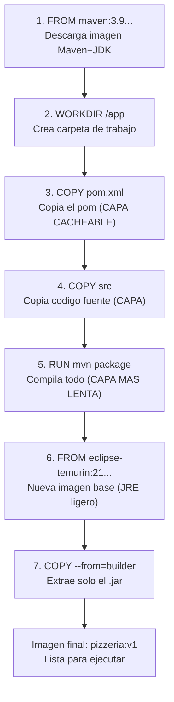

El diagrama muestra los 7 pasos que Docker ejecuta en orden, de arriba a abajo. Cada paso crea una "capa" (layer) que Docker guarda en cache. Los pasos amarillos (3, 4, 5) son los que se re-ejecutan cuando cambian algo. El truco esta en el orden: como el `pom.xml` (paso 3) se copia antes que el codigo fuente (paso 4), si solo cambian codigo Java, Docker reutiliza el cache del paso 3 (no re-descarga dependencias) y solo repite desde el paso 4. Esto es la diferencia entre un build de 5 minutos y uno de 30 segundos.

> **Si el build falla:** lean el mensaje de error completo. El 90% de las veces sera un error de Maven (codigo que no compila) — arreglen el error en IntelliJ primero, verifiquen que `mvn clean package` funciona en local, y luego reintenten el `docker build`.

## Paso 2: Verificar que la imagen existe

```bash
docker images
```

Deben ver algo como esto en la salida:

| REPOSITORY | TAG | SIZE |
|------------|-----|------|
| pizzeria | v1 | ~300 MB |
| maven | 3.9-eclipse-temurin-21 | ~800 MB |
| eclipse-temurin | 21-jre-alpine | ~200 MB |

Fijense que aparecen tres imagenes: la suya (`pizzeria:v1`) y las dos imagenes base que Docker descargo (Maven y Eclipse Temurin). La imagen de Maven es grande (~800 MB) pero solo se uso para compilar — su imagen final (`pizzeria:v1`) pesa solo ~300 MB porque esta basada en el JRE ligero.

## Paso 3: Ejecutar el contenedor

```bash
docker run -d -p 8081:8081 --name pizzeria pizzeria:v1
```

| Opcion | Significado | Detalle |
|--------|-------------|---------|
| `-d` | En segundo plano | El contenedor corre sin bloquear la terminal |
| `-p 8081:8081` | Mapeo de puertos `host:contenedor` | El primer 8081 es el puerto en SU maquina (al que acceden con el navegador). El segundo 8081 es el puerto DENTRO del contenedor (donde Spring Boot escucha) |
| `--name pizzeria` | Nombre amigable | En vez de usar el ID aleatorio (`a1b2c3d4e5f6`), pueden referirse al contenedor como `pizzeria` en todos los comandos |
| `pizzeria:v1` | La imagen que crearon en el paso 1 | Docker crea un contenedor a partir de esta imagen |

> **Mapeo de puertos en detalle:** El concepto de `-p host:contenedor` es fundamental. El contenedor es como una maquina aislada con su propia red. Spring Boot escucha en el puerto 8081 **dentro** del contenedor, pero eso no significa que sea accesible desde fuera. El `-p 8081:8081` crea un tunel: cuando su navegador pide `localhost:8081`, Docker redirige esa peticion al puerto 8081 del contenedor. Podrian hacer `-p 9999:8081` y acceder por `localhost:9999` — el contenedor seguiria escuchando en 8081, pero ustedes accederian por 9999.

## Paso 4: Verificar que funciona

Abran el navegador, Postman o Swagger (como en el Dia 12) y prueben estos endpoints — son los mismos que usaron cuando la pizzeria corria desde IntelliJ, pero ahora esta corriendo dentro de un contenedor Docker:

```
GET  http://localhost:8081/api/pizzas
GET  http://localhost:8081/api/pizzas/1
GET  http://localhost:8081/api/pizzas/categoria/CLASICA
GET  http://localhost:8081/api/pizzas/baratas?precioMax=10.0
GET  http://localhost:8081/swagger-ui.html
```

Si ven la respuesta JSON con las pizzas — **su aplicacion esta corriendo en un contenedor Docker.** Piensen en lo que acaba de pasar: su codigo Java, compilado con Maven, ejecutandose con un JRE dentro de un contenedor Linux ligero, accesible desde su navegador Windows. Todo empaquetado y reproducible.

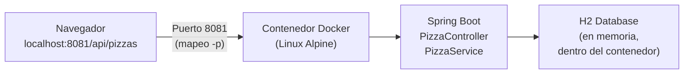

El diagrama muestra el recorrido de una peticion: su navegador (en Windows) hace un GET a `localhost:8081`. Docker intercepta esa peticion y la redirige al contenedor (que corre Linux Alpine internamente). Dentro del contenedor, Spring Boot recibe la peticion en el `PizzaController`, pasa por el `PizzaService`, consulta la base de datos H2 (que tambien esta dentro del contenedor, en memoria), y devuelve la respuesta JSON.

> **Datos efimeros:** Fijense que la consola H2 (`localhost:8081/h2-console`) tambien funciona desde el contenedor. Pero recuerden que H2 esta configurada como base de datos en memoria (`jdbc:h2:mem:pizzeriadb` en `application.properties`). Esto significa que si destruyen el contenedor con `docker rm`, **los datos desaparecen**. Esto no es un problema para nuestra pizzeria (que tiene datos de prueba), pero en una aplicacion real necesitarian persistir los datos fuera del contenedor. Manana (Dia 16) veremos como resolver esto con **volumenes** y Docker Compose.

## Paso 5: Ver los logs

Los logs del contenedor son exactamente los mismos que ven cuando ejecutan la app desde IntelliJ — las lineas de arranque de Spring Boot, los queries SQL, los errores, etc.

```bash
# Ver todos los logs desde que arranco el contenedor
docker logs pizzeria
```

Deben ver las lineas familiares:

```
  .   ____          _            __ _ _
 /\\ / ___'_ __ _ _(_)_ __  __ _ \ \ \ \
( ( )\___ | '_ | '_| | '_ \/ _` | \ \ \ \
...
Tomcat started on port 8081
Started PizzeriaSpringApplication in X.XXX seconds
```

Si ademas ven las lineas de `Hibernate: create table pizza (...)` y `Hibernate: insert into pizza (...)`, significa que H2 creo las tablas y cargo los datos iniciales. Todo igual que en IntelliJ.

Para seguir los logs en vivo (util cuando estan probando endpoints y quieren ver los queries SQL en tiempo real):

```bash
docker logs -f pizzeria
```

Presionen `Ctrl + C` para salir del seguimiento de logs. El contenedor sigue corriendo — solo dejan de ver los logs.

## Paso 6: Detener y eliminar

```bash
# Detener el contenedor (Spring Boot hace shutdown limpio)
docker stop pizzeria

# Eliminar el contenedor (liberar recursos)
docker rm pizzeria
```

Despues de `docker stop`, el contenedor existe pero esta parado (pueden verlo con `docker ps -a`). Despues de `docker rm`, desaparece completamente. Pero la **imagen** `pizzeria:v1` sigue existiendo — pueden crear otro contenedor cuando quieran con `docker run`.

---

# PARTE IV — PRACTICA

# 7. Ejercicio: Dockerizar su Proyecto Personal

Ya dockerizaron la pizzeria conmigo paso a paso. Ahora haganlo solos con **su proyecto personal** (el blueprint que eligieron en el Dia 13 y que completaron en el Dia 14).

### Objetivo

Que su proyecto personal corra dentro de un contenedor Docker, accesible desde el navegador, exactamente igual que cuando lo ejecutan desde IntelliJ.

### Pasos

**a) Crear el Dockerfile**

Vayan a la carpeta raiz de su proyecto (donde esta el `pom.xml`). Creen un archivo nuevo llamado `Dockerfile` — sin extension. Si usan IntelliJ: click derecho en la raiz del proyecto > New > File > escriban `Dockerfile` (asegurense de que no se anada `.txt` u otra extension).

La estructura de su proyecto deberia verse asi:

```
mi-proyecto/
    pom.xml          <-- aqui esta Maven
    Dockerfile       <-- AQUI va el nuevo archivo
    src/
        main/
            java/
            resources/
                application.properties
```

Contenido del `Dockerfile`:

```dockerfile
FROM maven:3.9-eclipse-temurin-21 AS builder
WORKDIR /app
COPY pom.xml .
COPY src ./src
RUN mvn clean package -DskipTests

FROM eclipse-temurin:21-jre-alpine
WORKDIR /app
COPY --from=builder /app/target/*.jar app.jar
EXPOSE 8080
ENTRYPOINT ["java", "-jar", "app.jar"]
```

> **Importante sobre el puerto:** Revisen su `application.properties`. Si configuraron `server.port=8080` (o no pusieron nada, que por defecto es 8080), dejen `EXPOSE 8080`. Si configuraron otro puerto (por ejemplo `server.port=8085`), cambien el `EXPOSE` a ese numero. El `EXPOSE` debe coincidir con el puerto que usa su aplicacion.

**b) Construir la imagen**

Abran una terminal, naveguen a la carpeta de su proyecto, y ejecuten:

```bash
docker build -t mi-proyecto:v1 .
```

**c) Si el build falla, lean el error**

| Error | Causa probable | Solucion |
|-------|----------------|----------|
| `pom.xml not found` | No estan en la carpeta correcta — Docker no encuentra el `pom.xml` | Verifiquen con `ls` que ven el `pom.xml` y el `Dockerfile` en la carpeta actual |
| `BUILD FAILURE` en Maven | El codigo no compila — algun error de Java | Arreglen el error primero. Ejecuten `mvn clean package` en la terminal (fuera de Docker) para ver el error exacto |
| `Connection refused` | Sin internet o detras de un proxy corporativo | Verificar conexion. Si estan detras de proxy, Docker Desktop tiene configuracion de proxy en Settings > Resources > Proxies |
| `COPY failed: file not found` | La carpeta `src/` no existe o tiene otro nombre | Verifiquen la estructura de su proyecto con `ls -la` |

**d) Ejecutar el contenedor**

```bash
docker run -d -p 8080:8080 --name mi-proyecto mi-proyecto:v1
```

> Si su app usa otro puerto (por ejemplo 8085), cambien el comando a: `docker run -d -p 8085:8085 --name mi-proyecto mi-proyecto:v1`

**e) Probar los endpoints**

Abran Postman o el navegador y prueben sus CRUDs. Las URLs seran las mismas que usaban desde IntelliJ, pero ahora la app corre en Docker.

**f) Ver los logs**

```bash
docker logs mi-proyecto
```

Verifiquen que ven el banner de Spring Boot y que no hay errores.

**g) Detener y limpiar**

```bash
docker stop mi-proyecto
docker rm mi-proyecto
```

---

# PARTE V — CONCEPTOS Y RESUMEN

# 8. El Flujo Completo de Docker

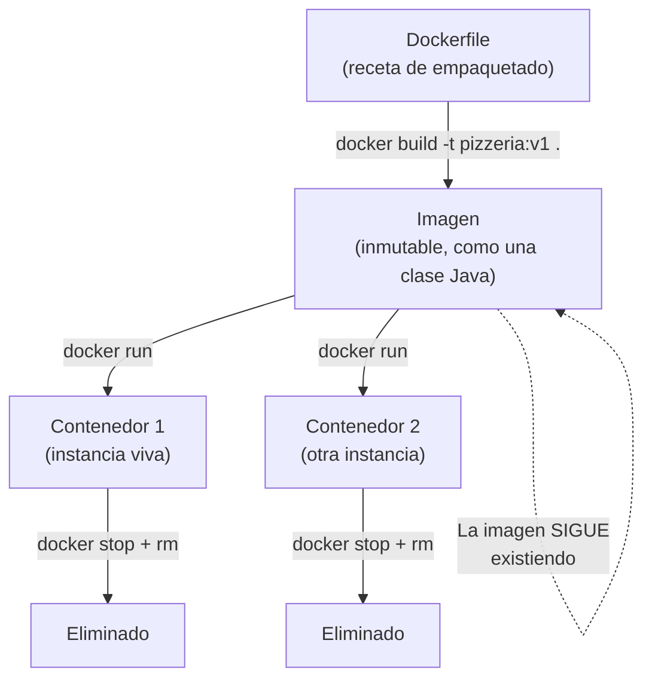

Este diagrama resume todo lo que aprendieron hoy. El flujo siempre es el mismo:

1. **Escriben un `Dockerfile`** — la receta que describe como empaquetar su aplicacion
2. **Ejecutan `docker build`** — Docker sigue la receta y produce una **imagen** (inmutable, como una clase Java)
3. **Ejecutan `docker run`** — Docker crea un **contenedor** (instancia viva) a partir de la imagen
4. **Pueden crear multiples contenedores** de la misma imagen, igual que pueden crear multiples objetos de la misma clase
5. **Cuando ya no lo necesitan**, hacen `docker stop` + `docker rm` — el contenedor desaparece, pero la imagen sigue disponible para crear nuevos contenedores

### Reglas importantes para recordar

| Regla | Que significa en la practica |
|-------|------------------------------|
| Las imagenes son **INMUTABLES** | Una vez creada con `docker build`, la imagen no se modifica. Si cambian el codigo, hacen un nuevo `docker build` y crean una nueva imagen (por ejemplo `pizzeria:v2`) |
| Los contenedores son **EFIMEROS** | Los contenedores estan pensados para crearse y destruirse libremente. No guarden nada importante dentro de un contenedor — cuando lo borren, todo lo de dentro se pierde |
| Cambio = nuevo build | Si cambian una linea de codigo en `PizzaController.java`, necesitan: (1) `docker build -t pizzeria:v2 .` para crear nueva imagen, (2) `docker stop pizzeria` + `docker rm pizzeria` para quitar el viejo, (3) `docker run ... pizzeria:v2` para ejecutar el nuevo |
| Datos volatiles | La base de datos H2 (en memoria) esta DENTRO del contenedor. Si borran el contenedor, los datos desaparecen. Para datos persistentes necesitan **volumenes** (Dia 16) |

> **Manana (Dia 16)** veremos Docker Compose — una herramienta para definir y ejecutar multiples contenedores (app + base de datos + herramienta admin) con un solo comando. Tambien veremos **volumenes** para que los datos sobrevivan cuando el contenedor se destruye.

---

# 9. GPS Arquitectonico: Donde Estamos?

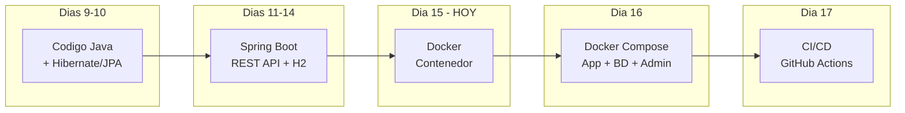

Este diagrama muestra el recorrido del curso. Fijense como cada dia construye sobre lo anterior: primero aprendieron Java y JPA para hablar con bases de datos (Dias 9-10), luego Spring Boot para crear APIs REST (Dias 11-14), y hoy Docker para empaquetar todo eso en un contenedor portable. Es una escalera: cada escalon necesita los anteriores.

El cuadro resaltado ("Dia 15 — HOY") es donde estan ahora. Los proximos dias van a anadir mas capas:
- **Dia 16:** Docker Compose — en vez de un solo contenedor, van a ejecutar varios (su app + PostgreSQL + una herramienta admin de BD) que hablan entre si
- **Dia 17:** CI/CD con GitHub Actions — automatizar todo: cada vez que hagan push a GitHub, se ejecuta el build y los tests automaticamente

| Antes de Docker | Despues de Docker |
|-----------------|-------------------|
| La app corre en su portatil, con SU Java, SU configuracion, SUS variables de entorno | La app corre en un contenedor con su PROPIO Java y config, aislada del entorno |
| Si la pasan a otro portatil, probablemente no funciona | Da igual donde se ejecute: portatil, servidor, AWS, Azure — funciona IGUAL |
| Depende de lo que haya instalado en la maquina | Es **independiente del entorno** — lleva todo lo que necesita consigo |
| Para instalar una BD necesitan instalador + 15 minutos de configuracion | `docker run postgres:16-alpine` y en 3 segundos tienen una BD lista |

### Flujo completo del proyecto: de codigo a contenedor

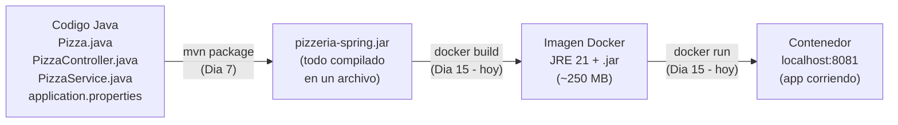

Este es el camino completo que recorre su codigo para llegar a un contenedor en ejecucion. Cada flecha es un comando que ya conocen. El codigo Java pasa por Maven (Dia 7) para convertirse en un `.jar`. Ese `.jar` pasa por Docker (hoy) para meterse dentro de una imagen con su JRE. Y esa imagen se ejecuta como un contenedor al que acceden desde el navegador. Todo el conocimiento de los dias anteriores se conecta aqui.

---

# 10. Tabla de Comandos del Dia

### Verificacion

| Accion | Comando | Cuando usarlo |
|--------|---------|---------------|
| Ver version de Docker | `docker --version` | Para confirmar que esta instalado |
| Ver estado completo del Engine | `docker info` | Para confirmar que el Engine esta corriendo y responde |
| Prueba completa del flujo | `docker run hello-world` | Solo la primera vez, para verificar que todo funciona de punta a punta |

### Construccion

| Accion | Comando | Cuando usarlo |
|--------|---------|---------------|
| Construir imagen | `docker build -t pizzeria:v1 .` | Cada vez que cambien codigo y quieran crear nueva imagen |
| Ver imagenes locales | `docker images` | Para ver que imagenes tienen descargadas/construidas |
| Descargar imagen de Hub | `docker pull postgres:16-alpine` | Cuando necesiten una imagen base sin ejecutarla aun |
| Eliminar imagen | `docker rmi pizzeria:v1` | Cuando quieran liberar espacio |

### Ejecucion

| Accion | Comando | Cuando usarlo |
|--------|---------|---------------|
| Crear y ejecutar contenedor | `docker run -d -p 8081:8081 --name pizzeria pizzeria:v1` | Para levantar la app en Docker |
| Ver contenedores activos | `docker ps` | Para saber que esta corriendo ahora mismo |
| Ver todos los contenedores | `docker ps -a` | Para ver tambien los que estan parados |
| Ver logs completos | `docker logs pizzeria` | Para diagnosticar errores o ver el arranque |
| Seguir logs en vivo | `docker logs -f pizzeria` | Mientras prueban endpoints y quieren ver la actividad |
| Detener contenedor | `docker stop pizzeria` | Cuando terminen de trabajar |
| Eliminar contenedor | `docker rm pizzeria` | Para limpiar (requiere que este detenido) |

### Limpieza

| Accion | Comando | Cuando usarlo |
|--------|---------|---------------|
| Limpiar recursos sin uso | `docker system prune` | Cuando quieran liberar espacio (contenedores parados, imagenes huerfanas) |

---

# 11. El `.dockerignore`

Igual que `.gitignore` le dice a Git que archivos ignorar al hacer commit, `.dockerignore` le dice a Docker que archivos **no copiar** al contexto de build. Sin este archivo, Docker copia ABSOLUTAMENTE TODO lo que hay en la carpeta del proyecto al contexto de build — incluyendo la carpeta `target/` (que puede pesar cientos de MB con todas las dependencias compiladas), `.git/` (todo el historial de commits), y `.idea/` (la configuracion de IntelliJ). Nada de eso se necesita dentro del contenedor, y copiarlo hace el build mas lento sin aportar nada.

Creen un archivo llamado `.dockerignore` (con el punto al inicio, sin extension) en la misma carpeta donde esta el `Dockerfile`:

```
pizzeria-spring/
    pom.xml
    Dockerfile          <-- ya lo crearon antes
    .dockerignore       <-- ESTE archivo nuevo
    src/
    target/             <-- esto NO queremos que entre al build
    .git/               <-- esto TAMPOCO
    .idea/              <-- ni esto
```

Contenido del archivo `.dockerignore`:

```
# Carpetas que no necesita el build de Docker
target/
.idea/
.mvn/
.git/
.gitignore
*.iml
*.md
```

> **Consejo:** Es buena costumbre crear el `.dockerignore` siempre que creen un `Dockerfile`. Es como la pareja natural: `Dockerfile` + `.dockerignore`, igual que `pom.xml` viene con `.gitignore`.

---

# 12. Troubleshooting: Errores Comunes

Estos son los errores que mas van a ver durante la practica de hoy. Antes de llamar al profesor, busquen su error en esta tabla:

| Sintoma | Causa | Solucion |
|---------|-------|----------|
| `docker: command not found` | Docker no esta instalado o no esta en el PATH de la terminal | Instalar Docker Desktop, reiniciar la terminal, y volver a intentar |
| `Cannot connect to the Docker daemon` | Docker Desktop no esta abierto, o no termino de arrancar | Abrir Docker Desktop (el icono de la ballena) y esperar a que diga "Docker is running" (puede tardar 30-60 segundos) |
| `port is already allocated` | El puerto 8081 ya lo esta usando otro proceso (quizas IntelliJ con la pizzeria corriendo) | Opcion 1: Parar la app en IntelliJ. Opcion 2: usar otro puerto en Docker: `-p 9090:8081` y acceder por `localhost:9090` |
| `Error response from daemon: Conflict. The container name "/pizzeria" is already in use` | Ya existe un contenedor llamado "pizzeria" (puede estar parado) | Eliminarlo con `docker rm pizzeria` y volver a intentar. Si esta corriendo, primero `docker stop pizzeria` |
| El build tarda mucho (5-10 minutos) la primera vez | Es completamente normal — Docker descarga las imagenes base (~1 GB total) y todas las dependencias Maven | Paciencia. Las siguientes veces sera rapido porque Docker cachea las capas. Si quieren ver el progreso, no usen `-q` |
| `BUILD FAILURE` durante `mvn package` | El codigo Java no compila — hay un error en el fuente | Primero verifiquen que el proyecto compila fuera de Docker: abran una terminal en la carpeta del proyecto y ejecuten `mvn clean package`. Arreglen los errores ahi primero |
| La app arranca pero `localhost:8081` no responde | El mapeo de puertos es incorrecto, o la app usa un puerto distinto al que esperan | Verifiquen: (1) que `server.port` en `application.properties` coincide con el `EXPOSE` del Dockerfile, (2) que el `-p` del `docker run` coincide con ambos. Verifiquen con `docker logs pizzeria` que la app arranco correctamente |
| `exec format error` o `platform` warning | La imagen base no es compatible con la arquitectura de su procesador | Esto puede pasar en Macs con chip Apple Silicon (M1/M2). Anadan `--platform linux/amd64` al `docker build` |

---

## Creditos y referencias

Este proyecto ha sido desarrollado siguiendo la metodologia y el codigo base de **Juan Marcelo Gutierrez Miranda** @TodoEconometria.

| | |
|---|---|
| **Autor original** | Prof. Juan Marcelo Gutierrez Miranda |
| **Institucion** | @TodoEconometria |
| **Hash de Certificacion** | `4e8d9b1a5f6e7c3d2b1a0f9e8d7c6b5a4f3e2d1c0b9a8f7e6d5c4b3a2f1e0d9c` |

*Todos los materiales didacticos, la metodologia pedagogica, la estructura del curso, los ejemplos y el codigo base de este proyecto son produccion intelectual de Juan Marcelo Gutierrez Miranda. Queda prohibida su reproduccion total o parcial sin la autorizacion expresa del autor.*
