# Dia 17: CI/CD + README Profesional — Su Proyecto Listo para el Mundo

Hoy cierran el circulo: cada vez que hagan push a GitHub, su proyecto se compila, se empaqueta en una imagen Docker y se sube a Docker Hub automaticamente. Ademas, van a crear un README profesional que cualquier reclutador pueda leer y entender en 30 segundos.

Prof. Juan Marcelo Gutierrez Miranda

**Curso IFCD0014 — Semana 4, Dia 17 (Miercoles)**
**Objetivo:** Entender CI/CD, crear un pipeline con GitHub Actions que compile, teste, construya la imagen Docker y la suba a Docker Hub. Crear un README profesional con badge, screenshot de Swagger y instrucciones de uso.

> Este manual sigue el patron PARA-LEE-EJECUTA-VERIFICA. Antes de ejecutar cualquier comando, lean QUE hace y POR QUE. Despues de ejecutarlo, comprueben QUE DEBERIAN VER.

---

# PARTE 0 — AUTOPSIA DEL DIA 16

Antes de avanzar con CI/CD, vamos a repasar los problemas que surgieron ayer en clase con Docker Compose. Entender estos errores es fundamental porque CI/CD automatiza exactamente lo que hicieron a mano — y si no entienden que fallo, lo van a automatizar mal.

## Problema 1: Datos duplicados (14 pizzas, 21 pizzas, 28...)

Varios equipos vieron que cada vez que hacian `docker compose up`, las pizzas se duplicaban. Primero 7, luego 14, luego 21...

**Causa:** En `application.properties` tenian `spring.sql.init.mode=always`. Eso funciona perfecto con H2 (base de datos en memoria que se borra al reiniciar). Pero Docker Compose usa PostgreSQL con un **volumen persistente** — los datos sobreviven entre reinicios. Cada `docker compose up` ejecutaba `data.sql` de nuevo, insertando todas las pizzas otra vez.

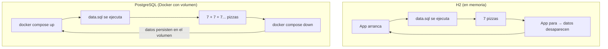

El diagrama muestra la diferencia: H2 empieza de cero cada vez, PostgreSQL acumula datos porque el volumen persiste.

**Solucion:** En `docker-compose.yml`, sobreescribir la variable para el servicio de la app:

```yaml
services:
  app:
    environment:
      - SPRING_SQL_INIT_MODE=never
```

Asi, en local con H2 se sigue usando `always` (definido en `application.properties`), pero en Docker con PostgreSQL se desactiva la inicializacion automatica.

**Si ya tienen datos duplicados:** Borrar el volumen y reconstruir:

```bash
docker compose down -v
docker compose up --build -d
```

El flag `-v` elimina los volumenes — eso borra la base de datos. Al levantar de nuevo con `--build`, se recrea todo limpio.

## Problema 2: Version de Java — 21 vs 17

Varios alumnos tenian Java 17 instalado en su maquina, pero el `pom.xml` decia `<java.version>21</java.version>`. Resultado: errores de compilacion y fallos en el Dockerfile.

**Regla:** Siempre compilar para la version **MINIMA** de Java que tenga el equipo. Codigo compilado para Java 17 funciona perfectamente en Java 21 (compatibilidad hacia adelante), pero NO al reves.

**Solucion:**

1. En `pom.xml`: `<java.version>17</java.version>`
2. En el `Dockerfile`: usar imagenes `temurin-17` (tanto para la fase de build como para la de ejecucion)

## Problema 3: Verificar que el JAR funciona ANTES de automatizar

Antes de que CI/CD automatice todo, necesitan saber que su proyecto funciona como JAR independiente. Este ejercicio lo hicimos en clase:

> **PARA:** Demostrar que el JAR es autocontenido — contiene la app, el servidor web y todo lo necesario para ejecutarse en cualquier maquina.

**LEE** los pasos y **EJECUTA** en orden:

```bash
# 1. Parar todo lo que pueda estar corriendo
docker compose down
taskkill /F /IM java.exe 2>$null

# 2. Construir el JAR
mvn clean package -DskipTests

# 3. Verificar que existe
ls target\*.jar

# 4. Crear una carpeta limpia en el escritorio (simula "otra maquina")
mkdir C:\Users\TU-USUARIO\Desktop\pizzeria-entrega

# 5. Copiar SOLO el JAR (nada mas)
cp target/pizzeria-spring-0.0.1-SNAPSHOT.jar C:\Users\TU-USUARIO\Desktop\pizzeria-entrega\

# 6. Ir a la carpeta limpia y ejecutar
cd C:\Users\TU-USUARIO\Desktop\pizzeria-entrega
java -jar pizzeria-spring-0.0.1-SNAPSHOT.jar

# 7. Abrir en el navegador:
# http://localhost:8081/swagger-ui/index.html

# 8. Cuando terminen de probar, matar el proceso
taskkill /F /IM java.exe
```

**VERIFICA:** Swagger debe abrir y funcionar desde la carpeta limpia del escritorio, sin IntelliJ, sin Maven, sin nada mas que el JAR y Java instalado.

Este ejercicio demuestra que el JAR es autosuficiente. CI/CD automatiza exactamente esto: compilar, generar el JAR, construir la imagen Docker y publicarla.

## Problema 4: Puerto ocupado (de nuevo)

Mismo problema que el Dia 15, pero ahora agravado: Docker Compose corre en segundo plano y ocupa el puerto 8081. Si luego intentan ejecutar el JAR manualmente, el puerto ya esta ocupado.

**Diagnostico:**

```bash
netstat -ano | findstr :8081
```

Esto muestra que proceso esta usando el puerto. La columna final es el PID.

**Solucion:**

```bash
# Parar Docker Compose
docker compose down

# Matar cualquier proceso Java suelto
taskkill /F /IM java.exe 2>$null
```

Siempre parar Docker Compose **Y** matar procesos Java antes de cambiar entre modos de ejecucion (IntelliJ, JAR manual, Docker Compose).

---

> Si el JAR funciona en una carpeta limpia del escritorio, funciona en cualquier maquina. Hoy van a automatizar exactamente eso: que un servidor en la nube compile el JAR, construya la imagen Docker y la publique. Es lo mismo que hicieron a mano, pero automatico.

---

# PARTE I — CONCEPTOS DE CI/CD

# 1. Que es CI/CD y Por Que Les Importa

Hasta ahora, su flujo de trabajo ha sido: escribir codigo, compilar en IntelliJ, probar en local, y hacer `git push` cuando esta listo. Eso funciona cuando trabajan solos. En una empresa con 5, 10 o 50 desarrolladores, es un desastre.

CI/CD automatiza todo lo que pasa despues del `git push`:

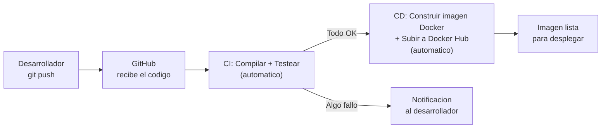

El diagrama muestra el flujo completo. Ustedes solo hacen `git push`. Todo lo demas ocurre solo en los servidores de GitHub. Si algo falla, les llega una notificacion. Si todo pasa, la imagen Docker queda lista en Docker Hub para que cualquiera la descargue y ejecute.

- **CI (Continuous Integration):** Cada push compila y testea automaticamente. Detecta errores en minutos, no en dias.
- **CD (Continuous Delivery):** Si CI pasa, empaqueta y publica automaticamente. Sin intervenccion manual.

| Sin CI/CD | Con CI/CD |
|-----------|-----------|
| "Ya lo probe en mi maquina, funciona" | El servidor compila y testea por ti |
| Si algo falla, nadie se entera hasta que otro lo descarga | Notificacion inmediata en GitHub |
| Deploy manual: copiar .jar por FTP al servidor | Imagen Docker publicada automaticamente |
| "Quien rompio el build?" — horas investigando | El commit exacto que rompio queda marcado en rojo |

---

# 2. GitHub Actions: CI/CD Gratis Integrado en GitHub

GitHub Actions es la plataforma de CI/CD integrada en GitHub. No necesitan instalar nada, no necesitan un servidor propio. Funciona directamente desde su repositorio.

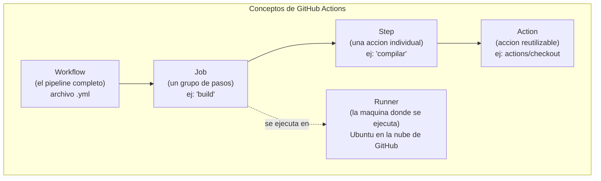

El diagrama muestra la jerarquia: un Workflow contiene Jobs, cada Job contiene Steps, y cada Step puede usar una Action predefinida o ejecutar un comando de terminal. Todo se ejecuta en un Runner (una maquina Ubuntu en la nube de GitHub).

| Concepto | Que es | Ejemplo |
|----------|--------|---------|
| **Workflow** | El pipeline completo (archivo YAML) | `.github/workflows/build.yml` |
| **Job** | Un grupo de pasos dentro del workflow | `build`, `docker`, `deploy` |
| **Step** | Una accion individual dentro del job | "Compilar", "Ejecutar tests" |
| **Action** | Accion reutilizable de la comunidad | `actions/checkout@v4`, `actions/setup-java@v4` |
| **Runner** | La maquina donde se ejecuta | `ubuntu-latest` (en la nube de GitHub) |

**Costo:**
- Repositorios publicos: **GRATIS** (ilimitado)
- Repositorios privados: 2000 minutos/mes gratis (mas que suficiente)

---

# PARTE II — CREAR EL PIPELINE

> **ATAJO:** Si prefieren que un script haga todo el setup automaticamente, pueden usar `setup_cicd.sh` que crea todos los archivos de esta seccion (workflow, .env, README, docs/). Copien el archivo a la raiz de su proyecto y ejecuten: `bash setup_cicd.sh`. El script les pide los datos (nombre de BD, usuario de Docker Hub) y genera todo. **Igual tienen que leer el manual** para entender que hizo el script, y los Secrets de GitHub (Paso 5.3) se configuran a mano en el navegador.

# 3. Para Que Sirve Todo Esto (En Este Curso, En Concreto)

Antes de escribir una linea de YAML, necesitan saber **por que estan haciendo esto** y **que van a entregar**.

## 3.1. El resultado final: que van a tener al terminar hoy

Al final del dia, su proyecto va a tener:

```
╔════════════════════════════════════════════════════════════════════╗
║   SU PROYECTO DESPUES DEL DIA 17                                  ║
╠════════════════════════════════════════════════════════════════════╣
║                                                                    ║
║  1. Un pipeline que compila y testea automaticamente              ║
║     → Cada vez que hacen git push, GitHub lo verifica solo        ║
║     → Si algo falla, les avisa (badge rojo en el README)          ║
║                                                                    ║
║  2. Su imagen Docker publicada en Docker Hub                      ║
║     → Cualquiera puede ejecutar su proyecto con UN comando        ║
║     → docker pull su-usuario/su-proyecto:latest                   ║
║                                                                    ║
║  3. Un README profesional con:                                    ║
║     → Badge verde de "este proyecto compila y pasa tests"         ║
║     → Screenshot de Swagger (la API documentada)                  ║
║     → Instrucciones para ejecutar                                 ║
║                                                                    ║
║  4. ENTREGABLE para la certificacion:                             ║
║     → PDF del Swagger con todos los endpoints                     ║
║     → Entrega en el repositorio del curso                         ║
║                                                                    ║
╚════════════════════════════════════════════════════════════════════╝
```

## 3.2. Como conecta con la entrega del curso

Todo lo que hacen hoy tiene un proposito directo para la entrega final:

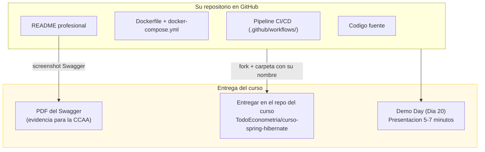

El diagrama muestra que su repositorio en GitHub alimenta tres cosas: el PDF de Swagger como evidencia imprimible para la Comunidad Autonoma, la entrega en el repositorio del curso, y la presentacion del Demo Day.

| Entregable | Para quien | Formato | Lo hacemos hoy |
|------------|-----------|---------|:--------------:|
| Repositorio GitHub con pipeline verde | Reclutadores + profesor | URL del repo | SI |
| Imagen en Docker Hub | Cualquiera que quiera probar | `docker pull` | SI |
| README con badge + screenshot | Reclutadores + evaluacion | Markdown en GitHub | SI |
| **PDF del Swagger** | **CCAA (certificacion)** | **PDF imprimible** | **SI** |
| Entrega en repo del curso | Profesor (evaluacion formal) | Fork + carpeta | Dia 19-20 |
| Presentacion Demo Day | Clase + profesor | 5-7 minutos en vivo | Dia 20 |

> Lo que NO van a entregar: no entregan el codigo por email, no entregan un ZIP, no entregan un Word. **Entregan un repositorio vivo** con pipeline verde, imagen publicada, y README que explica todo. Y un PDF imprimible del Swagger como evidencia para la Comunidad Autonoma.

## 3.3. Que es un pipeline (en 30 segundos)

Un **pipeline** automatiza lo que ustedes hacen a mano. Hasta ahora:

1. Compilan a mano (`mvn compile`)
2. Testean a mano (`mvn test`)
3. Generan el JAR a mano (`mvn package`)
4. Construyen la imagen Docker a mano (`docker build`)
5. Suben a Docker Hub a mano (`docker push`)

Con un pipeline, todo eso pasa **solo** cada vez que hacen `git push`. Si algo falla, les llega una notificacion. Si todo pasa, la imagen Docker se publica automaticamente.

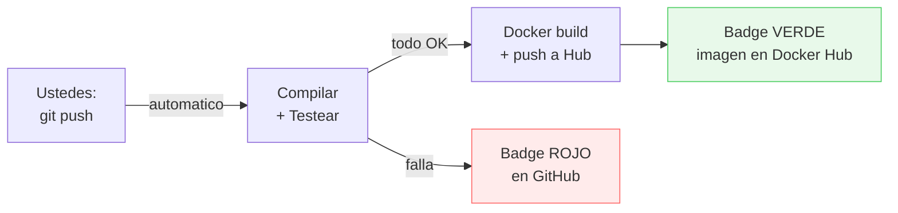

**Donde se ejecuta:** NO en su PC. En un servidor Ubuntu de GitHub (gratis para repos publicos). GitHub les presta una maquina limpia, ejecuta los pasos, y la destruye. Por eso el primer paso del pipeline siempre es "descargar su codigo" — la maquina no tiene nada.

## 3.4. Requisito: el proyecto DEBE estar en GitHub

> **PAREN.** Si su proyecto no esta subido a GitHub, nada de lo que sigue va a funcionar. Verifiquen AHORA.

```bash
# En la terminal de IntelliJ, en la raiz del proyecto:
git remote -v
```

**Si ven algo asi, OK — sigan adelante:**
```
origin  https://github.com/SU-USUARIO/SU-PROYECTO.git (fetch)
origin  https://github.com/SU-USUARIO/SU-PROYECTO.git (push)
```

**Si NO ven nada** (o da error), necesitan subir el proyecto:

1. Ir a github.com > boton **"+"** > **New repository**
2. Nombre: el de su proyecto (ej: `cine-estrella`)
3. **Publico** (para GitHub Actions gratis ilimitado)
4. **NO marcar** "Add README" (ya tienen archivos)
5. GitHub les muestra comandos — ejecuten estos en la terminal de IntelliJ:

```bash
git init
git branch -M main
git remote add origin https://github.com/SU-USUARIO/SU-PROYECTO.git
git add .
git commit -m "Initial commit"
git push -u origin main
```

**Si pide contraseña:** GitHub ya no acepta contraseñas. Necesitan un **Personal Access Token**:
1. GitHub > su avatar > **Settings** > **Developer Settings** > **Personal Access Tokens** > **Tokens (classic)**
2. **Generate new token** > marcar **repo** (todo el checkbox)
3. Copiar el token — usarlo como contraseña cuando git les pida

**VERIFICAR:** Abran `https://github.com/SU-USUARIO/SU-PROYECTO` en el navegador. Deben ver `pom.xml`, `src/`, `Dockerfile`, etc. Si lo ven, pueden continuar.

---

# 4. Crear el Primer Workflow: Solo CI (Compilar y Testear)

Vamos a crear el pipeline en dos fases. Primero solo CI (compilar + testear), y despues le agregamos CD (Docker Hub). Asi, si algo falla, saben exactamente en que fase esta el problema.

> **NOTA:** YAML es el formato de estos archivos. Dos reglas basicas: la indentacion es con **ESPACIOS** (2 espacios, NO tabuladores), y los guiones `-` indican elementos de una lista. Con eso alcanza.

## Paso 4.1: Crear la estructura de carpetas

> **QUE VAMOS A HACER:** Crear la carpeta donde GitHub busca los workflows.
> **POR QUE:** GitHub Actions SOLO busca archivos YAML dentro de `.github/workflows/`. Si el archivo esta en otro sitio, no lo detecta. El punto delante de `.github` es obligatorio — en Unix/Linux, las carpetas que empiezan con punto son "ocultas".

**DONDE:** En la **terminal de IntelliJ** (pestaña `Terminal` abajo del todo). Asegurense de estar en la raiz de su proyecto — deben ver el `pom.xml` si hacen `ls`.

```bash
# Verificar que estan en la raiz del proyecto
ls pom.xml
# Si da error "No such file", estan en la carpeta equivocada.
# Navegar a la raiz:
# cd C:\Users\TU-USUARIO\IdeaProjects\TU-PROYECTO

# Crear la carpeta (el -p crea todas las carpetas intermedias)
mkdir -p .github/workflows
```

**QUE DEBERIAN VER:** En el panel izquierdo de IntelliJ (Project), deberia aparecer la carpeta `.github` > `workflows` al mismo nivel que `src/` y `pom.xml`. Si NO la ven, hagan click derecho en la raiz del proyecto > Reload from Disk.

> **ATENCION:** Si la carpeta aparece dentro de `src/` o dentro de `target/`, esta MAL. Debe estar en la raiz, al lado del `pom.xml`. Borrenla y vuelvan a crearla asegurandose de estar en la carpeta correcta.

```
mi-proyecto/                  <-- raiz del proyecto
  .github/                    <-- AQUI (con punto delante)
    workflows/
      build.yml               <-- lo creamos en el paso siguiente
  src/
  target/
  pom.xml
  Dockerfile
  docker-compose.yml
  .env                        <-- NO se sube (esta en .gitignore)
```

## Paso 4.2: Crear el archivo del workflow

> **QUE VAMOS A HACER:** Escribir el pipeline de CI que compila, testea y empaqueta.
> **POR QUE:** Este archivo le dice a GitHub: "cada vez que alguien haga push a main, ejecuta estos pasos automaticamente en un servidor Ubuntu en la nube".

**COMO CREAR EL ARCHIVO:** Tienen dos opciones:

**Opcion A — Desde IntelliJ (recomendado):**
1. Click derecho en la carpeta `workflows` (en el panel izquierdo)
2. New > File
3. Nombre: `build.yml` (respetar minusculas y la extension `.yml`)
4. Se abre el editor — pegar el contenido de abajo

**Opcion B — Desde la terminal de IntelliJ:**

```bash
# Desde la raiz del proyecto:
notepad .github/workflows/build.yml
# Se abre el Bloc de notas — pegar el contenido, guardar y cerrar
```

**CONTENIDO del archivo `.github/workflows/build.yml`** — copien TODO exactamente como esta, respetando la indentacion (son espacios, NO tabuladores):

```yaml
# ============================================================
# Pipeline CI: Compilar, testear, y construir imagen Docker
# Este archivo le dice a GitHub: "cuando alguien haga push,
# ejecuta estos pasos automaticamente en un servidor en la nube"
# ============================================================
name: CI/CD Pipeline

# ===========================================
# SECCION 1: CUANDO SE EJECUTA
# ===========================================
# "on" define los EVENTOS que disparan el pipeline.
# Piensen en esto como un listener/trigger:
#   - Cuando alguien hace push a main → se ejecuta
#   - Cuando alguien crea un pull request a main → se ejecuta
on:
  push:
    branches: [ main ]
  pull_request:
    branches: [ main ]

# ===========================================
# SECCION 2: QUE SE EJECUTA
# ===========================================
# "jobs" contiene los trabajos. Cada job es un grupo de pasos.
# Pueden tener varios jobs (build, test, deploy), pero
# nosotros usamos uno solo llamado "build".
jobs:
  build:
    # En que maquina se ejecuta: Ubuntu Linux en la nube de GitHub.
    # Es una maquina NUEVA cada vez — no tiene nada suyo.
    runs-on: ubuntu-latest

    # Los pasos se ejecutan EN ORDEN, uno tras otro.
    # Si uno falla, los siguientes NO se ejecutan.
    steps:
      # ---- PASO 1: Descargar su codigo ----
      # El runner esta vacio. Lo primero es traer su codigo.
      # "uses" significa: "usa esta Action predefinida de la comunidad"
      # actions/checkout@v4 = hace un git clone de su repo
      - name: Checkout codigo
        uses: actions/checkout@v4

      # ---- PASO 2: Instalar Java ----
      # El runner tiene Java preinstalado pero no siempre la version correcta.
      # Esto garantiza Java 17 Temurin (la misma que usan en clase).
      - name: Configurar Java 17
        uses: actions/setup-java@v4
        with:
          java-version: '17'
          distribution: 'temurin'

      # ---- PASO 3: Cache de Maven ----
      # Sin cache, Maven descarga TODAS las dependencias cada vez (~2 min).
      # Con cache, las guarda y solo descarga las nuevas (~10 seg).
      # Es como tener la carpeta .m2 guardada entre ejecuciones.
      - name: Cache Maven
        uses: actions/cache@v4
        with:
          path: ~/.m2/repository
          key: ${{ runner.os }}-maven-${{ hashFiles('**/pom.xml') }}
          restore-keys: |
            ${{ runner.os }}-maven-

      # ---- PASO 4: Compilar ----
      # Exactamente lo mismo que "mvn compile" en su terminal.
      # "run" significa: "ejecuta este comando de terminal"
      - name: Compilar
        run: mvn compile

      # ---- PASO 5: Ejecutar tests ----
      # Aqui es donde CI demuestra su valor: si un test falla,
      # el pipeline se marca ROJO y les notifica.
      # Sin CI, el test fallaria en silencio en la maquina de alguien.
      - name: Ejecutar tests
        run: mvn test

      # ---- PASO 6: Generar el JAR ----
      # -DskipTests porque ya los ejecutamos en el paso anterior.
      # El JAR queda en target/ dentro del runner.
      - name: Empaquetar
        run: mvn package -DskipTests

      # ---- PASO 7: Construir imagen Docker ----
      # Usa el Dockerfile que crearon en el Dia 15.
      # La etiqueta incluye el hash del commit para trazabilidad.
      - name: Build Docker image
        run: docker build -t ${{ github.repository }}:${{ github.sha }} .
```

## 4.3. Anatomia del workflow: que significa cada cosa

Vamos linea por linea. Esto es importante — si no entienden que hace cada parte, no van a poder arreglar los errores cuando fallen.

### Seccion `on:` — El trigger (cuando se ejecuta)

```yaml
on:
  push:
    branches: [ main ]
  pull_request:
    branches: [ main ]
```

Esto define **cuando** GitHub dispara el pipeline. Es como un `@EventListener` de Spring: "cuando ocurra el evento X, ejecuta esto".

| Evento | Cuando se dispara | Ejemplo |
|--------|-------------------|---------|
| `push` a `main` | Alguien hace `git push` a la rama main | Ustedes suben codigo nuevo |
| `pull_request` a `main` | Alguien crea o actualiza un PR hacia main | Un compañero quiere mergear su trabajo |

**Lo que NO dispara el pipeline:**
- Push a otras ramas (ej: `feature/nueva-pizza`) — solo `main`
- Editar archivos directamente en GitHub (depende de la config)
- Hacer commit sin push — el pipeline es de GitHub, no de su PC

### Seccion `jobs:` — Los trabajos

```yaml
jobs:
  build:
    runs-on: ubuntu-latest
```

Un workflow puede tener varios jobs (ej: `build`, `test`, `deploy`). Nosotros usamos uno solo: `build`. El `runs-on: ubuntu-latest` significa que se ejecuta en la version mas reciente de Ubuntu que GitHub ofrece.

### Seccion `steps:` — Los pasos

Cada `step` tiene:

| Campo | Que hace | Ejemplo |
|-------|----------|---------|
| `name` | Nombre descriptivo (aparece en la UI de GitHub) | `"Compilar"` |
| `uses` | Usa una Action predefinida (como una dependencia Maven) | `actions/checkout@v4` |
| `run` | Ejecuta un comando de terminal | `mvn compile` |
| `with` | Parametros para la Action | `java-version: '17'` |
| `if` | Condicion: solo ejecutar si se cumple | `if: github.event_name == 'push'` |

**`uses` vs `run`**: Son las dos formas de definir un paso.
- `uses`: invoca una Action pre-hecha de la comunidad (como importar una libreria)
- `run`: ejecuta un comando de terminal directamente (como escribir codigo propio)

### Las expresiones `${{ }}`

Cuando ven `${{ algo }}`, es una **expresion de GitHub Actions** — se reemplaza por un valor en tiempo de ejecucion:

| Expresion | Que valor tiene | Para que se usa |
|-----------|-----------------|-----------------|
| `${{ github.sha }}` | Hash del commit (ej: `a1b2c3d`) | Etiquetar la imagen Docker con el commit exacto |
| `${{ github.repository }}` | `usuario/nombre-repo` | Para nombrar la imagen Docker |
| `${{ runner.os }}` | `Linux` | Para la cache de Maven |
| `${{ secrets.NOMBRE }}` | El valor del secreto (cifrado) | Credenciales de Docker Hub (lo vemos en la siguiente seccion) |
| `${{ hashFiles('**/pom.xml') }}` | Hash del pom.xml | Si el pom no cambio, reutilizar la cache |

No es codigo Java, no es JavaScript — es la sintaxis propia de GitHub Actions. Solo la necesitan dentro de los archivos `.yml`.

### Resumen visual: que hace cada paso

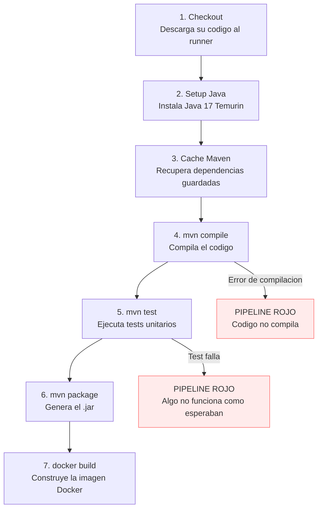

Si el paso 4 falla (no compila), los pasos 5, 6 y 7 no se ejecutan. Si el paso 5 falla (un test no pasa), los pasos 6 y 7 no se ejecutan. El pipeline se detiene en el primer error — exactamente como Java detiene la ejecucion en la primera excepcion no capturada.

---

# PARTE III — SUBIR LA IMAGEN A DOCKER HUB

# 5. Docker Hub: Su Imagen Disponible para el Mundo

Docker Hub es como GitHub pero para imagenes Docker. Cualquiera puede descargar su imagen y ejecutarla con un solo comando, sin clonar el repo, sin instalar Java, sin compilar nada.

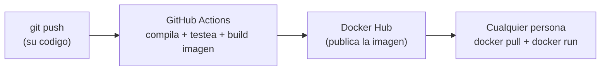

El diagrama muestra el flujo: ustedes hacen push de codigo, GitHub Actions construye todo, y la imagen termina en Docker Hub lista para que cualquiera la descargue.

## Paso 5.1: Crear cuenta en Docker Hub

> **QUE VAMOS A HACER:** Crear una cuenta gratuita en Docker Hub.
> **POR QUE:** Necesitan un lugar donde publicar su imagen Docker. Docker Hub es gratuito para imagenes publicas (ilimitadas).

1. Ir a https://hub.docker.com/
2. Click en **Sign Up** (o **Register**)
3. Crear cuenta con usuario y contraseña
4. Verificar el email

**QUE DEBERIAN VER:** Su dashboard de Docker Hub vacio (sin repositorios aun).

> **TIP:** Usen un nombre de usuario profesional (su nombre real o algo reconocible). Este usuario aparecera en la URL de su imagen: `docker.io/SU-USUARIO/su-proyecto`.

## Paso 5.2: Crear un Access Token en Docker Hub

> **QUE VAMOS A HACER:** Generar un token de acceso para que GitHub Actions pueda subir imagenes a su cuenta.
> **POR QUE:** Nunca se pone la contraseña real en un pipeline. Los tokens son mas seguros: se pueden revocar individualmente y tienen permisos limitados.

1. En Docker Hub: click en su avatar (arriba derecha) > **Account Settings**
2. En el menu izquierdo: **Security** > **New Access Token**
3. Descripcion: `github-actions`
4. Permisos: **Read & Write**
5. Click **Generate**
6. **COPIEN EL TOKEN AHORA** — solo se muestra una vez

**QUE DEBERIAN VER:** Un token largo tipo `dckr_pat_xxxxxxxxxxxxxxxxxxxx`. Guardenlo temporalmente en un archivo de texto (lo van a necesitar en el siguiente paso).

## Paso 5.3: Configurar Secrets en GitHub

> **QUE VAMOS A HACER:** Guardar el usuario y token de Docker Hub como secretos cifrados en GitHub.
> **POR QUE:** El pipeline necesita hacer login en Docker Hub para subir la imagen. Pero NUNCA se ponen credenciales directamente en el archivo YAML (ese archivo se sube a GitHub y cualquiera lo ve). Los Secrets son la solucion.

### Que son los GitHub Secrets

Los **Secrets** son variables cifradas que se guardan en la configuracion de su repositorio en GitHub. Son parecidos al archivo `.env` que usamos en Docker Compose (Dia 16), pero a nivel de GitHub:

| Concepto | Donde se guardan | Quien los ve | Como se usan |
|----------|-----------------|--------------|--------------|
| `.env` (Docker Compose) | Archivo local en su PC | Solo ustedes | `${POSTGRES_PASSWORD}` en docker-compose.yml |
| **GitHub Secrets** | Configuracion del repositorio en GitHub (cifrado) | Solo ustedes (ni los colaboradores ven el valor) | `${{ secrets.NOMBRE }}` en el workflow .yml |

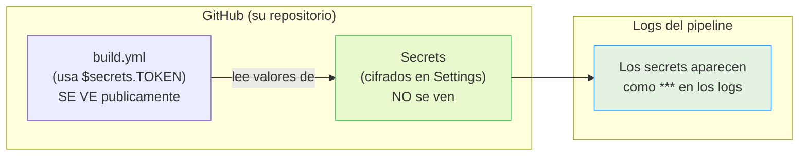

El diagrama muestra la separacion: el archivo `build.yml` es publico (cualquiera que visite su repo lo lee), pero los valores reales de los Secrets estan cifrados en Settings. Cuando el pipeline se ejecuta, usa los valores reales, pero en los logs aparecen como `***`.

**Es el mismo patron que el `.env`:** el archivo de configuracion (docker-compose.yml / build.yml) usa variables, y los valores reales estan en otro lugar seguro (.env / GitHub Secrets).

### Como crear los Secrets (paso a paso)

1. Abran su repositorio en GitHub en el navegador
2. Click en la pestaña **Settings** (la de rueda dentada, arriba del repo — NO la del perfil)
3. En el menu lateral izquierdo: **Secrets and variables** > **Actions**
4. Click en el boton verde **New repository secret**
5. Crear el primer secreto:
   - **Name:** `DOCKERHUB_USERNAME`
   - **Secret:** Su nombre de usuario de Docker Hub (ej: `juanperez`)
   - Click **Add secret**
6. Repetir para el segundo:
   - **Name:** `DOCKERHUB_TOKEN`
   - **Secret:** El token que copiaron en el paso anterior (`dckr_pat_xxxx...`)
   - Click **Add secret**

| Name | Value | Para que se usa |
|------|-------|-----------------|
| `DOCKERHUB_USERNAME` | Su usuario de Docker Hub (ej: `juanperez`) | Para hacer login en Docker Hub |
| `DOCKERHUB_TOKEN` | El token del paso anterior | Es la "contraseña" (pero revocable y con permisos limitados) |

**QUE DEBERIAN VER:** Dos secretos listados en la pagina. El valor NO se muestra (solo aparece la fecha de creacion) — esto es **correcto y es el punto**: nadie puede ver los valores, ni siquiera ustedes despues de guardarlos. Si necesitan cambiarlo, lo actualizan (no lo leen).

> **IMPORTANTE:** Estos secrets son **de su repositorio**, no de su cuenta entera. Si tienen otro repositorio, necesitan crear los secrets de nuevo ahi.

## Paso 5.4: Actualizar el workflow para subir a Docker Hub

> **QUE VAMOS A HACER:** Anadir pasos al pipeline para hacer login en Docker Hub y subir la imagen.
> **POR QUE:** Con esto, cada push a main genera automaticamente una imagen nueva en Docker Hub.

**DONDE:** Abran el archivo `.github/workflows/build.yml` que crearon en el Paso 4.2. En IntelliJ, panel izquierdo > `.github` > `workflows` > doble click en `build.yml`. Seleccionen TODO el contenido (Ctrl+A) y reemplacenlo con esta version completa:

```yaml
# ============================================================
# Pipeline CI/CD: Compilar, testear, Docker build + push
# ============================================================
name: CI/CD Pipeline

on:
  push:
    branches: [ main ]
  pull_request:
    branches: [ main ]

jobs:
  build:
    runs-on: ubuntu-latest

    steps:
      # --- CI: Compilar y testear ---

      - name: Checkout codigo
        uses: actions/checkout@v4

      - name: Configurar Java 17
        uses: actions/setup-java@v4
        with:
          java-version: '17'
          distribution: 'temurin'

      - name: Cache Maven
        uses: actions/cache@v4
        with:
          path: ~/.m2/repository
          key: ${{ runner.os }}-maven-${{ hashFiles('**/pom.xml') }}
          restore-keys: |
            ${{ runner.os }}-maven-

      - name: Compilar
        run: mvn compile

      - name: Ejecutar tests
        run: mvn test

      - name: Empaquetar
        run: mvn package -DskipTests

      # ============================================================
      # --- CD: Construir imagen Docker y subir a Docker Hub ---
      # Estos pasos solo se ejecutan en PUSH (no en Pull Requests).
      # Usan los Secrets que configuraron en el Paso 5.3.
      # ============================================================

      # Paso 8: Login en Docker Hub
      # Aqui es donde entran los Secrets. El pipeline lee:
      #   - secrets.DOCKERHUB_USERNAME → su usuario (ej: "juanperez")
      #   - secrets.DOCKERHUB_TOKEN → el token que generaron
      # Estos valores NUNCA aparecen en el archivo ni en los logs.
      - name: Login en Docker Hub
        if: github.event_name == 'push'
        uses: docker/login-action@v3
        with:
          username: ${{ secrets.DOCKERHUB_USERNAME }}
          password: ${{ secrets.DOCKERHUB_TOKEN }}

      # Paso 9: Construir la imagen Docker Y subirla a Docker Hub
      # Es lo mismo que "docker build" + "docker push" combinados.
      # La imagen se sube con dos etiquetas (tags):
      #   - latest: siempre apunta a la version mas reciente
      #   - sha: etiqueta con el hash del commit (para trazabilidad)
      - name: Build y Push imagen Docker
        if: github.event_name == 'push'
        uses: docker/build-push-action@v6
        with:
          context: .
          push: true
          tags: |
            ${{ secrets.DOCKERHUB_USERNAME }}/${{ github.event.repository.name }}:latest
            ${{ secrets.DOCKERHUB_USERNAME }}/${{ github.event.repository.name }}:${{ github.sha }}
```

### Como funcionan los Secrets dentro del workflow

Cuando el pipeline se ejecuta, GitHub reemplaza `${{ secrets.DOCKERHUB_USERNAME }}` por el valor real que guardaron en Settings. Es exactamente como Docker Compose reemplaza `${POSTGRES_PASSWORD}` por el valor del `.env`:

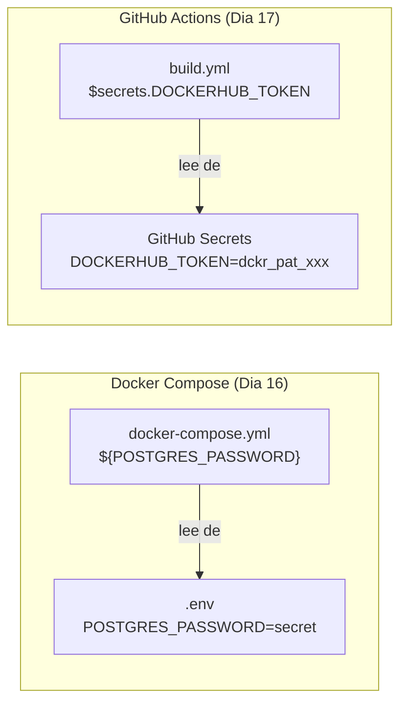

El patron es el mismo: **el archivo de configuracion usa variables, los valores reales estan en otro lugar seguro**. La diferencia es que `.env` esta en su PC y GitHub Secrets esta en los servidores de GitHub (cifrado).

### Que hay de nuevo respecto a la version anterior

| Paso | Que hace | Detalle |
|------|----------|---------|
| `docker/login-action@v3` | Hace login en Docker Hub con sus credenciales | Usa los secrets que configuraron en el Paso 5.3 |
| `docker/build-push-action@v6` | Construye la imagen Y la sube a Docker Hub | Todo en un solo paso, optimizado |
| `if: github.event_name == 'push'` | Solo sube en push a main, NO en pull requests | Evita subir imagenes de PRs sin revisar |
| `tags: latest` | La imagen se publica como `su-usuario/su-proyecto:latest` | Siempre apunta a la ultima version |
| `tags: ${{ github.sha }}` | Tambien se etiqueta con el hash del commit | Para tener versiones exactas (trazabilidad) |

---

# PARTE IV — PROBAR EL PIPELINE

# 6. Probar que Todo Funciona

## Paso 6.1: Commit y push

> **QUE VAMOS A HACER:** Subir el workflow a GitHub para que se ejecute por primera vez.
> **POR QUE:** GitHub Actions detecta automaticamente los archivos en `.github/workflows/` y los ejecuta segun las reglas del `on:`.

**DONDE:** En la **terminal de IntelliJ** (pestaña `Terminal` abajo). Asegurense de estar en la raiz del proyecto (donde esta el `pom.xml`).

**ANTES DE HACER PUSH:** Verifiquen que el archivo existe y que git lo ve:

```bash
# Verificar que el archivo esta donde debe estar
ls .github/workflows/build.yml
# Si da error: el archivo no esta en la ruta correcta

# Verificar que git detecta el archivo nuevo
git status
# Debe aparecer en rojo: .github/workflows/build.yml (Untracked files)
```

**AHORA SI — commit y push:**

```bash
git add .github/workflows/build.yml
git commit -m "Add CI/CD pipeline: build, test, Docker push to Hub"
git push
```

**QUE DEBERIAN VER:** El push debe terminar sin errores. Si pide usuario/contraseña, usen el token de GitHub (no la contraseña). Si da error `rejected`, probablemente la rama no es `main` — pregunten al profesor.

> **PROBLEMA COMUN:** Si hacen `git push` y dice `Everything up-to-date`, el commit no se hizo. Vuelvan a hacer `git add` y `git commit`. Verifiquen con `git log --oneline -3` que su commit aparece.

## Paso 6.2: Ver el pipeline en GitHub

> **QUE VAMOS A HACER:** Verificar que el workflow se disparo y monitorear su progreso.
> **POR QUE:** La primera vez puede fallar (dependencias, configuracion, etc.). Hay que verificar.

1. Abran su repositorio en GitHub
2. Vayan a la pestaña **Actions**
3. Van a ver "CI/CD Pipeline" ejecutandose

**QUE DEBERIAN VER:**

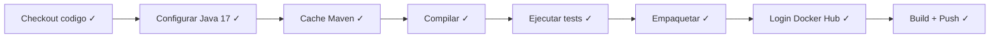

Cada paso se muestra con un indicador: circulo amarillo (en ejecucion), check verde (paso), X roja (fallo). El pipeline completo tarda entre 2 y 5 minutos la primera vez.

## Paso 6.3: Verificar la imagen en Docker Hub

> **QUE VAMOS A HACER:** Confirmar que la imagen se subio correctamente.
> **POR QUE:** Que el pipeline este verde no garantiza que la imagen este accesible. Verificar siempre.

1. Ir a https://hub.docker.com/
2. En su perfil, deberia aparecer un nuevo repositorio con el nombre de su proyecto
3. Click en el repositorio — deberian ver al menos 2 tags: `latest` y el hash del commit

**QUE DEBERIAN VER:** La imagen publicada con la fecha de hoy.

Ahora cualquier persona en el mundo puede ejecutar su proyecto con:

```bash
docker pull su-usuario/su-proyecto:latest
docker run -p 8081:8081 su-usuario/su-proyecto:latest
```

Sin clonar el repo, sin instalar Java, sin compilar. Eso es CI/CD.

---

# 7. Cuando el Pipeline Falla

No se asusten. Es normal que falle la primera vez. Lo importante es saber leer los logs.

## Como leer los logs de un fallo

1. En GitHub > Actions > click en el workflow con X roja
2. Click en el job "build"
3. Click en el paso que tiene la X roja
4. Lean el log expandido — el error esta ahi

## Errores comunes

| Error | Causa probable | Solucion |
|-------|---------------|----------|
| `Compilation failure` | Error de sintaxis o import faltante | Arreglar el codigo, commit, push |
| `Tests run: X, Failures: Y` | Un test no paso | Arreglar el test o el codigo |
| `unauthorized: incorrect username or password` | Los secrets de Docker Hub estan mal | Verificar DOCKERHUB_USERNAME y DOCKERHUB_TOKEN en Settings > Secrets |
| `denied: requested access to the resource is denied` | El nombre del repositorio no coincide | Verificar que el nombre del repo en Docker Hub coincide |
| `Cannot resolve dependencies` | Dependencia mal declarada en pom.xml | Verificar groupId, artifactId |
| `Error: Process completed with exit code 1` | Error generico | Leer las lineas ANTERIORES del log — ahi esta la causa real |

> Cada vez que hacen push, el pipeline se ejecuta de nuevo automaticamente. Corrijan, commit, push — el ciclo es asi.

---

# PARTE V — README PROFESIONAL

# 8. El README como Carta de Presentacion

El README.md es lo primero que ve un reclutador cuando abre su repositorio. Tienen literalmente **10 segundos** para convencerle de que su proyecto vale la pena. Un README vacio o generico dice "no me importa". Un README profesional dice "se lo que hago".

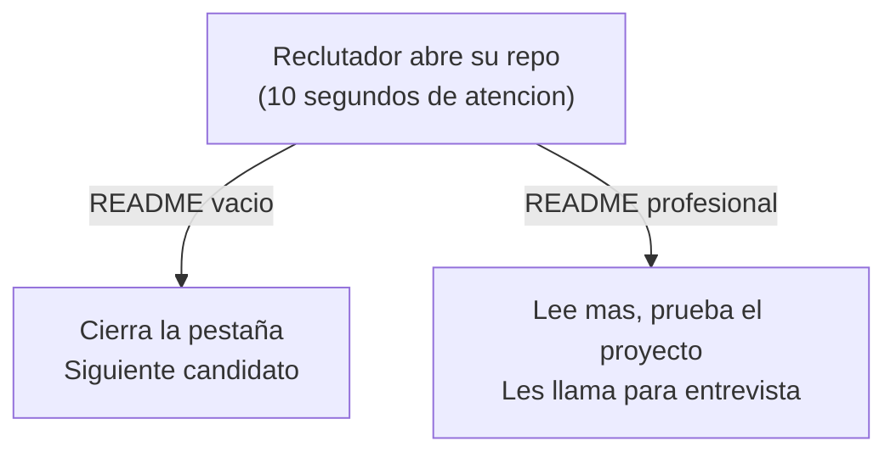

## Paso 8.1: Estructura del README profesional

> **QUE VAMOS A HACER:** Crear un README con toda la informacion que un reclutador o compañero necesita.
> **POR QUE:** Es su carta de presentacion tecnica. Vale mas que un CV de 3 paginas.

**DONDE:** El archivo `README.md` debe estar en la **raiz del proyecto** (al lado del `pom.xml`, `Dockerfile`, `docker-compose.yml`). Si ya tienen uno, abranlo en IntelliJ (doble click en el panel izquierdo) y reemplacen todo el contenido. Si no tienen uno, click derecho en la raiz del proyecto > New > File > `README.md`.

Estructura completa — adapten los datos a su proyecto:

```markdown
# Nombre del Proyecto


Descripcion breve de una linea: que hace la aplicacion y para quien.

## Tecnologias

| Tecnologia | Version | Uso |
|------------|---------|-----|
| Java | 17 | Lenguaje principal |
| Spring Boot | 4.0.x | Framework backend |
| JPA/Hibernate | 6.x | Persistencia (ORM) |
| PostgreSQL | 16 | Base de datos (Docker) |
| H2 | - | Base de datos (desarrollo) |
| Docker | - | Contenedorizacion |
| GitHub Actions | - | CI/CD |
| Swagger/OpenAPI | - | Documentacion API |

## Arquitectura

(Aqui va un diagrama Mermaid con las capas: Controller > Service > Repository > BD)

## API Endpoints

| Metodo | URL | Descripcion |
|--------|-----|-------------|
| GET | `/api/recurso` | Listar todos |
| GET | `/api/recurso/{id}` | Obtener por ID |
| POST | `/api/recurso` | Crear nuevo |
| PUT | `/api/recurso/{id}` | Actualizar |
| DELETE | `/api/recurso/{id}` | Eliminar |

## Screenshot Swagger

(Aqui va la imagen capturada con GoFullPage)

## Como ejecutar

### Opcion 1: Docker Compose (recomendado)

(Instrucciones con docker compose up)

### Opcion 2: Desde Docker Hub (sin clonar)

(Instrucciones con docker pull + docker run)

### Opcion 3: Desde IntelliJ (desarrollo)

(Instrucciones con IntelliJ)

## Autor

Nombre — Curso IFCD0014
```

## Paso 8.2: El badge de CI/CD

> **QUE VAMOS A HACER:** Agregar un badge que muestra si el pipeline esta pasando o fallando.
> **POR QUE:** Es lo primero que ve un reclutador. Un badge verde dice "este proyecto compila y pasa tests".

```markdown

```

Reemplacen `SU-USUARIO` con su usuario de GitHub y `SU-REPO` con el nombre del repositorio.

**QUE DEBERIAN VER:** Un badge verde con "passing" si el pipeline esta OK, o rojo con "failing" si algo fallo.

## Paso 8.3: Screenshot de Swagger con GoFullPage

> **QUE VAMOS A HACER:** Capturar una imagen completa de su Swagger UI para incluirla en el README.
> **POR QUE:** Un reclutador no va a clonar su proyecto para ver los endpoints. Con un screenshot, lo ve de un vistazo.

1. Instalar la extension GoFullPage en Chrome: busquen "GoFullPage" en la Chrome Web Store
2. Con su app corriendo (`docker compose up -d` o desde IntelliJ), abrir Swagger: `http://localhost:8081/swagger-ui.html`
3. Expandir todos los endpoints (click en cada tag para que se abran)
4. Click en el icono de GoFullPage (una camara en la barra de extensiones)
5. Descargar la imagen como PNG
6. Guardarla en su proyecto: `docs/swagger-screenshot.png` (creen la carpeta `docs/` si no existe)

```bash
mkdir -p docs
# Mover el screenshot descargado a la carpeta docs/
# (el nombre puede variar segun lo que descargaron)
```

7. En el README, referenciar la imagen:

```markdown
## Screenshot Swagger


```

**QUE DEBERIAN VER:** La imagen del Swagger completo renderizada en el README de GitHub.

## Paso 8.4: PDF del Swagger para la certificacion (CCAA)

> **QUE VAMOS A HACER:** Generar un PDF imprimible con todos los endpoints de su API.
> **POR QUE:** La Comunidad Autonoma necesita evidencia imprimible de que su proyecto funciona. El PDF del Swagger es la prueba de que tienen una API REST completa y documentada. Ademas, la vais a necesitar para la entrega formal del Dia 19.

**Con la app corriendo** (desde IntelliJ o `docker compose up -d`):

**Opcion A — Desde Chrome (la mas facil):**
1. Abrir Swagger: `http://localhost:8081/swagger-ui.html` (o el puerto de su app)
2. **Expandir todos los endpoints**: click en cada tag/grupo para que se abran los GET, POST, PUT, DELETE
3. `Ctrl+P` (imprimir)
4. Destino: **Guardar como PDF**
5. Guardar como `docs/swagger-api.pdf`

**Opcion B — Desde GoFullPage + conversion:**
1. Capturar con GoFullPage (como en el paso anterior)
2. Descargar como PNG
3. Abrir el PNG en cualquier visor de imagenes
4. `Ctrl+P` > Guardar como PDF

**Opcion C — JSON de OpenAPI (para evaluadores tecnicos):**
```bash
# Descargar la especificacion JSON completa de su API
curl http://localhost:8081/v3/api-docs -o docs/openapi-spec.json

# O abrir en el navegador y Ctrl+S:
# http://localhost:8081/v3/api-docs
```

**QUE DEBERIAN TENER al final:**

```
docs/
    swagger-screenshot.png   <-- para el README (Paso 8.3)
    swagger-api.pdf          <-- para la CCAA (imprimible)
    openapi-spec.json        <-- opcional, especificacion tecnica
```

> **IMPORTANTE:** Este PDF es su evidencia de que la API existe y funciona. La CCAA lo necesita como parte del expediente del curso. Guardenlo tambien fuera del proyecto (USB, email a ustedes mismos) por si acaso.

## Paso 8.5: Seccion "Como ejecutar" con Docker Hub (y .env)

> **QUE VAMOS A HACER:** Documentar como ejecutar el proyecto de 3 formas diferentes.
> **POR QUE:** Cada persona que visite el repo tiene un contexto diferente. Unos quieren probarlo rapido (Docker Hub), otros quieren desarrollar (IntelliJ), otros quieren ver el stack completo (Docker Compose).

```markdown
## Como ejecutar

### Opcion 1: Docker Compose (stack completo con PostgreSQL)

```bash
git clone https://github.com/SU-USUARIO/SU-REPO.git
cd SU-REPO
cp .env.example .env    # Copiar y rellenar las credenciales
docker compose up --build -d
```

- App: http://localhost:8081
- Swagger: http://localhost:8081/swagger-ui.html
- Adminer (BD): http://localhost:9090

### Opcion 2: Desde Docker Hub (sin clonar, sin compilar)

```bash
docker pull SU-USUARIO-DOCKERHUB/SU-REPO:latest
docker run -p 8081:8081 SU-USUARIO-DOCKERHUB/SU-REPO:latest
```

> Nota: esta opcion usa H2 en memoria (los datos no persisten).

### Opcion 3: Desde IntelliJ (desarrollo)

1. Clonar el repositorio
2. Abrir en IntelliJ IDEA
3. Esperar a que Maven descargue las dependencias
4. Ejecutar la clase principal (`Application.java`)
5. Abrir http://localhost:8081/swagger-ui.html
```

## Paso 8.7: Commit del README

> **QUE VAMOS A HACER:** Subir el README y el screenshot.
> **POR QUE:** El push disparara el pipeline de nuevo (y el badge se actualizara).

```bash
git add README.md docs/
git commit -m "Add professional README with badge, Swagger screenshot and run instructions"
git push
```

**QUE DEBERIAN VER:** En GitHub, el README renderizado con el badge, la imagen de Swagger, y las instrucciones de uso.

---

# PARTE VI — JENKINS (REFERENCIA)

# 9. Jenkins: La Alternativa Enterprise

Jenkins es la herramienta de CI/CD mas veterana. Es open-source, autohospedada y usada por miles de empresas grandes. No lo van a practicar, pero deben saber que existe porque sale en el programa del curso y en entrevistas.

| Aspecto | GitHub Actions | Jenkins |
|---------|---------------|---------|
| **Instalacion** | Cero (viene con GitHub) | Instalar servidor + Java + plugins |
| **Costo** | Gratis para repos publicos | Software gratis, pero pagan el servidor |
| **Configuracion** | `.github/workflows/*.yml` | `Jenkinsfile` (Groovy) |
| **Donde se ejecuta** | Nube de GitHub | Su propio servidor |
| **Mantenimiento** | GitHub lo mantiene | Ustedes lo mantienen (actualizaciones, plugins, seguridad) |
| **Mejor para** | Equipos modernos, open source, startups | Enterprise, on-premises, regulaciones estrictas |

Ejemplo de Jenkinsfile equivalente (para que vean la similitud):

```groovy
pipeline {
    agent any
    tools {
        maven 'Maven-3.9'
        jdk 'JDK-17'
    }
    stages {
        stage('Compilar') {
            steps { sh 'mvn compile' }
        }
        stage('Tests') {
            steps { sh 'mvn test' }
        }
        stage('Empaquetar') {
            steps { sh 'mvn package -DskipTests' }
        }
    }
}
```

La estructura es similar: etapas (stages) con pasos (steps). La diferencia es que Jenkins necesita un servidor propio corriendo y configurado. En 2026, para un proyecto nuevo, GitHub Actions es la opcion practica.

---

# PARTE VII — EJERCICIO: TODO JUNTO

# 10. Ejercicio: Pipeline + README en su Proyecto Personal

Apliquen todo lo anterior a su proyecto personal (el blueprint). Sigan el checklist en orden:

### Bloque 1: Docker Hub

- [ ] Crear cuenta en Docker Hub (si no la tienen)
- [ ] Crear Access Token con permisos Read & Write
- [ ] Copiar el token (solo se muestra una vez)

### Bloque 2: Secrets en GitHub

- [ ] Ir a Settings > Secrets and variables > Actions
- [ ] Crear secret `DOCKERHUB_USERNAME` con su usuario
- [ ] Crear secret `DOCKERHUB_TOKEN` con el token

### Bloque 3: Workflow

- [ ] Crear carpeta `.github/workflows/`
- [ ] Crear `build.yml` con el pipeline completo (Seccion 5.4)
- [ ] Adaptar si su proyecto usa un puerto diferente o Java diferente
- [ ] Commit y push

### Bloque 4: Verificar pipeline

- [ ] Ir a la pestaña Actions en GitHub
- [ ] Esperar a que el pipeline termine (2-5 min)
- [ ] Si falla: leer logs, corregir, commit, push (Seccion 7)
- [ ] Verificar la imagen en Docker Hub

### Bloque 5: README profesional

- [ ] Capturar Swagger con GoFullPage y guardar en `docs/` (Paso 8.3)
- [ ] Crear/reemplazar README.md con la estructura del Paso 8.1
- [ ] Incluir badge, tabla de tecnologias, endpoints, screenshot, instrucciones
- [ ] Commit y push
- [ ] Verificar que el README se ve bien en GitHub

### Bloque 6: PDF para la certificacion (CCAA)

- [ ] Con la app corriendo, abrir Swagger en Chrome
- [ ] Expandir todos los endpoints
- [ ] `Ctrl+P` > Guardar como PDF > `docs/swagger-api.pdf` (Paso 8.4)
- [ ] Guardar una copia en USB o enviarselo por email (seguridad)

### Verificacion final

```
╔════════════════════════════════════════════════════════════════════╗
║   CHECKLIST FINAL — todo esto debe estar listo                    ║
╠════════════════════════════════════════════════════════════════════╣
║                                                                    ║
║  [ ] Badge VERDE en el README de GitHub                           ║
║  [ ] Imagen disponible en Docker Hub                              ║
║  [ ] Screenshot de Swagger visible en el README                   ║
║  [ ] PDF de Swagger guardado en docs/ (para la CCAA)              ║
║  [ ] Instrucciones de Docker Compose en el README                 ║
║  [ ] .env en .gitignore (NO subir credenciales)                   ║
║  [ ] .env.example SI subido (plantilla para otros)                ║
║  [ ] Un compañero puede hacer docker pull y funciona              ║
║                                                                    ║
╚════════════════════════════════════════════════════════════════════╝
```

---

# 11. Resumen del Dia 17

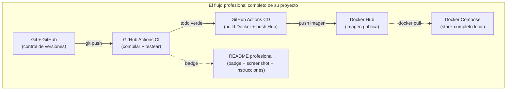

El diagrama muestra todo lo que su proyecto tiene ahora: codigo versionado en GitHub, pipeline automatico que compila, testea y publica la imagen en Docker Hub, Docker Compose para levantar el stack completo, y un README que documenta todo. Esto es el flujo completo de un proyecto con gestion real.

| Lo que aprendieron hoy | Para que sirve | Para la entrega |
|------------------------|----------------|-----------------|
| CI/CD como concepto | Automatizar build + test + deploy | Badge verde = proyecto funcional |
| GitHub Actions | CI/CD gratis integrado en GitHub | Pipeline que verifica su codigo |
| Workflow YAML | Definir el pipeline paso a paso | Lo revisa el profesor |
| Docker Hub + push automatico | Publicar la imagen para que cualquiera la use | Demuestra que el proyecto es ejecutable |
| Secrets en GitHub | Guardar credenciales de forma segura | Buenas practicas profesionales |
| README profesional | Presentar su proyecto al mundo | Primera impresion del evaluador |
| Badge de CI | Indicador visual de que el proyecto compila | Evidencia de calidad |
| GoFullPage + PDF | Capturar Swagger completo | **PDF imprimible para la CCAA** |

### Archivos nuevos hoy

| Archivo | Para que | Se sube a GitHub |
|---------|----------|:---:|
| `.github/workflows/build.yml` | Pipeline CI/CD | SI |
| `README.md` (actualizado) | Carta de presentacion del proyecto | SI |
| `docs/swagger-screenshot.png` | Captura de Swagger para el README | SI |
| `docs/swagger-api.pdf` | **Evidencia imprimible para la CCAA** | SI |
| `docs/openapi-spec.json` | Especificacion tecnica (opcional) | SI |

---

# 12. Troubleshooting

| Sintoma | Causa | Solucion |
|---------|-------|----------|
| El workflow no aparece en Actions | El archivo no esta en `.github/workflows/` | Verificar la ruta exacta. Ojo con mayusculas y la carpeta `.github` (con punto) |
| `unauthorized` al hacer push a Docker Hub | Los secrets estan mal configurados | Verificar DOCKERHUB_USERNAME y DOCKERHUB_TOKEN en Settings > Secrets |
| El badge dice "no status" | El workflow nunca se ejecuto | Hacer un push a main para dispararlo por primera vez |
| El badge dice "failing" | El pipeline fallo | Ir a Actions, ver que paso fallo, corregir |
| `denied: requested access to the resource is denied` | El nombre de usuario en Docker Hub no coincide con el secret | El DOCKERHUB_USERNAME debe ser exactamente su usuario de Docker Hub (case-sensitive) |
| La imagen se sube pero no funciona con `docker run` | Falta la configuracion de BD | Normal si no hay PostgreSQL. Usar `docker compose up` en vez de `docker run` solo |
| El screenshot no se ve en GitHub | Ruta incorrecta en el markdown | Verificar que la ruta es relativa: `docs/swagger-screenshot.png` (sin `/` al inicio) |
| Maven tarda mucho en el pipeline | Primera ejecucion, sin cache | Normal. Las siguientes veces el cache de Maven lo acelera |

---

# ANEXO A — Kubernetes: Glosario de Conceptos (Referencia Teorica)

Este anexo cubre los conceptos de Kubernetes (K8s) que aparecen en el programa oficial del curso IFCD0014. No vamos a practicarlo — necesitaria un cluster y mas tiempo — pero si deben conocer la terminologia porque sale en entrevistas y en el material oficial.

> Si ya leyeron la Seccion 11 del Dia 16 (Docker Compose vs Kubernetes), esto amplia ese contenido con todos los conceptos especificos.

## A.1 Que es Kubernetes y Por Que Existe

Docker Compose orquesta contenedores en **una maquina**. En produccion real, una empresa necesita distribuir contenedores en **muchas maquinas** (nodos), con balanceo de carga, auto-escalado y recuperacion automatica si algo falla. Kubernetes es el estandar mundial para eso.

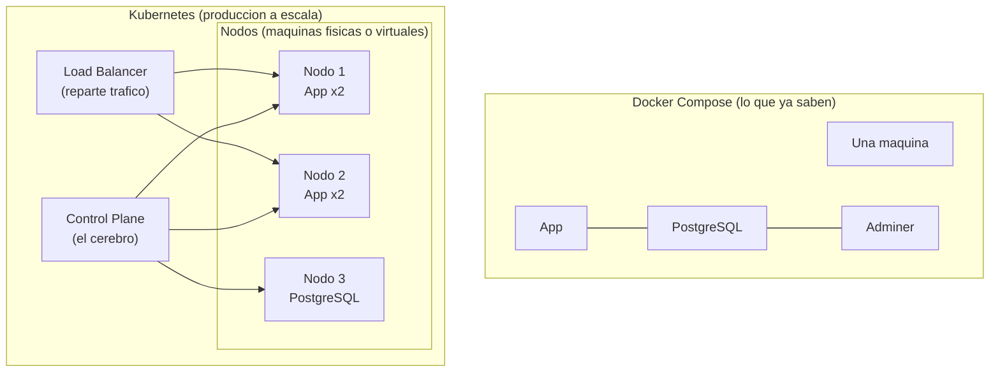

El diagrama muestra la diferencia de escala. Arriba, lo que ya conocen: Docker Compose con 3 contenedores en una maquina. Abajo, Kubernetes: un Control Plane (cerebro) que gestiona multiples nodos, cada uno con replicas de la app, un Load Balancer que reparte el trafico entre ellos, y la base de datos en su propio nodo. Si un nodo muere, K8s mueve los contenedores a otro automaticamente.

## A.2 Glosario Completo de Recursos Kubernetes

Cada concepto de K8s tiene un equivalente en algo que ya conocen. Esta tabla es su diccionario:

### Unidades basicas

| Concepto K8s | Que es | Equivalencia con lo que ya saben |
|---|---|---|
| **Pod** | La unidad minima de K8s. Un Pod contiene uno o mas contenedores que comparten red y almacenamiento. | Como un `docker run` — pero K8s lo gestiona por ti |
| **Node (Nodo)** | Una maquina (fisica o virtual) donde corren los Pods. | Como su PC con Docker Desktop, pero en un datacenter |
| **Cluster** | El conjunto de todos los nodos gestionados por K8s. | Como si tuvieran 10 PCs con Docker Desktop coordinados |
| **Control Plane** | El "cerebro" de K8s. Decide donde colocar cada Pod, monitoriza la salud, etc. | No tiene equivalente en Docker Compose — es lo que K8s añade |
| **Namespace** | Una separacion logica dentro del cluster (ej: `desarrollo`, `produccion`). | Como tener dos `docker-compose.yml` separados para dev y prod |

### Cargas de trabajo (Workloads)

| Concepto K8s | Que es | Equivalencia |
|---|---|---|
| **Deployment** | Define cuantas replicas de un Pod quieres y gestiona su ciclo de vida (crear, actualizar, escalar). | Como un `service` en `docker-compose.yml` pero con `replicas: 3` |
| **ReplicaSet** | Asegura que siempre haya N copias de un Pod corriendo. Si uno muere, crea otro. | Docker Compose no tiene esto — si un contenedor muere, se queda muerto |
| **Rolling Update** | Actualizar la app sin downtime: K8s va reemplazando Pods uno a uno (v1 → v2) mientras el servicio sigue vivo. | Como hacer `docker compose up --build` pero sin que los usuarios noten el cambio |

### Redes y acceso

| Concepto K8s | Que es | Equivalencia |
|---|---|---|
| **Service** | Expone un grupo de Pods como un unico punto de acceso. Hay 3 tipos: ClusterIP (interno), NodePort (puerto fijo), LoadBalancer (externo). | Como los `ports:` en docker-compose.yml, pero mas sofisticado |
| **ClusterIP** | Service solo accesible DENTRO del cluster. | Como la red interna de Docker Compose (la app habla con `db` por nombre) |
| **NodePort** | Service accesible desde fuera del cluster en un puerto fijo (30000-32767). | Como `ports: "8081:8081"` en docker-compose.yml |
| **LoadBalancer** | Service con IP publica y balanceo de carga automatico. | No tiene equivalente en Docker Compose — es para produccion en la nube |
| **Ingress** | Un "router" HTTP que dirige trafico externo a diferentes Services segun la URL. | Como un Nginx que decide: `/api` va al backend, `/web` va al frontend |

### Configuracion y secretos

| Concepto K8s | Que es | Equivalencia |
|---|---|---|
| **ConfigMap** | Almacena configuracion no sensible (URLs, timeouts) separada del codigo. Se inyecta como variable de entorno o archivo. | Como las variables `environment:` en docker-compose.yml |
| **Secret** | Igual que ConfigMap pero para datos sensibles (contraseñas, tokens). Se almacenan codificados en Base64. | Como `SPRING_DATASOURCE_PASSWORD=secret` pero mas seguro |

En el Dia 16 ya hicieron esto con Docker Compose: pusieron `SPRING_DATASOURCE_URL`, `SPRING_DATASOURCE_PASSWORD`, etc. como variables de entorno. En K8s es el mismo concepto pero con recursos dedicados (ConfigMap y Secret) que se gestionan por separado del Deployment.

### Almacenamiento persistente

| Concepto K8s | Que es | Equivalencia |
|---|---|---|
| **PersistentVolume (PV)** | Un "trozo" de almacenamiento en el cluster, provisionado por un administrador. | Como el disco duro donde Docker guarda los volumenes |
| **PersistentVolumeClaim (PVC)** | Una solicitud de almacenamiento por parte de un Pod: "necesito 10GB". K8s busca un PV disponible. | Como `volumes: postgres_data:` en docker-compose.yml — pides espacio y Docker lo gestiona |
| **hostPath** | Volumen que monta una carpeta del nodo directamente en el Pod. Solo para desarrollo/testing. | Como un bind mount en Docker: `./data:/var/lib/postgresql/data` |
| **emptyDir** | Volumen temporal que se crea con el Pod y se destruye con el. | Como la base de datos H2 en memoria — cuando muere el contenedor, los datos desaparecen |
| **NFS** | Volumen en red compartido entre multiples nodos. | No tiene equivalente directo en Docker Compose — es para clusters |

En el Dia 16 aprendieron volumenes con Docker Compose (`volumes: postgres_data:`). En K8s el concepto es el mismo pero mas formal: un administrador crea el PV, y el Pod pide un PVC.

### Escalado y resiliencia

| Concepto K8s | Que es | Equivalencia |
|---|---|---|
| **Horizontal Pod Autoscaler (HPA)** | Ajusta automaticamente el numero de replicas segun la carga (CPU, memoria). Si la CPU pasa del 70%, crea mas Pods. Si baja, los elimina. | Docker Compose no tiene esto — el numero de contenedores es fijo |
| **Metrics Server** | El componente que recolecta metricas de CPU y memoria de los Pods para que el HPA pueda tomar decisiones. | Como un "monitor de rendimiento" del cluster |
| **Liveness Probe** | K8s pregunta periodicamente "estas vivo?" al contenedor. Si no responde, lo MATA y crea otro. | Docker Compose tiene `healthcheck:` pero no recrea automaticamente |
| **Readiness Probe** | K8s pregunta "estas listo para recibir trafico?". Si no, deja de enviarle peticiones pero no lo mata. | No tiene equivalente en Docker Compose |

### Archivos YAML

En K8s todo se define en archivos YAML, igual que Docker Compose. La diferencia: en Compose todo esta en UN archivo (`docker-compose.yml`), mientras que en K8s normalmente se usan VARIOS archivos, uno por recurso.

Ejemplo comparativo:

```yaml
# --- Docker Compose (lo que ya conocen) ---
# docker-compose.yml
services:
   app:
      build: ../src/main/java
      ports:
         - "8081:8081"
      environment:
         - SPRING_DATASOURCE_URL=jdbc:postgresql://db:5432/pizzeria
      depends_on:
         - db
   db:
      image: postgres:16-alpine
      volumes:
         - postgres_data:/var/lib/postgresql/data

volumes:
   postgres_data:
```

```yaml
# --- Kubernetes (equivalente) ---
# deployment.yaml
apiVersion: apps/v1
kind: Deployment
metadata:
  name: pizzeria-app
spec:
  replicas: 3                    # <-- 3 copias de la app (en Compose solo hay 1)
  selector:
    matchLabels:
      app: pizzeria
  template:
    metadata:
      labels:
        app: pizzeria
    spec:
      containers:
      - name: app
        image: mi-usuario/pizzeria-spring:latest
        ports:
        - containerPort: 8081
        env:
        - name: SPRING_DATASOURCE_URL
          value: "jdbc:postgresql://db-service:5432/pizzeria"
        livenessProbe:           # <-- K8s verifica que la app esta viva
          httpGet:
            path: /actuator/health
            port: 8081
          initialDelaySeconds: 15
          periodSeconds: 10
```

La estructura es similar: definen imagenes, puertos, variables de entorno. Pero K8s añade conceptos como `replicas`, `livenessProbe` y `labels` que Docker Compose no tiene. Si saben leer un `docker-compose.yml`, pueden leer un manifiesto de K8s — la curva no es tan empinada como parece.

## A.3 Tabla Resumen: Docker Compose vs Kubernetes

| Aspecto | Docker Compose | Kubernetes |
|---------|---------------|------------|
| **Archivo principal** | `docker-compose.yml` | Multiples YAML (Deployment, Service, ConfigMap...) |
| **Comando principal** | `docker compose up` | `kubectl apply -f .` |
| **Escalado** | Manual (un contenedor por servicio) | Automatico (HPA ajusta replicas) |
| **Si un contenedor muere** | Se queda muerto | K8s lo recrea en segundos |
| **Actualizaciones** | `docker compose up --build` (hay downtime) | Rolling Update (cero downtime) |
| **Red interna** | Automatica (nombre del servicio) | Services (ClusterIP, NodePort, LoadBalancer) |
| **Configuracion externa** | `environment:` en el YAML | ConfigMap + Secret |
| **Almacenamiento** | `volumes:` | PersistentVolume + PersistentVolumeClaim |
| **Acceso externo** | `ports:` | Ingress + LoadBalancer |
| **Ideal para** | Desarrollo, demos, proyectos pequeños | Produccion a gran escala |
| **Herramienta CLI** | `docker compose` | `kubectl` |

## A.4 Donde Encaja K8s en el Flujo del Curso

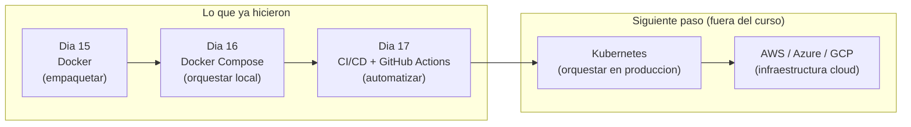

El diagrama muestra su progresion: empaquetaron con Docker (Dia 15), orquestaron localmente con Docker Compose (Dia 16), automatizaron con CI/CD (Dia 17). El paso natural siguiente es Kubernetes para orquestar en produccion, y luego la nube (AWS, Azure, GCP). Cada paso construye sobre el anterior — nada de lo que aprendieron se desperdicia.

> **Para entrevistas:** "Conozco Docker y Docker Compose para desarrollo y despliegue. Se que Kubernetes es la solucion estandar para orquestacion en produccion — gestiona replicas, escalado automatico, rolling updates y persistencia. No lo he practicado en un cluster real, pero entiendo los conceptos: Pods, Deployments, Services, ConfigMaps, PersistentVolumes e Ingress."

---

## Creditos y referencias

Este proyecto ha sido desarrollado siguiendo la metodologia y el codigo base de **Juan Marcelo Gutierrez Miranda** @TodoEconometria.

| | |
|---|---|
| **Autor original** | Prof. Juan Marcelo Gutierrez Miranda |
| **Institucion** | @TodoEconometria |
| **Hash de Certificacion** | `4e8d9b1a5f6e7c3d2b1a0f9e8d7c6b5a4f3e2d1c0b9a8f7e6d5c4b3a2f1e0d9c` |

*Todos los materiales didacticos, la metodologia pedagogica, la estructura del curso, los ejemplos y el codigo base de este proyecto son produccion intelectual de Juan Marcelo Gutierrez Miranda. Queda prohibida su reproduccion total o parcial sin la autorizacion expresa del autor.*
