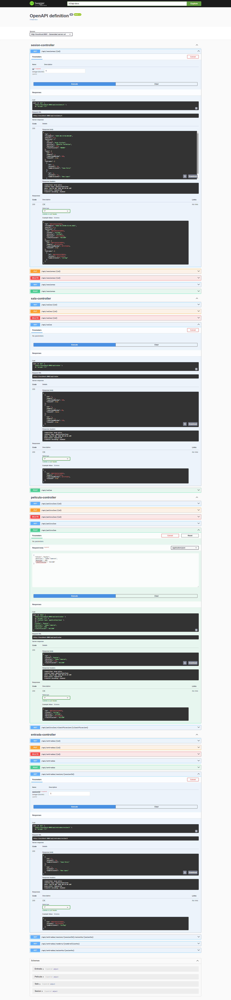

## JAVIER FAJARDO TÁBARA

## Funcionalidades de la API Cine-Estrella

La API de Cine-Estrella proporciona una interfaz RESTful para gestionar la
información de un cine, incluyendo películas, salas, sesiones y la venta de
entradas. A continuación se detallan las funcionalidades principales:

**Gestión de Películas**
Permite administrar el catálogo de películas del cine.

- Listar todas las películas: Obtiene una lista de todas las películas
  disponibles.
- Buscar película por ID: Recupera los detalles de una película específica a
  través de su ID.
- Crear una nueva película: Añade una nueva película al catálogo.
- Actualizar una película: Modifica la información de una película existente.
- Eliminar una película: Borra una película del catálogo.
- Buscar películas por clasificación: Permite filtrar según clasificación
  (ACCIÓN, DRAMA, TERROR, SUSPENSE, MUSICAL, ANIMACIÓN)

**Gestión de Salas**
Administra las salas de proyección del cine.

- Listar todas las salas: Obtiene una lista de todas las salas del cine.
- Buscar sala por ID: Recupera los detalles de una sala específica.
- Crear una nueva sala: Registra una nueva sala en el sistema.
- Actualizar una sala: Modifica la información de una sala existente.
- Eliminar una sala: Elimina una sala del sistema.

**Gestión de Sesiones**
Controla los horarios de las proyecciones de las películas en las diferentes
salas.

- Listar todas las sesiones: Obtiene una lista de todas las sesiones
  programadas.
- Buscar sesión por ID: Recupera los detalles de una sesión específica.
- Crear una nueva sesión: Programa una nueva proyección de una película en
  una sala y horario determinados.
- Actualizar una sesión: Modifica los detalles de una sesión programada.
- Eliminar una sesión: Cancela una sesión programada.

**Gestión de Entradas**
Maneja la consulta de entradas para las sesiones.

- Listar todas las entradas: Obtiene un listado de todas las entradas vendidas.
- Buscar entrada por ID: Recupera la información de una entrada específica.
- Buscar entradas por sesión: Lista todas las entradas vendidas para una
  sesión concreta.
- Buscar entradas por nombre de cliente: Encuentra las entradas compradas
  por un cliente específico.
- Crear una nueva entrada: Permite la "compra" de una entrada para una
  sesión, asociándola a un cliente y un asiento.
- Actualizar una entrada: Modifica la información de una entrada vendida.
- Eliminar una entrada: Anula una entrada vendida.

# A continuación se muestran capturas de pantalla de

# las funcionalidades descritas usando Swagger

