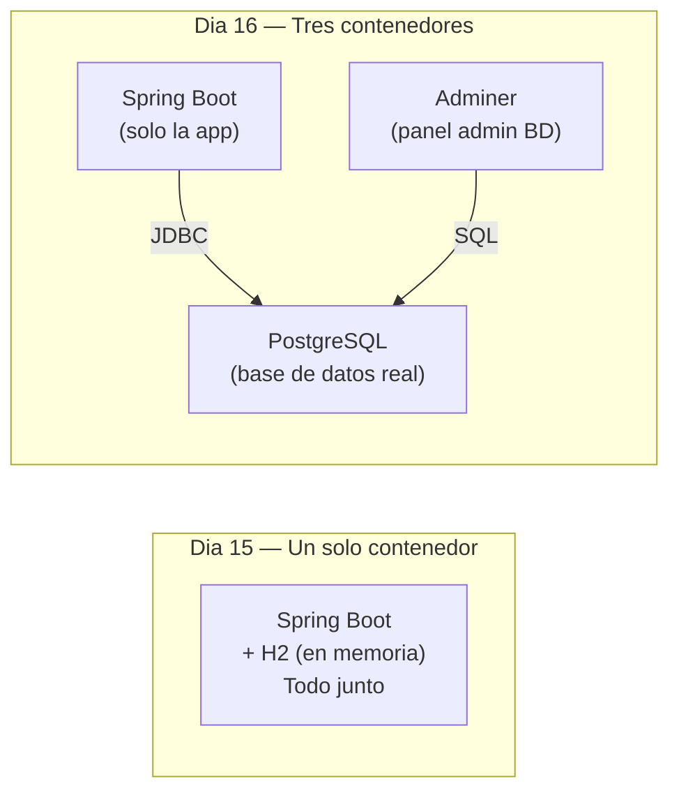
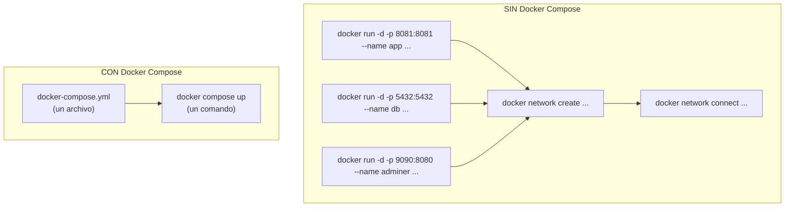
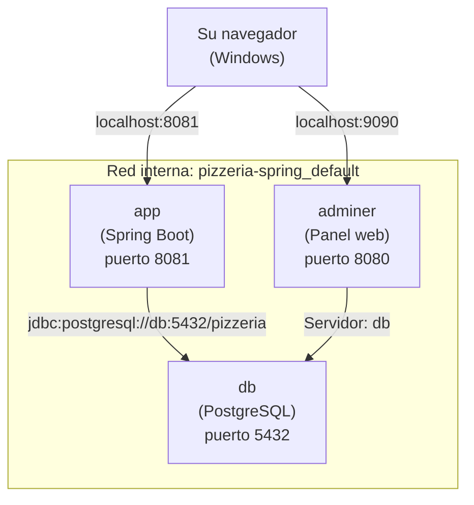
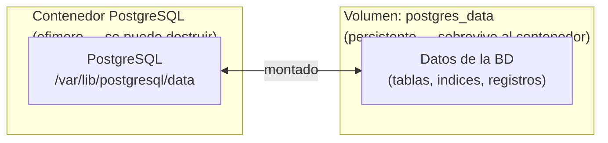
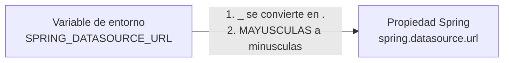
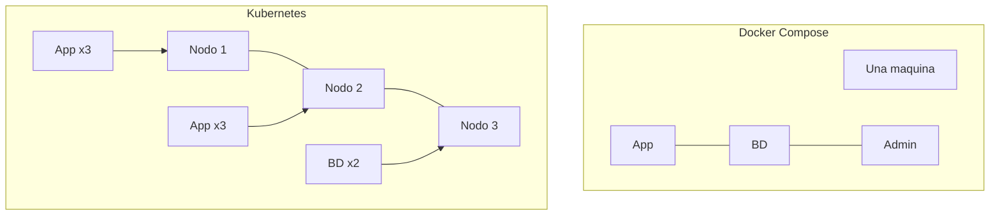

# Dia 16: Docker Compose — La Pizzeria con Base de Datos Real

Ayer dockerizaron su aplicacion. Hoy le agregan una base de datos real (PostgreSQL) y un panel de administracion, todo levantandose con un solo comando.

Prof. Juan Marcelo Gutierrez Miranda

**Curso IFCD0014 — Semana 4, Dia 16 (Martes)**
**Objetivo:** Entender Docker Compose, agregar PostgreSQL como base de datos real, definir servicios en `docker-compose.yml`, usar volumenes para persistencia y redes para comunicacion entre contenedores.

> Este manual es de consulta. Sigan los pasos con Docker Desktop corriendo y el proyecto abierto.
> Recuerden que ayer (Dia 15) ya dockerizaron la pizzeria con un solo contenedor. Hoy pasamos de 1 contenedor a 3 contenedores coordinados.

---

# PARTE 0 — AUTOPSIA DEL DIA 15

# 0. Lo Que Paso Ayer y Por Que

Ayer varios tuvieron problemas. Antes de avanzar, vamos a entender los 4 errores mas comunes que aparecieron. Son los mismos que van a encontrar en cualquier empresa cuando trabajen con Docker, asi que vale la pena dedicarles 5 minutos.

### Error 1: Puerto en uso (`port is already allocated`)

```
docker: Error response from daemon: Ports are not available:
  exposing port TCP 0.0.0.0:8081 -> 0.0.0.0:0: listen tcp 0.0.0.0:8081:
  bind: Only one usage of each socket address is normally permitted.
```

**Causa:** Algo ya estaba escuchando en el puerto 8081. Normalmente IntelliJ con la app corriendo, u otro contenedor Docker de un intento anterior.

**Solucion rapida en Windows:**

```powershell
# 1. Quien ocupa el puerto?
netstat -ano | findstr :8081

# 2. Ver el nombre del proceso (sustituir PID por el numero real)
tasklist | findstr <PID>

# 3. Matarlo
taskkill /PID <PID> /F
```

**Buena practica:** Antes de lanzar cualquier contenedor, comprobar si el puerto esta libre.

### Error 2: Errores de socket / Docker daemon no responde

```
error during connect: Get "http://%2F%2F.%2Fpipe%2FdockerDesktopLinuxEngine/...":
  open //./pipe/dockerDesktopLinuxEngine: The system cannot find the file specified.
```

**Causa:** Docker Desktop no esta corriendo, o WSL 2 se ha quedado colgado.

**Solucion:** Reiniciar Docker Desktop. Si sigue sin funcionar, abrir PowerShell como admin y ejecutar `wsl --shutdown`, luego reabrir Docker Desktop.

### Error 3: La app en Docker no conecta a mi base de datos

Algunos intentasteis dockerizar vuestro proyecto personal que usa PostgreSQL o MySQL instalado en vuestra maquina. El contenedor arrancaba pero la app daba `Connection refused`.

**Causa:** Un contenedor Docker es un mundo aislado. Cuando la app dentro del contenedor dice `localhost`, se refiere a SI MISMA, no a vuestra maquina Windows. El `localhost` del contenedor no es el `localhost` de vuestra maquina.

**Solucion:** Esto es EXACTAMENTE lo que resolvemos hoy con Docker Compose. Levantamos la base de datos como otro contenedor y los conectamos por red interna. Paciencia — en 30 minutos lo tendreis funcionando.

### Error 4: "Borro todo y lo hago de nuevo"

Varios resolvisteis los problemas borrando la imagen y reconstruyendo. Eso no esta mal — los contenedores estan DISENADOS para ser desechables. En produccion se hace constantemente. Pero hay que saber que se borra y por que:

| Comando | Que borra | Analogia Java |
|---------|-----------|---------------|
| `docker stop pizzeria` | Para el contenedor (sigue existiendo) | `.close()` — cierras el recurso |
| `docker rm pizzeria` | Elimina el contenedor parado | `= null` — sueltas la referencia al objeto |
| `docker rmi pizzeria:v1` | Elimina la imagen (la plantilla) | Borras el `.class` — ya no puedes crear objetos |
| `docker system prune` | Limpia todo lo que no se usa | El garbage collector de Java |

Primero siempre `stop`, luego `rm`, luego `rmi` si quieres empezar de cero. El orden importa.

> **Dato:** Todo lo anterior estaba documentado en la seccion 12 del manual de ayer. Hoy el manual tambien tiene las respuestas a todo lo que vamos a hacer. Usadlo.

---

# PARTE I — EL PROBLEMA

# 1. Un Contenedor No Es Suficiente

Ayer pusieron su app Spring Boot en un contenedor Docker. Funcionaba perfecto porque la pizzeria usa H2 — una base de datos en memoria que vive DENTRO de la app. Pero en el mundo real, las aplicaciones no funcionan asi.



El diagrama muestra la diferencia entre ayer y hoy. A la izquierda, lo que hicieron ayer: un solo contenedor con todo dentro (la app + la base de datos H2 en memoria). A la derecha, lo que van a construir hoy: tres contenedores separados que hablan entre si. La app se conecta a PostgreSQL por JDBC, y Adminer (un panel web) tambien se conecta a PostgreSQL para que puedan ver las tablas y los datos.

**Por que separar?** Porque en produccion:

| Con H2 (ayer) | Con PostgreSQL (hoy) |
|---------------|---------------------|
| La BD vive dentro de la app | La BD es un servicio independiente |
| Si destruyen el contenedor, los datos desaparecen | Los datos persisten en un volumen (sobreviven al contenedor) |
| No se puede escalar la BD independientemente | La BD puede tener sus propios recursos, backups, replicas |
| Solo para desarrollo y tests | Es lo que usan miles de empresas en produccion |
| No se puede inspeccionar facilmente | Adminer permite ver tablas, datos y ejecutar queries |

Y ademas de la base de datos, una aplicacion real puede necesitar mas servicios: un servidor de cache (Redis), un broker de mensajes (RabbitMQ), un servidor de logs (Elasticsearch). Ejecutar un `docker run` por cada servicio es tedioso y propenso a errores. Docker Compose resuelve esto: **definen todo en un archivo YAML y levantan todo con un solo comando**.

---

# 2. Que es Docker Compose?

Docker Compose es una herramienta que permite definir y ejecutar aplicaciones Docker de multiples contenedores. En vez de ejecutar varios `docker run` con flags complicados, escriben un archivo `docker-compose.yml` que describe todos los servicios, y con un solo comando todo se levanta, se conecta y funciona.



El diagrama muestra la diferencia: sin Compose necesitan 5 o mas comandos para levantar 3 contenedores y conectarlos en una red. Con Compose, todo eso se define en un archivo y se ejecuta con un unico comando. Docker Compose crea los contenedores, la red interna, los volumenes y las conexiones automaticamente.

| Concepto | Docker (Dia 15) | Docker Compose (Dia 16) |
|----------|-----------------|------------------------|
| **Archivo de definicion** | `Dockerfile` | `docker-compose.yml` (usa el Dockerfile dentro) |
| **Que define** | Como empaquetar UNA app | Como orquestar VARIOS contenedores |
| **Comando principal** | `docker build` + `docker run` | `docker compose up` |
| **Red entre contenedores** | Hay que crearla manualmente | Se crea automaticamente |
| **Analogia del curso** | `pom.xml` (un proyecto) | `pom.xml` padre multi-modulo (varios proyectos) |

---

# PARTE II — PREPARAR EL PROYECTO

# 3. Agregar PostgreSQL al pom.xml

> **QUE VAMOS A HACER:** Agregar el driver de PostgreSQL como dependencia Maven.
> **POR QUE:** Ayer varios tuvisteis problemas porque vuestro proyecto usaba una BD externa y el contenedor no podia conectar. El driver de PostgreSQL permite que Spring Boot hable con una BD PostgreSQL real. Hoy la BD tambien sera un contenedor, y se conectaran por red interna.

Dentro de `<dependencies>` en el `pom.xml`, agregar:

```xml
        <!-- PostgreSQL — driver para conectarse a la BD real en Docker -->
        <dependency>
            <groupId>org.postgresql</groupId>
            <artifactId>postgresql</artifactId>
            <scope>runtime</scope>
        </dependency>
```

El `<scope>runtime</scope>` significa que el driver solo se necesita cuando la app se ejecuta, no cuando se compila. Spring Boot gestiona la version automaticamente porque usamos el `spring-boot-starter-parent`.

**Importante: NO borren la dependencia de H2.** Dejenla como esta. Asi su app funciona de dos formas:
- **Desde IntelliJ** (sin Docker): usa H2 en memoria, como siempre. No cambia nada.
- **Desde Docker Compose**: las variables de entorno sobreescriben la configuracion y usan PostgreSQL.

Mantener la configuracion de desarrollo (H2) en `application.properties` y sobreescribirla en el entorno de despliegue (Docker) con variables de entorno es la forma estandar de trabajar. Asi nunca rompes tu entorno local.

> **Recargar Maven** despues de agregar la dependencia: en IntelliJ, `Ctrl+Shift+O` o click en el icono de Maven que aparece.

**VERIFICAR antes de continuar:** Abran el panel de Maven en IntelliJ (barra lateral derecha) y expandan Dependencies. Deberian ver `org.postgresql:postgresql` en la lista. Si no aparece, el reload no funciono — click derecho en el `pom.xml` > Maven > Reload Project.

### 3.1 Atencion con el `data.sql`: diferencias H2 vs PostgreSQL

Si tienen un `data.sql` que funciona con H2, es posible que necesiten ajustar alguna cosa para que tambien funcione con PostgreSQL. La buena noticia: la pizzeria del curso ya tiene un `data.sql` compatible con ambas bases de datos. Pero si han creado datos propios en su proyecto personal, revisen esta tabla:

| Concepto | H2 (IntelliJ) | PostgreSQL (Docker) | Compatible con ambos? |
|----------|----------------|---------------------|-----------------------|
| `AUTO_INCREMENT` | Funciona | NO existe | Usar `GENERATED BY DEFAULT AS IDENTITY` en la tabla, o dejar que Hibernate lo gestione con `ddl-auto=update` |
| `IDENTITY` | Funciona | Funciona | Si |
| `CURRENT_TIMESTAMP` | Funciona | Funciona | Si |
| Nombres de tabla en MAYUSCULAS | Funciona (H2 es case-insensitive) | Puede fallar (PostgreSQL es case-sensitive con comillas) | Usar siempre minusculas en los nombres de tabla |
| `BOOLEAN` | Funciona | Funciona | Si |
| `VARCHAR(255)` | Funciona | Funciona | Si |
| Strings con comillas dobles `"texto"` | Funciona (H2 lo permite) | NO — las comillas dobles son para identificadores | Usar siempre comillas simples: `'texto'` |

**En la practica**, si usan `spring.jpa.hibernate.ddl-auto=update` (que es lo que hacemos), Hibernate crea las tablas automaticamente y el `data.sql` solo necesita los `INSERT INTO`. Los `INSERT INTO` son practicamente iguales en H2 y PostgreSQL siempre que usen comillas simples para strings.

---

# PARTE III — DOCKER COMPOSE

# 4. El Archivo docker-compose.yml

Creen un archivo llamado `docker-compose.yml` en la raiz del proyecto, al lado del `Dockerfile` que crearon ayer:

```
pizzeria-spring/
    pom.xml
    Dockerfile           <-- ya existia (Dia 15)
    .dockerignore         <-- ya existia (Dia 15)
    docker-compose.yml    <-- NUEVO
    src/
```

Contenido del `docker-compose.yml`:

```yaml
services:
  # =====================================================
  # Servicio 1: La aplicacion Spring Boot (pizzeria)
  # =====================================================
  app:
    build: .
    ports:
      - "8081:8081"
    environment:
      - SPRING_DATASOURCE_URL=jdbc:postgresql://db:5432/pizzeria
      - SPRING_DATASOURCE_USERNAME=postgres
      - SPRING_DATASOURCE_PASSWORD=secret
      - SPRING_DATASOURCE_DRIVER_CLASS_NAME=org.postgresql.Driver
      - SPRING_JPA_DATABASE_PLATFORM=org.hibernate.dialect.PostgreSQLDialect
      - SPRING_JPA_HIBERNATE_DDL_AUTO=update
      - SPRING_H2_CONSOLE_ENABLED=false
    depends_on:
      db:
        condition: service_healthy
    restart: on-failure

  # =====================================================
  # Servicio 2: Base de datos PostgreSQL
  # =====================================================
  db:
    image: postgres:16-alpine
    environment:
      - POSTGRES_DB=pizzeria
      - POSTGRES_USER=postgres
      - POSTGRES_PASSWORD=secret
    ports:
      - "5432:5432"
    volumes:
      - postgres_data:/var/lib/postgresql/data
    healthcheck:
      test: ["CMD-SHELL", "pg_isready -U postgres"]
      interval: 5s
      timeout: 5s
      retries: 5

  # =====================================================
  # Servicio 3: Adminer (panel web para ver la BD)
  # =====================================================
  adminer:
    image: adminer
    ports:
      - "9090:8080"
    depends_on:
      db:
        condition: service_healthy

# =======================================================
# Volumenes (para que los datos persistan)
# =======================================================
volumes:
  postgres_data:
```

Vamos a explicar cada seccion en detalle.

## Servicio `app` — Su aplicacion Spring Boot

```yaml
  app:
    build: .                    # Construir imagen desde el Dockerfile en esta carpeta
    ports:
      - "8081:8081"             # Puerto host:contenedor (8081 porque application.properties dice server.port=8081)
    environment:                # Variables de entorno que SOBREESCRIBEN application.properties
      - SPRING_DATASOURCE_URL=jdbc:postgresql://db:5432/pizzeria
      - SPRING_DATASOURCE_USERNAME=postgres
      - SPRING_DATASOURCE_PASSWORD=secret
      - SPRING_DATASOURCE_DRIVER_CLASS_NAME=org.postgresql.Driver
      - SPRING_JPA_DATABASE_PLATFORM=org.hibernate.dialect.PostgreSQLDialect
      - SPRING_JPA_HIBERNATE_DDL_AUTO=update
      - SPRING_H2_CONSOLE_ENABLED=false
    depends_on:                 # Esperar a que PostgreSQL este LISTO (no solo arrancado)
      db:
        condition: service_healthy
    restart: on-failure         # Si la app falla al arrancar, reintentarlo
```

Hay varias cosas importantes aqui:

**`build: .`** le dice a Compose que construya la imagen usando el Dockerfile que esta en la misma carpeta (`.`). Es equivalente al `docker build .` que hicieron ayer.

**`environment`** define variables de entorno dentro del contenedor. Spring Boot tiene una caracteristica muy util: convierte automaticamente variables de entorno a propiedades. La regla es simple: puntos (`.`) se convierten en guiones bajos (`_`), y todo va en MAYUSCULAS. Asi, `SPRING_DATASOURCE_URL` sobreescribe `spring.datasource.url` del `application.properties`. Esto es lo que hace que la app use PostgreSQL en Docker sin tocar el properties.

**`depends_on` con `condition: service_healthy`** es fundamental. Sin esto, Docker arranca la app ANTES de que PostgreSQL este listo para aceptar conexiones. La app intenta conectarse, PostgreSQL no responde, y Spring Boot falla con un error de conexion. Con el healthcheck, Compose espera a que PostgreSQL confirme "estoy listo" antes de arrancar la app.

**`restart: on-failure`** hace que si la app falla al arrancar (por ejemplo, porque PostgreSQL aun no estaba listo a pesar del healthcheck), Docker la reinicia automaticamente. Es una red de seguridad.

**`SPRING_H2_CONSOLE_ENABLED=false`** desactiva la consola H2 en el modo Docker, porque estamos usando PostgreSQL y la consola H2 no tiene sentido.

## Servicio `db` — PostgreSQL

```yaml
  db:
    image: postgres:16-alpine   # Imagen de Docker Hub (PostgreSQL 16, Alpine Linux)
    environment:
      - POSTGRES_DB=pizzeria    # Crear automaticamente la base de datos "pizzeria" al iniciar
      - POSTGRES_USER=postgres  # Usuario administrador
      - POSTGRES_PASSWORD=secret # Contraseña (en produccion seria un secreto seguro)
    ports:
      - "5432:5432"             # Accesible desde su maquina (DBeaver, pgAdmin, etc.)
    volumes:
      - postgres_data:/var/lib/postgresql/data  # Persistir datos fuera del contenedor
    healthcheck:                # Verificar que PostgreSQL esta LISTO, no solo arrancado
      test: ["CMD-SHELL", "pg_isready -U postgres"]
      interval: 5s              # Verificar cada 5 segundos
      timeout: 5s               # Si no responde en 5 seg, fallo
      retries: 5                # Reintentar 5 veces antes de declarar "unhealthy"
```

**`image: postgres:16-alpine`** descarga la imagen oficial de PostgreSQL version 16 basada en Alpine Linux (ligera, ~80 MB). No necesitan instalar nada — Docker lo descarga de Docker Hub.

**`POSTGRES_DB=pizzeria`** le dice a PostgreSQL que cree automaticamente una base de datos llamada `pizzeria` cuando arranque por primera vez. Sin esto, tendrian que crearla manualmente.

**`volumes: postgres_data:/var/lib/postgresql/data`** es lo que hace que los datos **sobrevivan** cuando destruyen el contenedor. `/var/lib/postgresql/data` es la carpeta donde PostgreSQL guarda sus archivos internamente. El volumen `postgres_data` vive fuera del contenedor — Docker lo gestiona. Esto lo explicamos en detalle en la seccion 7.

**`healthcheck`** ejecuta el comando `pg_isready` cada 5 segundos dentro del contenedor de PostgreSQL. `pg_isready` es una utilidad que viene con PostgreSQL y verifica si la base de datos esta lista para aceptar conexiones. Sin esto, el servicio `app` podria arrancar antes de que PostgreSQL este listo, causando errores de conexion.

## Servicio `adminer` — Panel de administracion

```yaml
  adminer:
    image: adminer              # Imagen oficial de Adminer (panel web para BDs)
    ports:
      - "9090:8080"             # Adminer escucha en el 8080, lo exponemos en el 9090 de su maquina
    depends_on:
      db:
        condition: service_healthy  # Esperar a que la BD este lista
```

Adminer es un panel web ligero (un solo archivo PHP) para administrar bases de datos. Lo usan para ver las tablas que Hibernate creo, inspeccionar datos, y ejecutar queries SQL. El `9090:8080` significa que Adminer escucha internamente en el puerto 8080, pero ustedes acceden desde el navegador por el puerto 9090.

## Seccion `volumes` — Almacenamiento persistente

```yaml
volumes:
  postgres_data:                # Declara un volumen con nombre gestionado por Docker
```

Esta seccion declara el volumen `postgres_data` a nivel de Compose. Docker crea un espacio de almacenamiento en su maquina que persiste independientemente de los contenedores. Lo explicamos en detalle en la seccion 7.

---

# 5. Ejecutar con Docker Compose

A partir de aqui, cada paso sigue el patron **PARA-LEE-EJECUTA-VERIFICA**. Es el mismo patron que usan los ingenieros cuando ejecutan comandos en servidores de produccion: primero entienden QUE van a hacer y POR QUE, ejecutan, y comprueban el resultado. Nunca ejecuten un comando sin saber que deberian ver despues.

---

## Paso 5.1: Verificar el estado ANTES de arrancar

> **QUE VAMOS A HACER:** Comprobar que no hay contenedores anteriores estorbando.
> **POR QUE:** Si queda un contenedor viejo del Dia 15 usando el puerto 8081, el nuevo va a fallar. Es lo que le paso a varios ayer.

```bash
# Ver si hay contenedores corriendo o parados
docker ps -a

# Ver si el puerto 8081 esta ocupado (Windows PowerShell)
netstat -ano | findstr :8081
```

**QUE DEBERIAN VER:**
- `docker ps -a`: Si aparece algun contenedor del Dia 15 (ej: "pizzeria"), eliminenlo: `docker stop pizzeria && docker rm pizzeria`
- `netstat`: Si no aparece nada, perfecto — el puerto esta libre. Si aparece algo, maten el proceso (ver Seccion 0).

---

## Paso 5.1b: Validar el YAML antes de levantar

> **QUE VAMOS A HACER:** Comprobar que el `docker-compose.yml` no tiene errores de sintaxis.
> **POR QUE:** Es mucho mas rapido detectar un error de indentacion o una clave mal escrita AHORA que despues de esperar 2 minutos al build. Es el equivalente a compilar antes de ejecutar.

```bash
docker compose config
```

**QUE DEBERIAN VER:** El YAML completo procesado, con los valores resueltos. Si hay errores de sintaxis (indentacion, comillas, claves mal escritas), los muestra inmediatamente con el numero de linea.

Si ven errores, corregid el `docker-compose.yml` y volved a ejecutar `docker compose config` hasta que salga limpio. Los errores mas comunes:
- Tabs en vez de espacios (YAML solo acepta espacios)
- Falta un espacio despues de `:`
- Indentacion desalineada (cada nivel son exactamente 2 espacios)
- Comillas tipograficas copiadas de un PDF (`"` en vez de `"`)

> **Regla:** Siempre `docker compose config` antes del primer `docker compose up`. Es gratis y ahorra muchos minutos de frustracion.

---

## Paso 5.2: Levantar los 3 servicios

> **QUE VAMOS A HACER:** Construir la imagen de la app y levantar los 3 contenedores (app + PostgreSQL + Adminer).
> **POR QUE:** `docker compose up` lee el `docker-compose.yml` y orquesta todo: crea la red, descarga imagenes, construye la app, y arranca en el orden correcto.

```bash
# Desde la carpeta donde esta el docker-compose.yml
docker compose up --build -d
```

| Flag | Que hace | Cuando usarlo |
|------|----------|---------------|
| `up` | Crear y arrancar todos los servicios definidos en el yml | Siempre — es el comando principal |
| `--build` | Reconstruir la imagen de la app antes de arrancar | Cuando cambiaron codigo Java. Sin esto, usa la imagen anterior |
| `-d` | Detached (segundo plano) — no bloquea la terminal | Siempre, excepto cuando quieren ver los logs en directo |

**QUE DEBERIAN VER:** Varias lineas de progreso. La primera vez tarda mas porque descarga PostgreSQL (~80 MB) y Adminer (~30 MB). Al final, algo como:

```
✔ Network pizzeria-spring_default    Created
✔ Volume "pizzeria-spring_postgres_data"  Created
✔ Container pizzeria-spring-db-1     Healthy
✔ Container pizzeria-spring-adminer-1  Started
✔ Container pizzeria-spring-app-1    Started
```

Si ven errores aqui, NO sigan adelante. Lean el error, busquen en la Seccion 13 (Troubleshooting), y resolvedlo antes de continuar.

---

## Paso 5.3: Verificar que los 3 servicios estan vivos

> **QUE VAMOS A HACER:** Comprobar el estado de todos los servicios.
> **POR QUE:** Que Docker diga "Started" no significa que la app este LISTA. PostgreSQL puede tardar unos segundos en aceptar conexiones, y la app puede fallar al conectarse. Hay que verificar.

```bash
docker compose ps
```

**QUE DEBERIAN VER:** 3 servicios con STATUS "Up" o "running":

| NAME | IMAGE | STATUS | PORTS |
|------|-------|--------|-------|
| pizzeria-spring-app-1 | pizzeria-spring-app | Up | 0.0.0.0:8081->8081/tcp |
| pizzeria-spring-db-1 | postgres:16-alpine | Up (healthy) | 0.0.0.0:5432->5432/tcp |
| pizzeria-spring-adminer-1 | adminer | Up | 0.0.0.0:9090->8080/tcp |

**Si alguno NO dice "Up":** miren los logs de ese servicio especifico (siguiente paso).

---

## Paso 5.4: Leer los logs

> **QUE VAMOS A HACER:** Inspeccionar los logs de cada servicio para confirmar que todo arranco correctamente.
> **POR QUE:** Los logs son la PRIMERA herramienta de diagnostico. En el mundo profesional, cuando algo falla en produccion, lo primero que haces es mirar logs. Siempre. Sin excepcion.

```bash
# Logs de TODOS los servicios (colores diferentes por servicio)
docker compose logs

# Solo los logs de la app (buscar "Tomcat started on port")
docker compose logs app

# Solo los ultimos 30 logs de la base de datos
docker compose logs --tail=30 db

# Seguir logs de la app EN VIVO mientras prueban endpoints (Ctrl+C para salir)
docker compose logs -f app
```

**QUE DEBERIAN VER en los logs de `app`:**
```
Started DemoSpringApplication in X.XXX seconds
Tomcat started on port 8081
```

Si ven `Connection refused` o `password authentication failed`, el problema esta en la conexion a PostgreSQL. Revisen que el `docker-compose.yml` tiene las variables de entorno correctas.

### Buscar errores especificos en los logs

Esto es una habilidad que van a usar el resto de su carrera. En vez de leer 200 lineas de log, pueden filtrar:

```bash
# Buscar errores en los logs de la app
docker compose logs app 2>&1 | findstr /I "error exception failed"

# Buscar cuando se creo la conexion a PostgreSQL
docker compose logs app 2>&1 | findstr /I "datasource postgres"

# Ver SOLO los logs de PostgreSQL para confirmar que acepta conexiones
docker compose logs db 2>&1 | findstr "ready to accept"
```

**QUE DEBERIAN VER:**
- En `app`: ninguna linea con "error" (o solo warnings inofensivos)
- En `db`: `database system is ready to accept connections`

---

## Paso 5.5: Probar que la API responde

> **QUE VAMOS A HACER:** Llamar a los endpoints de la pizzeria para verificar que la app funciona con PostgreSQL.
> **POR QUE:** Que la app arranque no significa que funcione. Hay que verificar que los datos se cargaron (data.sql) y que los endpoints responden.

```bash
# Listar todas las pizzas
curl http://localhost:8081/api/pizzas
```

**QUE DEBERIAN VER:** Un JSON con 7 pizzas. Si ven `[]` (array vacio), el `data.sql` no se ejecuto. Si ven un error HTML, la app no esta lista — esperen 10 segundos y reintentenlo.

```bash
# Una pizza especifica
curl http://localhost:8081/api/pizzas/1

# Los clientes
curl http://localhost:8081/api/clientes

# Los pedidos (con relaciones)
curl http://localhost:8081/api/pedidos
```

**Tambien en el navegador:**
- Swagger: `http://localhost:8081/swagger-ui.html` — deberian ver la interfaz con 3 tags
- Adminer: `http://localhost:9090` — datos de conexion:

| Campo | Valor | Por que ese valor |
|-------|-------|-------------------|
| Sistema | PostgreSQL | Es la BD que estamos usando |
| Servidor | `db` | Nombre del servicio en docker-compose.yml (NO localhost) |
| Usuario | `postgres` | El POSTGRES_USER del compose |
| Contraseña | `secret` | El POSTGRES_PASSWORD del compose |
| Base de datos | `pizzeria` | El POSTGRES_DB del compose |

---

## Paso 5.6: Inspeccionar los contenedores por dentro (habilidad forense)

> **QUE VAMOS A HACER:** Entrar dentro de un contenedor y ver que hay. Inspeccionar la red, las variables de entorno, los procesos.
> **POR QUE:** Cuando algo falla y los logs no dan suficiente informacion, necesitas "meterte dentro" del contenedor para investigar. Es como hacer un `debug` pero a nivel de infraestructura.

```bash
# Ver los detalles internos de un contenedor (red, volumenes, config)
docker inspect pizzeria-spring-app-1

# Ver SOLO la IP del contenedor de la app dentro de la red Docker
docker inspect -f "{{range .NetworkSettings.Networks}}{{.IPAddress}}{{end}}" pizzeria-spring-app-1

# Ver las variables de entorno que tiene la app (verificar que PostgreSQL esta configurado)
docker inspect -f "{{range .Config.Env}}{{println .}}{{end}}" pizzeria-spring-app-1
```

**QUE DEBERIAN VER** en las variables de entorno:
```
SPRING_DATASOURCE_URL=jdbc:postgresql://db:5432/pizzeria
SPRING_DATASOURCE_USERNAME=postgres
SPRING_DATASOURCE_PASSWORD=secret
...
```

Si estas variables no aparecen o tienen valores incorrectos, la app no puede conectar a PostgreSQL. El fallo esta en el `environment` del `docker-compose.yml`.

```bash
# Entrar DENTRO del contenedor de PostgreSQL (como hacer SSH a un servidor)
docker exec -it pizzeria-spring-db-1 bash

# Una vez dentro, pueden ejecutar comandos de PostgreSQL directamente:
psql -U postgres -d pizzeria -c "SELECT * FROM pizzas;"

# Ver las tablas que Hibernate creo
psql -U postgres -d pizzeria -c "\dt"

# Salir del contenedor
exit
```

No siempre hay un panel bonito para ver que pasa dentro de un contenedor — a veces la terminal es todo lo que tienen.

```bash
# Ver cuanta memoria y CPU usa cada contenedor (en vivo, Ctrl+C para salir)
docker stats

# Ver el espacio en disco que ocupa Docker
docker system df
```

**QUE DEBERIAN VER** en `docker stats`: 3 contenedores corriendo. La app Spring Boot consume mas memoria (~300-500 MB), PostgreSQL menos (~50-100 MB), y Adminer casi nada.

---

## Paso 5.7: Detener y limpiar

> **QUE VAMOS A HACER:** Parar los servicios cuando terminen de trabajar.
> **POR QUE:** Dejar contenedores corriendo consume recursos (memoria, CPU, puertos). Ademas, si mañana intentan levantar otra cosa en el mismo puerto, fallara.

```bash
# Detener y eliminar contenedores (los datos del volumen SE MANTIENEN)
docker compose down
```

**QUE DEBERIAN VER:**
```
✔ Container pizzeria-spring-adminer-1  Removed
✔ Container pizzeria-spring-app-1     Removed
✔ Container pizzeria-spring-db-1      Removed
✔ Network pizzeria-spring_default     Removed
```

```bash
# Verificar que no queda nada corriendo
docker compose ps
docker ps -a
```

**QUE DEBERIAN VER:** Nada. Cero contenedores.

### CUIDADO con `down -v`

```bash
# Detener y eliminar TODO, incluyendo volumenes (BORRA DATOS)
docker compose down -v
```

La diferencia entre `down` y `down -v` es critica:
- `down` para todo pero los datos de PostgreSQL **siguen en el volumen**. Mañana pueden levantar y los datos estan ahi.
- `down -v` destruye tambien el volumen — **los datos desaparecen para siempre**.

Usen `down -v` solo cuando quieran empezar de cero (o cuando la BD esta corrupta y necesitan resetear).

### Buenos habitos al terminar la sesion

```bash
# 1. Parar los servicios del proyecto
docker compose down

# 2. Ver si queda algo suelto de sesiones anteriores
docker ps -a

# 3. Limpiar contenedores e imagenes huerfanas (no borra nada que este en uso)
docker system prune -f

# 4. Ver cuanto espacio ocupa Docker en total
docker system df
```

El `docker system prune` es como vaciar la papelera: elimina contenedores parados, redes sin usar, e imagenes huerfanas. El flag `-f` evita la pregunta de confirmacion. **No borra volumenes** (los datos de PostgreSQL estan a salvo).

---

## Reconstruir despues de cambiar codigo

Si cambian codigo Java y quieren que se refleje en el contenedor:

> **QUE VAMOS A HACER:** Reconstruir solo la imagen de la app y relanzar.
> **POR QUE:** Compose es inteligente: detecta que la imagen cambio y recrea solo el contenedor de la app. PostgreSQL y Adminer siguen corriendo — no se reinician, no se pierden datos.

```bash
docker compose up --build -d
```

**QUE DEBERIAN VER:** Solo el servicio `app` se recrea. Los otros dicen "Running".

---

# PARTE IV — CONCEPTOS CLAVE

# 6. Redes en Docker Compose

Docker Compose crea una **red interna** automaticamente. Todos los servicios definidos en el mismo `docker-compose.yml` estan en la misma red y pueden comunicarse usando el **nombre del servicio** como hostname.



El diagrama muestra dos mundos: dentro del recuadro esta la red interna de Docker, donde los 3 servicios se ven entre si por nombre (`app`, `db`, `adminer`). Fuera del recuadro esta su maquina Windows, desde donde acceden por los puertos mapeados (8081, 9090). Los contenedores NO usan `localhost` para hablarse entre si — usan el nombre del servicio. Por eso la URL JDBC dice `db` y no `localhost`.

| Desde donde | Como llegar a la app | Como llegar a PostgreSQL | Como llegar a Adminer |
|-------------|---------------------|-------------------------|----------------------|
| **Su navegador** (Windows) | `http://localhost:8081` | `localhost:5432` (con DBeaver/pgAdmin) | `http://localhost:9090` |
| **Dentro de Docker** (entre contenedores) | `app:8081` | `db:5432` | `adminer:8080` |

La regla es simple: desde fuera de Docker usan `localhost` + el puerto mapeado. Desde dentro de Docker usan el **nombre del servicio** + el puerto interno.

---

# 7. Volumenes: Persistencia de Datos

Los contenedores son **efimeros** — estan pensados para crearse y destruirse. Pero los datos de la base de datos NO pueden ser efimeros. Los volumenes resuelven esto: guardan datos fuera del contenedor, en un espacio gestionado por Docker.



El diagrama muestra que los datos de PostgreSQL no viven dentro del contenedor — estan en un volumen externo llamado `postgres_data`. Cuando destruyen el contenedor, el volumen sigue existiendo con todos los datos. Cuando crean un contenedor nuevo, se monta el mismo volumen y los datos reaparecen.

### Demo de persistencia (haganlo en vivo)

> **QUE VAMOS A HACER:** Demostrar que los datos sobreviven cuando destruyen contenedores, y que desaparecen cuando destruyen el volumen.
> **POR QUE:** Si no lo ven con sus propios ojos, no lo van a creer. Esta es la diferencia entre un contenedor efimero y un volumen persistente.

**Paso 1 — Crear un dato nuevo:**

```bash
# Levantar todo (si no esta corriendo)
docker compose up --build -d

# Crear una pizza nueva
curl -X POST http://localhost:8081/api/pizzas -H "Content-Type: application/json" -d '{"nombre":"Barbacoa","precio":12.50,"categoria":"PREMIUM"}'
```

**QUE DEBERIAN VER:** 201 Created y el JSON de la pizza Barbacoa con un ID asignado.

```bash
# Verificar que existe
curl http://localhost:8081/api/pizzas
```

**QUE DEBERIAN VER:** 8 pizzas (las 7 del data.sql + Barbacoa).

**Paso 2 — Destruir los contenedores y ver que pasa:**

```bash
# DESTRUIR contenedores (sin -v: el volumen se queda)
docker compose down

# Verificar: no hay nada corriendo
docker compose ps
```

**QUE DEBERIAN VER:** Nada. Cero contenedores. Pero el volumen sigue ahi:

```bash
# Comprobar que el volumen existe (habilidad forense: verificar ANTES de asumir)
docker volume ls
```

**QUE DEBERIAN VER:** `pizzeria-spring_postgres_data` en la lista.

**Paso 3 — Levantar de nuevo y comprobar que los datos siguen:**

```bash
docker compose up -d

# Los datos siguen?
curl http://localhost:8081/api/pizzas
```

**QUE DEBERIAN VER:** 8 pizzas. Barbacoa sigue ahi. Los datos sobrevivieron porque el volumen no se destruyo.

**Paso 4 — Ahora destruir TODO (con -v):**

```bash
# Destruir contenedores Y volumenes
docker compose down -v

# Verificar que el volumen ya NO existe
docker volume ls
```

**QUE DEBERIAN VER:** `pizzeria-spring_postgres_data` ya NO aparece en la lista.

```bash
# Levantar de nuevo
docker compose up -d

# Comprobar los datos
curl http://localhost:8081/api/pizzas
```

**QUE DEBERIAN VER:** 7 pizzas. Barbacoa desaparecio. Al borrar el volumen, PostgreSQL arranco de cero y solo cargo el `data.sql`.

### Comandos de volumenes

```bash
# Listar todos los volumenes de Docker
docker volume ls

# Ver detalles de un volumen (donde esta fisicamente, cuando se creo)
docker volume inspect pizzeria-spring_postgres_data

# Eliminar un volumen especifico (CUIDADO: borra los datos permanentemente)
docker volume rm pizzeria-spring_postgres_data
```

### "Y por que no usamos una carpeta normal del disco?"

Pregunta valida. Tecnicamente se puede hacer — se llama **bind mount** y funciona asi:

```yaml
# BIND MOUNT (carpeta local)                      # VOLUME (lo que usamos nosotros)
volumes:                                           volumes:
  - ./datos_postgres:/var/lib/postgresql/data         - postgres_data:/var/lib/postgresql/data
```

La diferencia:

| | Bind mount (carpeta local) | Volume (gestionado por Docker) |
|---|---|---|
| **Donde viven los datos** | En una carpeta que ustedes eligen (ej: `./datos_postgres/`) | En una ubicacion interna que Docker gestiona |
| **Portabilidad** | Si mueven el proyecto a otro PC, tienen que mover la carpeta | Docker recrea el volumen automaticamente |
| **Rendimiento en Windows** | Lento — Windows traduce entre NTFS y el filesystem Linux de WSL 2 | Rapido — el volumen vive directamente en WSL 2 |
| **Rendimiento en Mac** | Mejorado con VirtioFS, pero sigue siendo mas lento que un volume | Rapido — vive dentro de la VM Linux nativa |
| **Rendimiento en Linux** | Igual de rapido (Docker corre nativamente, sin VM ni WSL) | Igual de rapido |
| **Seguridad** | Cualquier proceso del sistema operativo puede acceder a esa carpeta | Solo Docker puede acceder al volumen |
| **Backups** | Con el explorador de archivos o `cp` | Con `docker volume` commands |
| **Uso profesional** | Para codigo fuente (editar desde el IDE) | Para bases de datos y datos persistentes |

En clase usamos Windows, pero la logica aplica a cualquier sistema. En los tres sistemas operativos, la recomendacion profesional es la misma: **volumes para bases de datos, bind mounts para codigo fuente**. La diferencia es que en Linux no hay penalizacion de rendimiento con bind mounts (Docker corre nativamente), mientras que en Windows y Mac siempre hay una capa de traduccion (WSL 2 o VM) que hace los bind mounts mas lentos.

Por eso usamos `postgres_data:` y no `./datos/`.

---

# 8. Adminer: Ver la Base de Datos

Adminer es un panel web ligero para administrar bases de datos. Viene como un servicio mas en el Compose y permite ver tablas, datos, y ejecutar queries SQL directamente desde el navegador.

## Acceder a Adminer

Con los contenedores corriendo, abran el navegador:

```
http://localhost:9090
```

## Datos de conexion

| Campo | Valor | Por que ese valor |
|-------|-------|-------------------|
| **Sistema** | PostgreSQL | Es la BD que estamos usando |
| **Servidor** | `db` | El nombre del servicio en docker-compose.yml (NO localhost) |
| **Usuario** | `postgres` | El POSTGRES_USER del compose |
| **Contraseña** | `secret` | El POSTGRES_PASSWORD del compose |
| **Base de datos** | `pizzeria` | El POSTGRES_DB del compose |

El servidor es `db` (no `localhost`) porque Adminer esta DENTRO de la red de Docker y se conecta al servicio PostgreSQL por su nombre. Esto es lo mismo que explicamos en la seccion 6.

Una vez dentro, van a ver las tablas que Hibernate creo automaticamente: `pizzas`, `clientes`, `pedidos`, `pedido_pizzas`. Pueden hacer click en cada tabla para ver los datos, y ejecutar queries SQL como:

```sql
SELECT * FROM pizzas;
SELECT * FROM pedidos p JOIN clientes c ON p.cliente_id = c.id;
```

---

# 9. Variables de Entorno y Spring Boot

Spring Boot tiene una caracteristica muy util: lee variables de entorno del sistema operativo y las convierte automaticamente a propiedades de configuracion.

La regla de conversion es:



El diagrama muestra la regla: los guiones bajos (`_`) se convierten en puntos (`.`) y las mayusculas se convierten en minusculas. Asi, `SPRING_DATASOURCE_URL` se convierte en `spring.datasource.url`.

| Variable de entorno (en docker-compose.yml) | Propiedad Spring (en application.properties) |
|---------------------------------------------|----------------------------------------------|
| `SPRING_DATASOURCE_URL` | `spring.datasource.url` |
| `SPRING_DATASOURCE_USERNAME` | `spring.datasource.username` |
| `SPRING_DATASOURCE_PASSWORD` | `spring.datasource.password` |
| `SPRING_DATASOURCE_DRIVER_CLASS_NAME` | `spring.datasource.driver-class-name` |
| `SPRING_JPA_DATABASE_PLATFORM` | `spring.jpa.database-platform` |
| `SPRING_JPA_HIBERNATE_DDL_AUTO` | `spring.jpa.hibernate.ddl-auto` |
| `SERVER_PORT` | `server.port` |

**Lo mas importante:** las variables de entorno tienen **prioridad** sobre `application.properties`. Esto significa que pueden tener el properties apuntando a H2 (para trabajar desde IntelliJ) y las variables de entorno en el Compose apuntando a PostgreSQL (para Docker). La app funciona en ambos entornos sin cambiar nada. Esta es la razon por la que NO tocamos el `application.properties` en la seccion 3.

---

# PARTE V — PRACTICA

# 10. Ejercicio: Dockerizar su Proyecto Personal con Compose

Ahora aplican todo lo anterior a su proyecto personal (el blueprint que eligieron en el Dia 13). Sigan los pasos en orden. **No se salten la verificacion de ningun paso** — si algo falla y no lo detectan aqui, se arrastra al siguiente paso y el error es mas dificil de encontrar.

---

**Paso 1: Verificar que el Dockerfile existe (Dia 15)**

> **QUE:** Confirmar que tienen Dockerfile en la raiz del proyecto.
> **POR QUE:** Docker Compose necesita el Dockerfile para construir la imagen de la app.

Si no lo crearon ayer, creen el `Dockerfile` multi-stage en la raiz del proyecto. Usen el modelo de la seccion 5 del Dia 15.

```bash
# Verificar desde la terminal (estando en la raiz del proyecto)
ls Dockerfile
```

**QUE DEBERIAN VER:** El archivo listado sin error. Si dice "No such file", creenlo.

---

**Paso 2: Agregar PostgreSQL al pom.xml**

> **QUE:** Agregar el driver de PostgreSQL como dependencia.
> **POR QUE:** Sin este driver, Spring Boot no sabe como hablar con PostgreSQL.

```xml
        <dependency>
            <groupId>org.postgresql</groupId>
            <artifactId>postgresql</artifactId>
            <scope>runtime</scope>
        </dependency>
```

NO borren H2. Recargar Maven: `Ctrl+Shift+O`.

**VERIFICAR:** En el panel Maven de IntelliJ, deben ver `org.postgresql:postgresql` en Dependencies.

---

**Paso 3: Crear docker-compose.yml**

> **QUE:** Crear el archivo de orquestacion con los 3 servicios.
> **POR QUE:** Este archivo reemplaza los `docker run` manuales y ademas resuelve el problema de ayer (la app no podia conectar a la BD).

Copien el modelo de la seccion 4 y adapten SOLO estas 3 cosas:

| Que cambiar | Ejemplo pizzeria | Su proyecto (ej: CineEstrella) |
|---|---|---|
| Puerto de la app | `"8081:8081"` | Si su `application.properties` dice `server.port=8080` (o no dice nada): `"8080:8080"` |
| Nombre de la BD | `POSTGRES_DB=pizzeria` | `POSTGRES_DB=cine_estrella` |
| URL JDBC | `jdbc:postgresql://db:5432/pizzeria` | `jdbc:postgresql://db:5432/cine_estrella` |

**VERIFICAR antes de continuar:** Abran el `docker-compose.yml` y comprueben que:
1. La URL JDBC termina con el MISMO nombre que `POSTGRES_DB`
2. El puerto del `ports` de la app coincide con su `server.port`
3. El `POSTGRES_PASSWORD` es el mismo en el servicio `app` y en el servicio `db`

---

**Paso 4: Limpiar ANTES de arrancar**

> **QUE:** Asegurarse de que no hay contenedores viejos estorbando.
> **POR QUE:** Es el error numero 1 de ayer. Puerto en uso = contenedor viejo sin borrar.

```bash
# Ver si hay algo corriendo
docker ps -a

# Si hay contenedores viejos del Dia 15, borrarlos
docker stop <nombre> && docker rm <nombre>

# Verificar que los puertos estan libres
netstat -ano | findstr :8080
netstat -ano | findstr :5432
netstat -ano | findstr :9090
```

**QUE DEBERIAN VER:** Nada en los tres `netstat`. Si alguno muestra algo, maten el proceso (ver Seccion 0).

---

**Paso 5: Levantar todo**

```bash
cd mi-proyecto
docker compose up --build -d
```

**QUE DEBERIAN VER:** Los 3 servicios arrancando sin errores.

---

**Paso 6: Verificar (NO se salten esto)**

```bash
# 6a. Estado de los servicios — los 3 deben decir "Up"
docker compose ps

# 6b. Logs de la app — buscar "Tomcat started on port"
docker compose logs app

# 6c. Buscar errores especificos
docker compose logs app 2>&1 | findstr /I "error exception failed"

# 6d. Probar la API
curl http://localhost:8080/api/...

# 6e. Swagger en el navegador
# http://localhost:8080/swagger-ui.html

# 6f. Adminer en el navegador
# http://localhost:9090
# Servidor: db / Usuario: postgres / Contraseña: secret / BD: nombre_de_su_bd

# 6g. Si algo falla, investigar por dentro (Seccion 5.6)
docker inspect -f "{{range .Config.Env}}{{println .}}{{end}}" <nombre_contenedor_app>
```

**QUE DEBERIAN VER:**
- `docker compose ps`: 3 servicios "Up"
- Logs: "Tomcat started on port XXXX"
- `curl`: JSON con datos
- Swagger: interfaz con sus endpoints
- Adminer: las tablas de su proyecto con datos

---

**Paso 7: Verificar persistencia**

```bash
# 7a. Crear un dato con POST (adapten a su API)
curl -X POST http://localhost:8080/api/... -H "Content-Type: application/json" -d '{ ... }'

# 7b. Destruir todo (sin -v — el volumen se queda)
docker compose down

# 7c. Levantar de nuevo
docker compose up -d

# 7d. Verificar que el dato sigue ahi
curl http://localhost:8080/api/...
```

**QUE DEBERIAN VER:** El dato que crearon en 7a sigue ahi en 7d. Si no esta, revisen que el `docker-compose.yml` tiene la seccion `volumes` con `postgres_data`.

---

**Paso 8: Limpiar al terminar**

```bash
# Parar servicios
docker compose down

# Verificar que no queda nada
docker ps -a

# Limpiar basura
docker system prune -f

# Ver cuanto espacio ocupa Docker
docker system df
```

---

# PARTE VI — MAS ALLA

# 11. Docker Compose vs Kubernetes

Docker Compose resuelve la orquestacion en **una sola maquina**. Pero que pasa cuando una empresa necesita 100 contenedores en 10 servidores, con balanceo de carga, auto-escalado y recuperacion automatica?



El diagrama muestra la escala: Docker Compose gestiona contenedores en una maquina. Kubernetes gestiona contenedores distribuidos en multiples maquinas (nodos), con replicas y balanceo automatico.

| Caracteristica | Docker Compose | Kubernetes (K8s) |
|---------------|---------------|------------------|
| **Escala** | Una maquina | Cluster de muchas maquinas |
| **Ideal para** | Desarrollo, proyectos pequeños, demos | Produccion a gran escala |
| **Si un contenedor muere** | Se queda muerto | K8s lo recrea automaticamente |
| **Si hay mas trafico** | No escala solo | K8s crea mas replicas automaticamente |
| **Complejidad** | Baja (un archivo YAML) | Alta (muchos conceptos: Pods, Deployments, Services) |
| **Archivo de config** | `docker-compose.yml` | Multiples archivos YAML (Deployment, Service, Ingress...) |

No van a practicar Kubernetes en este curso, pero ahora saben que existe y cual es su rol. Lo importante: si en una entrevista les preguntan, pueden decir que conocen Docker y Docker Compose para desarrollo, y que saben que Kubernetes es la solucion para orquestacion a escala en produccion.

---

# 12. Tabla de Comandos del Dia

### Levantar y construir

| Comando | Que hace | Cuando usarlo |
|---------|----------|---------------|
| `docker compose up -d` | Levantar todos los servicios en segundo plano | Cada vez que quieran trabajar |
| `docker compose up --build -d` | Reconstruir imagen + levantar | Despues de cambiar codigo Java |
| `docker compose up` (sin -d) | Levantar en primer plano (ver logs en directo) | Para depurar problemas de arranque |

### Monitorear

| Comando | Que hace | Cuando usarlo |
|---------|----------|---------------|
| `docker compose ps` | Ver estado de todos los servicios | Para verificar que todo esta corriendo |
| `docker compose logs` | Ver logs de todos los servicios | Para ver que paso en general |
| `docker compose logs -f app` | Seguir logs de la app en vivo | Mientras prueban endpoints |
| `docker compose logs --tail=50 db` | Ultimos 50 logs de la BD | Para ver errores de PostgreSQL |

### Detener y limpiar

| Comando | Que hace | Cuando usarlo |
|---------|----------|---------------|
| `docker compose down` | Parar y eliminar contenedores (datos se mantienen) | Al terminar de trabajar |
| `docker compose down -v` | Parar + eliminar contenedores + volumenes (BORRA DATOS) | Para empezar de cero |

### Volumenes

| Comando | Que hace |
|---------|----------|
| `docker volume ls` | Listar todos los volumenes |
| `docker volume inspect <nombre>` | Ver detalles de un volumen |

### URLs de acceso

| Servicio | URL | Que ven |
|----------|-----|---------|
| App (API) | `http://localhost:8081` | Endpoints REST de la pizzeria |
| Swagger | `http://localhost:8081/swagger-ui.html` | Documentacion interactiva de la API |
| Adminer | `http://localhost:9090` | Panel web para ver la BD PostgreSQL |

### Archivos clave

| Archivo | Para que | Creado en |
|---------|----------|-----------|
| `Dockerfile` | Receta para empaquetar la app en una imagen | Dia 15 |
| `.dockerignore` | Que no incluir en el build | Dia 15 |
| `docker-compose.yml` | Orquestacion de los 3 servicios | Dia 16 (hoy) |
| `pom.xml` | Dependencia de PostgreSQL (nueva) | Dia 16 (hoy) |
| `application.properties` | Config para desarrollo (H2) — NO se toca | Ya existia |

---

# 13. Troubleshooting: Errores Comunes

| Sintoma | Causa | Solucion |
|---------|-------|----------|
| La app falla con "Connection refused" a PostgreSQL | PostgreSQL no esta listo cuando la app arranca | Verificar que el `depends_on` tiene `condition: service_healthy` y que el `healthcheck` esta definido en el servicio `db` |
| `port is already allocated` en el 8081 | IntelliJ tiene la app corriendo, o hay otro contenedor | Parar la app en IntelliJ. O `docker compose down` + `docker compose up -d` |
| `port is already allocated` en el 5432 | PostgreSQL instalado localmente ocupa el puerto | Cambiar el mapeo a `"5433:5432"` y conectarse por el 5433 desde fuera |
| Adminer no se conecta (servidor `db` no responde) | Los contenedores no estan en la misma red | Verificar que estan en el mismo `docker-compose.yml`. Si arrancaron servicios por separado con `docker run`, no comparten red |
| Los datos desaparecen al reiniciar | Usaron `docker compose down -v` (la `-v` borra volumenes) | Usar `docker compose down` sin `-v` para mantener datos |
| `docker compose` no se reconoce como comando | Docker Desktop no esta instalado o no tiene Compose v2 | Actualizar Docker Desktop. Si usan la version antigua, probar `docker-compose` (con guion) |
| La app arranca pero los endpoints devuelven 500 | Hibernate no puede crear las tablas en PostgreSQL | Verificar logs: `docker compose logs app`. Buscar errores de SQL o de conexion |
| El build tarda mucho la primera vez | Normal — descarga PostgreSQL + Adminer + reconstruye la app | Paciencia. Las siguientes veces usan cache |

---

# ANEXOS

# Anexo A: Que poner en el .dockerignore (y por que)

El `.dockerignore` le dice a Docker que archivos y carpetas **NO debe copiar** al contexto de build. Funciona exactamente igual que `.gitignore`: cada linea es un patron que Docker ignora.

Esto importa por dos razones:
- **Velocidad:** Docker copia todo el contexto al daemon antes de construir. Si incluyen `target/` (que puede pesar 200 MB+) o `.git/` (que puede pesar gigas), el build tarda mucho mas.
- **Seguridad:** No quieren que archivos con contraseñas, tokens o configuracion local acaben dentro de la imagen Docker, que potencialmente se comparte.

### El .dockerignore recomendado para un proyecto Spring Boot

```
# =============================================
# Carpetas de build (se regeneran en el Docker build)
# =============================================
target/
build/
out/

# =============================================
# IDE (configuracion local de cada desarrollador)
# =============================================
.idea/
.vscode/
*.iml
*.swp
*.swo
.project
.classpath
.settings/

# =============================================
# Git (historial, no necesario para construir la imagen)
# =============================================
.git/
.gitignore

# =============================================
# Docker (evitar recursion y archivos de compose)
# =============================================
docker-compose.yml
docker-compose*.yml
.dockerignore

# =============================================
# Maven wrapper (se descarga en el build)
# =============================================
.mvn/
mvnw
mvnw.cmd

# =============================================
# Documentacion y archivos no necesarios
# =============================================
*.md
docs/
LICENSE

# =============================================
# Variables de entorno y secretos (NUNCA incluir)
# =============================================
.env
*.env
*.pem
*.key
credentials/
```

### Que NO poner en el .dockerignore

| Archivo/carpeta | Ponerlo en .dockerignore? | Por que |
|-----------------|--------------------------|---------|
| `pom.xml` | **NO, nunca** | Maven lo necesita para descargar dependencias y compilar |
| `src/` | **NO, nunca** | Es el codigo fuente — sin esto no hay nada que compilar |
| `Dockerfile` | Da igual | Docker lo lee antes de aplicar el .dockerignore, no se copia al contexto |
| `target/` | **SI, siempre** | Se regenera dentro del contenedor durante el `mvn package`. Incluirlo es peso muerto |
| `.git/` | **SI, siempre** | Puede pesar varios GB en repos con historial largo. No aporta nada al build |
| `.env` | **SI, siempre** | Puede contener contraseñas reales. Nunca debe acabar dentro de una imagen |
| `docker-compose.yml` | **SI** | El compose orquesta contenedores, no se necesita dentro de la imagen de la app |

### Como verificar que funciona

```bash
# Ver cuanto pesa el contexto de build (lo que Docker copia)
docker build -t test:check . 2>&1 | findstr "transferring"
# Esperado: algo como "transferring context: 5.2MB"
# Si dice 200 MB+ es que se esta colando target/ o .git/

# Ver que hay dentro de la imagen final (habilidad forense)
docker run --rm pizzeria:v1 ls -la /app/
# Solo deberia haber el .jar y nada mas
```

---

# Anexo B: Sintaxis del docker-compose.yml — Orden, Estructura y Reglas

El `docker-compose.yml` es un archivo YAML. YAML es un formato de datos basado en indentacion (como Python), no en llaves (como JSON o Java). Tiene reglas estrictas y si las violan, Docker Compose da errores crípticos.

### Regla 1: La indentacion IMPORTA (y son ESPACIOS, no tabs)

YAML usa la indentacion para definir la jerarquia. Cada nivel son **2 espacios** (el estandar). Si usan tabs, el archivo no funciona.

```yaml
# CORRECTO (2 espacios por nivel)
services:
  app:
    build: .
    ports:
      - "8081:8081"

# INCORRECTO (tabs o indentacion inconsistente)
services:
	app:
	  build: .
	    ports:
	      - "8081:8081"
```

IntelliJ marca los tabs con una linea gris. Si ven esa linea, reemplacen los tabs por espacios. En IntelliJ: `Ctrl+Shift+A` > buscar "Tabs to Spaces" > Enter.

### Regla 2: El orden de las secciones principales NO importa (pero hay un convenio)

Estas son las secciones principales de un `docker-compose.yml`. Pueden ir en cualquier orden, pero el convenio es:

```yaml
services:      # 1. Primero los servicios (lo mas importante)
  app:
    ...
  db:
    ...
  adminer:
    ...

volumes:       # 2. Despues los volumenes
  postgres_data:

networks:      # 3. Despues las redes (opcional, Compose crea una por defecto)
  mi_red:
```

### Regla 3: El orden de los servicios NO importa (Compose lo resuelve)

Pueden definir `app` antes que `db` o al reves. Docker Compose lee el `depends_on` y arranca los servicios en el orden correcto. Esto es valido:

```yaml
services:
  adminer:       # Primero adminer
    ...
  app:           # Despues app
    ...
  db:            # Y al final db
    ...
```

Compose arranca `db` primero (porque `app` y `adminer` dependen de `db`), independientemente del orden en que los escriban.

### Regla 4: El orden de las propiedades DENTRO de un servicio NO importa

Dentro de cada servicio, el orden de `build`, `ports`, `environment`, etc. da igual. Esto es equivalente:

```yaml
# Version A                          # Version B
app:                                  app:
  build: .                              environment:
  ports:                                  - SPRING_DATASOURCE_URL=...
    - "8081:8081"                       ports:
  environment:                            - "8081:8081"
    - SPRING_DATASOURCE_URL=...         build: .
  depends_on:                           depends_on:
    db:                                   db:
      condition: service_healthy            condition: service_healthy
```

Pero por legibilidad, el convenio es: `image/build` > `ports` > `environment` > `depends_on` > `restart` > `volumes` > `healthcheck`.

### Regla 5: Los guiones (-) indican listas

En YAML, un guion seguido de un espacio (`- `) indica un elemento de una lista:

```yaml
# Esto es una lista de puertos
ports:
  - "8081:8081"
  - "8082:8082"

# Esto es una lista de variables de entorno
environment:
  - SPRING_DATASOURCE_URL=jdbc:postgresql://db:5432/pizzeria
  - SPRING_DATASOURCE_USERNAME=postgres
```

Si olvidan el guion o el espacio despues del guion, YAML no lo interpreta como lista y falla.

### Regla 6: Las comillas en los puertos

Los puertos van entre comillas: `"8081:8081"`. Tecnicamente YAML puede interpretarlos sin comillas, pero hay un caso trampa: si el puerto es `"5432:5432"`, YAML sin comillas lo interpreta como un numero en formato sexagesimal (base 60) y da resultados inesperados. Por seguridad, **siempre comillas en los puertos**.

```yaml
# CORRECTO
ports:
  - "8081:8081"
  - "5432:5432"

# PELIGROSO (puede dar resultados raros)
ports:
  - 8081:8081
  - 5432:5432
```

### Regla 7: Comentarios con #

```yaml
services:
  app:
    build: .          # Construir desde el Dockerfile local
    # Esta linea esta comentada
    ports:
      - "8081:8081"   # Puerto host:contenedor
```

### Errores comunes de sintaxis y como detectarlos

| Error | Que ven | Causa | Solucion |
|-------|---------|-------|----------|
| `yaml: line X: did not find expected key` | El parser no entiende la estructura | Indentacion incorrecta en la linea X o alrededor | Verificar que los niveles tienen exactamente 2 espacios |
| `yaml: line X: mapping values are not allowed here` | Hay un `:` donde no deberia | Falta un espacio despues de `:`, o hay un `:` dentro de un valor sin comillas | Poner comillas alrededor del valor: `"jdbc:postgresql://..."` |
| `services.app.ports must be a list` | `ports` no tiene guiones | Olvidaron el `- ` antes de cada puerto | Añadir `- ` (guion + espacio) |
| `Unsupported config option` | Docker Compose no reconoce una clave | Escribieron mal el nombre (ej: `enviroment` en vez de `environment`) | Verificar la ortografia exacta |
| Caracteres raros (guiones largos, comillas tipograficas) | Copiaron desde un PDF o Word | Los editores de texto "inteligentes" reemplazan `"` por `"` y `-` por `—` | Reescribir los caracteres a mano en IntelliJ |

### Validar el YAML antes de lanzar

```bash
# Validar la sintaxis sin levantar nada
docker compose config

# Si hay errores de YAML, los muestra
# Si esta bien, imprime el YAML procesado (con los valores resueltos)
```

Este comando es el equivalente a "compilar sin ejecutar". Usadlo siempre antes del primer `docker compose up` para detectar errores de sintaxis sin tener que esperar al build.

---

## Creditos y referencias

Este proyecto ha sido desarrollado siguiendo la metodologia y el codigo base de **Juan Marcelo Gutierrez Miranda** @TodoEconometria.

| | |
|---|---|
| **Autor original** | Prof. Juan Marcelo Gutierrez Miranda |
| **Institucion** | @TodoEconometria |
| **Hash de Certificacion** | `4e8d9b1a5f6e7c3d2b1a0f9e8d7c6b5a4f3e2d1c0b9a8f7e6d5c4b3a2f1e0d9c` |

*Todos los materiales didacticos, la metodologia pedagogica, la estructura del curso, los ejemplos y el codigo base de este proyecto son produccion intelectual de Juan Marcelo Gutierrez Miranda. Queda prohibida su reproduccion total o parcial sin la autorizacion expresa del autor.*
